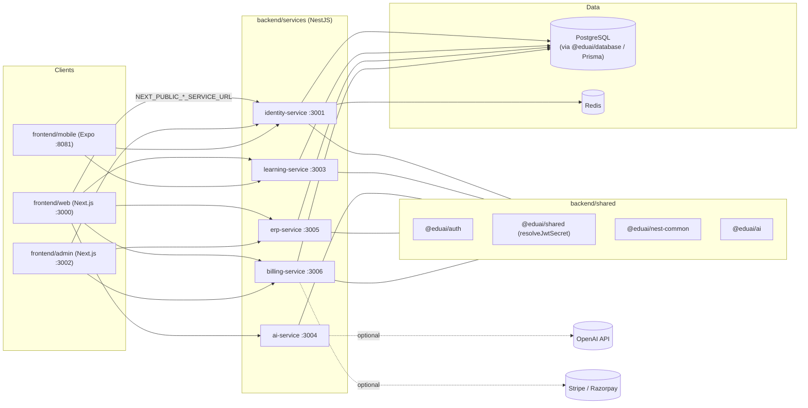

# Architecture

## Purpose

EduAI is a multi-tenant, AI-powered education SaaS platform serving schools,
teachers, students, and parents through separate web, admin, and mobile
experiences backed by a set of NestJS microservices. The platform covers
learning content and progress (Learning), identity/auth/RBAC (Identity),
AI-assisted features such as tutoring/content generation (AI), school
operations such as attendance/timetabling (ERP), and subscriptions/payments
(Billing).

This is a pnpm + Turborepo monorepo (`pnpm-workspace.yaml`, `turbo.json`).
Frontend apps talk to backend services over HTTP using
`NEXT_PUBLIC_*_SERVICE_URL` environment variables — there is no shared
business logic duplicated inside the Next.js route handlers; the Next.js apps
are thin clients over the service APIs.

## Microservices (`backend/services/*`)

Each service is an independent NestJS application with its own `package.json`,
build (`nest build`), and Jest test suite. All services share the following
workspace packages from `backend/shared/*` and `backend/database`:

| Service | Package | Port | Responsibility |
|---|---|---|---|
| `identity-service` | `@eduai/identity-service` | 3001 | Authentication, tenants, users, roles/permissions, JWT issuance |
| `learning-service` | `@eduai/learning-service` | 3003 | Courses, lessons, assignments, student progress |
| `ai-service` | `@eduai/ai-service` | 3004 | AI tutoring/content generation (OpenAI as an optional dependency; falls back to a mock when unset) |
| `erp-service` | `@eduai/erp-service` | 3005 | School operations — attendance, timetabling, and related admin workflows |
| `billing-service` | `@eduai/billing-service` | 3006 | Subscriptions and payments (Stripe integration; Razorpay keys are also present in `.env.example`) |

All five services follow the same internal shape: `@nestjs/core` +
`@nestjs/passport` + `passport-jwt` for auth, `@nestjs/config` for
configuration, `@nestjs/swagger` for API docs, and `@nestjs/throttler` for
rate limiting.

## Frontend Apps (`frontend/`)

| App | Package | Port | Stack | Audience |
|---|---|---|---|---|
| `frontend/web` | `@eduai/web` | 3000 | Next.js 15, React 19, next-auth v5 beta | Student / Teacher / Parent portal (tabs on one login page) |
| `frontend/admin` | `@eduai/admin` | 3002 | Next.js 15, React 19, next-auth v5 beta | Platform admin & CRM |
| `frontend/mobile` | `@eduai/mobile` | 8081 (Expo Metro) | Expo ~52 / React Native 0.76, expo-router | Mobile app (React Native, tested with Vitest) |

Shared frontend packages live under `frontend/shared-ui/*`:

- `@eduai/ui` — shared UI component library (Radix UI primitives, Tailwind)
- `@eduai/i18n` — shared internationalization
- `@eduai/analytics` — shared analytics utilities

`frontend/assets` and `frontend/public` hold shared static assets;
`frontend/design/stitch` holds design-system/Stitch export tooling used by the
`stitch:*` root scripts.

## Shared Backend Packages (`backend/shared/*`)

- `@eduai/auth` — shared auth utilities
- `@eduai/nest-common` — shared NestJS building blocks (guards, decorators,
  interceptors, etc.) used across all five services
- `@eduai/shared` — shared types/constants/utilities used by both frontend
  and backend (e.g. `JwtClaims`, `RoleCode`, `DASHBOARD_ROUTES`, and the JWT
  secret helpers described below)
- `@eduai/ai` — shared AI integration helpers used by `ai-service`

## Data Layer

- **PostgreSQL** (via `@eduai/database`, `backend/database`) — schema,
  migrations, and seed data are managed with Prisma (`@prisma/client`,
  `prisma migrate dev` / `migrate deploy`). Local Postgres runs in Docker on
  host port `5433` (container port `5432`); CI runs Postgres 16-alpine as a
  service container on port `5432`.
- **Redis** — used for caching/session-adjacent concerns (`ioredis` in
  `identity-service`); runs in Docker on port `6379` locally.

Local infrastructure is defined in
`backend/infrastructure/docker/docker-compose.yml`. Production build/deploy
assets (`Dockerfile.prod`, `Dockerfile.next.prod`,
`docker-compose.prod.yml`), Kubernetes manifests
(`backend/infrastructure/kubernetes/*.yaml`), Terraform modules
(`backend/infrastructure/terraform/`), and monitoring config (Prometheus,
Grafana dashboards, OpenTelemetry collector, alerting rules under
`backend/infrastructure/monitoring/`) also live under
`backend/infrastructure/`.

## Auth Pattern: `resolveJwtSecret`

All five NestJS services configure their `passport-jwt` strategy the same
way. Each service's `src/auth/jwt.strategy.ts` calls a shared helper instead
of reading `process.env.JWT_SECRET` directly:

```ts
// backend/services/<service>/src/auth/jwt.strategy.ts
import { resolveJwtSecret } from '@eduai/shared';

super({
  jwtFromRequest: ExtractJwt.fromAuthHeaderAsBearerToken(),
  ignoreExpiration: false,
  secretOrKey: resolveJwtSecret(config.get<string>('JWT_SECRET')),
});
```

`resolveJwtSecret` is defined once in `backend/shared/shared/src/index.ts`:

- If `JWT_SECRET` is set, it's used as-is.
- If unset and `NODE_ENV=production`, it throws — the platform refuses to
  start in production without an explicit secret.
- If unset outside production, it falls back to a well-known dev-only
  constant (`DEV_JWT_SECRET`) so local development works without extra setup.

The same file defines a companion `resolveAuthSecret` helper for the
frontend's Auth.js (`next-auth`) `AUTH_SECRET`, with an equivalent
production-vs-development fallback pattern (minimum 32 characters, warns
rather than throws in production if too short). This gives every service and
frontend app one consistent, centrally-defined rule for how JWT/auth secrets
are resolved, rather than each app reimplementing its own env-var fallback
logic.

## Repository Layout

```
EduAI/
├── frontend/
│   ├── web/                  Next.js — student/teacher/parent portal (:3000)
│   ├── admin/                Next.js — platform admin & CRM (:3002)
│   ├── mobile/                Expo/React Native app (:8081)
│   ├── shared-ui/
│   │   ├── ui/                @eduai/ui — component library
│   │   ├── i18n/               @eduai/i18n
│   │   └── analytics/          @eduai/analytics
│   ├── assets/                shared frontend assets
│   ├── public/                 shared public assets
│   ├── design/stitch/          design-system / Stitch export tooling
│   └── package.json            frontend workspace aggregate scripts
├── backend/
│   ├── services/
│   │   ├── identity-service/   :3001 — auth, tenants, RBAC
│   │   ├── learning-service/   :3003 — courses, lessons, progress
│   │   ├── ai-service/         :3004 — AI tutoring/content generation
│   │   ├── erp-service/        :3005 — attendance, timetabling
│   │   └── billing-service/    :3006 — subscriptions, payments
│   ├── database/               @eduai/database — Prisma schema/migrations/seed
│   ├── shared/
│   │   ├── auth/                @eduai/auth
│   │   ├── nest-common/          @eduai/nest-common
│   │   ├── shared/                @eduai/shared (incl. resolveJwtSecret)
│   │   └── ai/                     @eduai/ai
│   ├── infrastructure/
│   │   ├── docker/              docker-compose (local + prod), Dockerfiles
│   │   ├── kubernetes/          per-service K8s manifests, ingress, HPA
│   │   ├── terraform/           VPC, EKS, RDS, ElastiCache, S3, CloudFront, Route53, SES modules
│   │   └── monitoring/          Prometheus, Grafana dashboards, OTel collector, alerting rules
│   ├── testing/
│   │   ├── e2e/                  end-to-end tests
│   │   ├── load/                  k6 load tests (own pnpm workspace entry)
│   │   └── scripts/               operational scripts (billing validation, DR checklist, dev launchers)
│   └── docs/                    architecture, audit, release, design, and sprint docs
├── .github/
│   └── workflows/                ci.yml, deploy.yml (staging deploy to EKS)
├── pnpm-workspace.yaml
├── turbo.json
├── package.json
└── README.md
```

## Request Flow (High Level)



## Related Documents

- `README.md` — quickstart, port map, demo logins
- `CONTRIBUTING.md` — setup, branching, commit conventions, PR process
- `SECURITY.md` — vulnerability disclosure policy
- `REORG_PLAN.md` — structural observations and low-risk documentation
  improvements
- `backend/docs/` — deeper architecture, audit, release, and design
  documentation (release checklists, database schema notes, security/audit
  reports, etc.)
