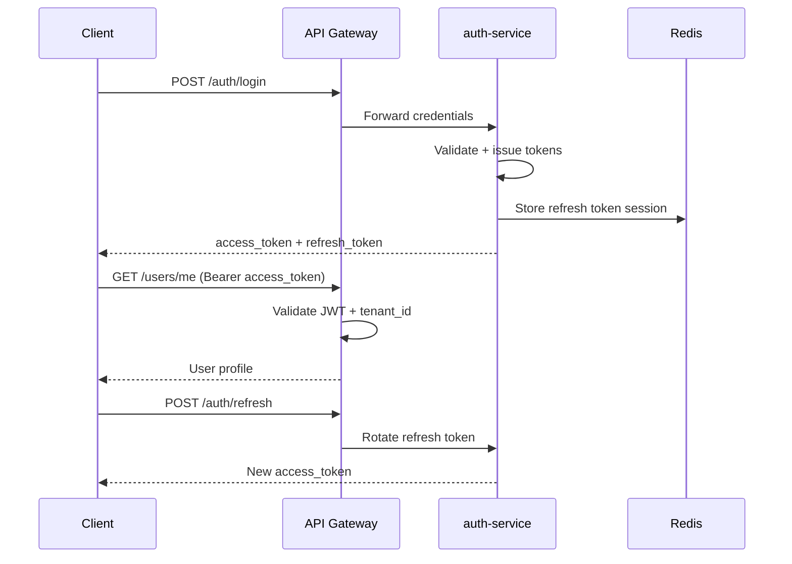

# EduAI — REST API Documentation

**Document ID:** EDUAI-API-001  
**Version:** 1.0.0  
**Base URL:** `https://api.eduai.in/api/v1`  
**Date:** June 2025  
**Owner:** Platform Engineering

---

## 1. Overview

EduAI exposes a versioned REST API consumed by the Next.js 15 web application, React Native mobile app, and third-party integrations (Phase 2). All services sit behind an API Gateway (Kong/AWS ALB) that handles TLS termination, rate limiting, tenant resolution, and JWT validation before forwarding to NestJS microservices.

This document serves as the human-readable companion to the OpenAPI 3.1 specification (`openapi.yaml`). It catalogs endpoints by domain module, defines cross-cutting conventions, and provides request/response examples for critical flows.

### 1.1 Related Documents

| Document | Purpose |
|----------|---------|
| [HLD](../architecture/high-level-design.md) | Service topology and data flow |
| [RBAC](../architecture/rbac-design.md) | Permission codes referenced in endpoint auth |
| [Multi-Tenant](../architecture/multi-tenant-architecture.md) | Tenant resolution and isolation |
| [Database Schema](../database/database-schema.md) | Entity shapes reflected in payloads |

---

## 2. REST Conventions

### 2.1 URL Structure

```
https://{tenant-subdomain}.eduai.in/api/v1/{resource}[/{id}][/{sub-resource}]
```

| Segment | Rule |
|---------|------|
| Version | Always `/api/v1/`; breaking changes increment to `/api/v2/` |
| Resource | Plural nouns in `kebab-case` (`mock-tests`, not `mockTests`) |
| ID | UUID v4 in path segments |
| Actions | Use HTTP verbs; non-CRUD actions use sub-resources (`POST /lessons/{id}/complete`) |

### 2.2 HTTP Methods

| Method | Usage |
|--------|-------|
| `GET` | Read single resource or collection; idempotent |
| `POST` | Create resource or trigger action |
| `PUT` | Full replace of resource |
| `PATCH` | Partial update |
| `DELETE` | Soft delete (sets `deleted_at`); hard delete is platform-admin only |

### 2.3 Standard Headers

| Header | Required | Description |
|--------|:--------:|-------------|
| `Authorization` | Yes* | `Bearer {access_token}` |
| `X-Tenant-Id` | Conditional | UUID; required when not resolved via subdomain/custom domain |
| `Accept-Language` | No | BCP 47 tag: `en-IN`, `hi-IN`, `mr-IN` (default: user profile locale) |
| `X-Request-Id` | No | Client-generated UUID for tracing; echoed in response |
| `X-Idempotency-Key` | Conditional | Required for payment and subscription mutations |
| `Content-Type` | On body | `application/json` or `multipart/form-data` for uploads |

*Public endpoints (login, register, health) omit `Authorization`.

### 2.4 Response Envelope

All successful responses wrap data in a consistent envelope:

```json
{
  "data": { },
  "meta": {
    "request_id": "550e8400-e29b-41d4-a716-446655440000",
    "timestamp": "2025-06-20T10:30:00.000Z"
  }
}
```

Collection responses include pagination metadata:

```json
{
  "data": [ ],
  "meta": {
    "request_id": "550e8400-e29b-41d4-a716-446655440000",
    "timestamp": "2025-06-20T10:30:00.000Z",
    "pagination": {
      "page": 1,
      "page_size": 20,
      "total_items": 847,
      "total_pages": 43,
      "has_next": true,
      "has_prev": false
    }
  }
}
```

### 2.5 Pagination

| Parameter | Type | Default | Max | Description |
|-----------|------|---------|-----|-------------|
| `page` | integer | 1 | — | 1-indexed page number |
| `page_size` | integer | 20 | 100 | Items per page |
| `sort` | string | varies | — | Comma-separated fields; prefix `-` for descending (`-created_at,name`) |
| `cursor` | string | — | — | Cursor-based pagination for high-volume streams (notifications, audit logs) |

Cursor pagination response adds `meta.pagination.next_cursor`.

### 2.6 Filtering

Query parameters use bracket notation for nested filters:

```
GET /api/v1/users?filter[role]=student&filter[class_level]=8&filter[school_id]={uuid}
GET /api/v1/lessons?filter[subject_id]={uuid}&filter[status]=published
```

Full-text search uses `q`:

```
GET /api/v1/content/search?q=quadratic+equations&filter[board]=cbse&filter[class]=10
```

### 2.7 Error Response Format

```json
{
  "error": {
    "code": "VALIDATION_ERROR",
    "message": "Request validation failed.",
    "details": [
      {
        "field": "email",
        "code": "INVALID_FORMAT",
        "message": "Must be a valid email address."
      }
    ],
    "request_id": "550e8400-e29b-41d4-a716-446655440000",
    "documentation_url": "https://docs.eduai.in/api/errors#VALIDATION_ERROR"
  }
}
```

### 2.8 Error Code Catalog

| HTTP | Code | When |
|------|------|------|
| 400 | `VALIDATION_ERROR` | Schema validation failure |
| 400 | `INVALID_FILTER` | Unknown or malformed filter parameter |
| 401 | `UNAUTHORIZED` | Missing or expired token |
| 401 | `TOKEN_EXPIRED` | Access token expired; use refresh |
| 403 | `FORBIDDEN` | Authenticated but insufficient permission |
| 403 | `TENANT_SUSPENDED` | Tenant account suspended |
| 403 | `CONSENT_REQUIRED` | Parental consent not recorded (minor accounts) |
| 404 | `NOT_FOUND` | Resource does not exist or not visible in scope |
| 409 | `CONFLICT` | Duplicate resource (email, slug) |
| 409 | `ALREADY_COMPLETED` | Idempotent action already applied |
| 422 | `BUSINESS_RULE_VIOLATION` | Valid syntax but business logic rejected |
| 429 | `RATE_LIMIT_EXCEEDED` | Per-user or per-tenant rate limit |
| 429 | `AI_QUOTA_EXCEEDED` | Daily AI query limit reached |
| 500 | `INTERNAL_ERROR` | Unexpected server error |
| 503 | `SERVICE_UNAVAILABLE` | Dependency down; retry with backoff |

### 2.9 Rate Limits

| Tier | Requests/min (user) | AI queries/day (student) |
|------|---------------------|--------------------------|
| Free | 60 | 10 |
| Starter | 120 | 50 |
| Professional | 300 | 200 |
| Enterprise | 600 | Unlimited* |

Rate limit headers on every response:

```
X-RateLimit-Limit: 120
X-RateLimit-Remaining: 118
X-RateLimit-Reset: 1718879400
```

### 2.10 Versioning & Deprecation

- Minor additive changes (new optional fields) do not require version bump.
- Breaking changes ship under `/api/v2/` with 6-month overlap.
- Deprecated endpoints return `Sunset` and `Deprecation` headers.
- Changelog published at `https://docs.eduai.in/api/changelog`.

---

## 3. Authentication Flow



---

## 4. Module Catalog

### 4.1 Auth (`/auth`)

| Method | Endpoint | Auth | Description |
|--------|----------|------|-------------|
| POST | `/auth/register` | Public | Register new user (role-specific) |
| POST | `/auth/login` | Public | Email/password login |
| POST | `/auth/login/google` | Public | Google OAuth token exchange |
| POST | `/auth/refresh` | Refresh token | Rotate access token |
| POST | `/auth/logout` | Bearer | Invalidate current session |
| POST | `/auth/logout-all` | Bearer | Invalidate all device sessions |
| POST | `/auth/forgot-password` | Public | Send reset email |
| POST | `/auth/reset-password` | Public | Reset with token |
| GET | `/auth/sessions` | Bearer | List active sessions |
| DELETE | `/auth/sessions/{id}` | Bearer | Revoke specific session |
| POST | `/auth/verify-email` | Public | Confirm email verification token |
| POST | `/auth/consent` | Bearer | Record parental consent (DPDP) |

#### Example: Login

**Request**

```http
POST /api/v1/auth/login
Content-Type: application/json
X-Tenant-Id: 7c9e6679-7425-40de-944b-e07fc1f90ae7

{
  "email": "arjun.patil@student.eduai.in",
  "password": "SecurePass123!",
  "device": {
    "name": "Chrome on Windows",
    "platform": "web"
  }
}
```

**Response `200 OK`**

```json
{
  "data": {
    "access_token": "eyJhbGciOiJIUzI1NiIs...",
    "refresh_token": "dGhpcyBpcyBhIHJlZnJlc2g...",
    "expires_in": 900,
    "token_type": "Bearer",
    "user": {
      "id": "a1b2c3d4-e5f6-7890-abcd-ef1234567890",
      "email": "arjun.patil@student.eduai.in",
      "first_name": "Arjun",
      "roles": ["student"],
      "tenant_id": "7c9e6679-7425-40de-944b-e07fc1f90ae7",
      "school_id": "school-uuid-here",
      "class_level": 5,
      "locale": "hi-IN"
    }
  },
  "meta": {
    "request_id": "req-login-001",
    "timestamp": "2025-06-20T10:30:00.000Z"
  }
}
```

#### Example: Refresh Token

**Request**

```http
POST /api/v1/auth/refresh
Content-Type: application/json

{
  "refresh_token": "dGhpcyBpcyBhIHJlZnJlc2g..."
}
```

**Response `200 OK`**

```json
{
  "data": {
    "access_token": "eyJhbGciOiJIUzI1NiIs...new",
    "expires_in": 900,
    "token_type": "Bearer"
  },
  "meta": {
    "request_id": "req-refresh-001",
    "timestamp": "2025-06-20T10:45:00.000Z"
  }
}
```

---

### 4.2 Users (`/users`)

| Method | Endpoint | Permission | Description |
|--------|----------|------------|-------------|
| GET | `/users/me` | Bearer | Current user profile + preferences |
| PATCH | `/users/me` | `users:update:own` | Update profile, locale, avatar |
| GET | `/users` | `users:read:tenant` | List users (admin) |
| GET | `/users/{id}` | Scoped read | Get user by ID |
| POST | `/users` | `users:create:tenant` | Create user (admin bulk import via `/users/import`) |
| PATCH | `/users/{id}` | Scoped update | Update user |
| DELETE | `/users/{id}` | `users:delete:tenant` | Soft delete user |
| POST | `/users/{id}/roles` | `users:assign_role:school` | Assign role |
| GET | `/users/me/children` | `users:read:linked` | Parent: list linked children |
| POST | `/users/link-child` | `users:link_parent:own` | Parent: link student account |
| DELETE | `/users/link-child/{studentId}` | `users:link_parent:own` | Unlink child |
| GET | `/users/me/preferences` | Bearer | Notification + UI preferences |
| PATCH | `/users/me/preferences` | Bearer | Update preferences |
| POST | `/users/me/avatar` | Bearer | Upload avatar (multipart) |

#### Example: Parent Link Child

**Request**

```http
POST /api/v1/users/link-child
Authorization: Bearer {access_token}
Content-Type: application/json

{
  "student_email": "arjun.patil@student.eduai.in",
  "link_code": "ABCD-1234"
}
```

**Response `201 Created`**

```json
{
  "data": {
    "link_id": "link-uuid",
    "student": {
      "id": "a1b2c3d4-e5f6-7890-abcd-ef1234567890",
      "first_name": "Arjun",
      "class_level": 5,
      "school_name": "Delhi Public School Pune"
    },
    "linked_at": "2025-06-20T11:00:00.000Z"
  },
  "meta": {
    "request_id": "req-link-001",
    "timestamp": "2025-06-20T11:00:00.000Z"
  }
}
```

---

### 4.3 Tenants (`/tenants`)

| Method | Endpoint | Permission | Description |
|--------|----------|------------|-------------|
| GET | `/tenants/me` | Bearer | Current tenant config (resolved from domain) |
| GET | `/tenants` | `tenants:manage:global` | List all tenants (platform admin) |
| POST | `/tenants` | `tenants:manage:global` | Provision new tenant |
| GET | `/tenants/{id}` | Scoped | Tenant details |
| PATCH | `/tenants/{id}` | Scoped | Update tenant settings |
| DELETE | `/tenants/{id}` | `tenants:manage:global` | Suspend/delete tenant |
| GET | `/tenants/{id}/branding` | Scoped | White-label branding |
| PATCH | `/tenants/{id}/branding` | `tenants:manage:tenant` | Update logo, colors, app name |
| GET | `/tenants/{id}/feature-flags` | Scoped | Feature flag list |
| PATCH | `/tenants/{id}/feature-flags/{key}` | Scoped | Toggle feature flag |
| GET | `/tenants/{id}/schools` | Scoped | Schools under tenant |
| POST | `/tenants/{id}/schools` | Scoped | Create school |

#### Example: Create Tenant (Platform Admin)

**Request**

```http
POST /api/v1/tenants
Authorization: Bearer {platform_admin_token}
Content-Type: application/json

{
  "slug": "dps-pune",
  "name": "Delhi Public School Pune",
  "type": "white_label",
  "subscription_tier": "professional",
  "max_students": 5000,
  "branding": {
    "app_name": "DPS Learn",
    "primary_color": "262 83% 58%",
    "logo_url": "https://cdn.eduai.in/tenants/dps-pune/logo.svg"
  },
  "custom_domain": "learn.dpspune.edu.in"
}
```

**Response `201 Created`**

```json
{
  "data": {
    "id": "7c9e6679-7425-40de-944b-e07fc1f90ae7",
    "slug": "dps-pune",
    "name": "Delhi Public School Pune",
    "type": "white_label",
    "subscription_tier": "professional",
    "status": "active",
    "custom_domain": "learn.dpspune.edu.in",
    "created_at": "2025-06-20T12:00:00.000Z"
  },
  "meta": {
    "request_id": "req-tenant-create-001",
    "timestamp": "2025-06-20T12:00:00.000Z"
  }
}
```

---

### 4.4 Learning (`/learning`)

| Method | Endpoint | Permission | Description |
|--------|----------|------------|-------------|
| GET | `/learning/dashboard` | Bearer (student) | Personalized dashboard payload |
| GET | `/learning/paths` | Bearer | Adaptive learning paths |
| GET | `/learning/paths/{id}` | Bearer | Path detail with milestones |
| GET | `/learning/progress` | Scoped | User progress summary |
| GET | `/learning/progress/{userId}` | Scoped | View another user's progress |
| GET | `/learning/study-planner` | Bearer | Calendar events + AI schedule |
| POST | `/learning/study-planner/generate` | Bearer | Regenerate AI study plan |
| GET | `/lessons` | Scoped | List lessons (filter by subject/chapter) |
| GET | `/lessons/{id}` | Scoped | Lesson detail + media URLs |
| POST | `/lessons/{id}/start` | Bearer | Mark lesson in progress |
| POST | `/lessons/{id}/complete` | `lessons:complete:own` | Complete lesson, trigger XP |
| PATCH | `/lessons/{id}/progress` | Bearer | Update watch position / checkpoint |
| GET | `/curriculum/boards` | Bearer | Available boards (CBSE, ICSE, State) |
| GET | `/curriculum/boards/{boardId}/classes/{classLevel}/subjects` | Bearer | Subject tree |
| GET | `/curriculum/subjects/{id}/chapters` | Bearer | Chapter list |

#### Example: Student Dashboard

**Request**

```http
GET /api/v1/learning/dashboard
Authorization: Bearer {student_token}
Accept-Language: hi-IN
```

**Response `200 OK`**

```json
{
  "data": {
    "greeting": "नमस्ते, Arjun!",
    "continue_learning": {
      "lesson_id": "lesson-uuid",
      "title": "Fractions — Introduction",
      "subject": "Mathematics",
      "progress_percent": 45,
      "thumbnail_url": "https://cdn.eduai.in/thumbs/fractions.jpg"
    },
    "streak": {
      "current": 7,
      "longest": 14,
      "freeze_tokens": 1,
      "last_activity_date": "2025-06-19"
    },
    "upcoming_tasks": [
      {
        "type": "homework",
        "title": "Algebra Worksheet Ch. 3",
        "due_at": "2025-06-22T18:00:00.000Z"
      },
      {
        "type": "mock_test",
        "title": "Science Unit Test",
        "scheduled_at": "2025-06-25T09:00:00.000Z"
      }
    ],
    "xp_summary": {
      "total_xp": 2450,
      "level": 12,
      "xp_to_next_level": 150
    },
    "recent_badges": [
      {
        "id": "badge-uuid",
        "name": "Math Whiz",
        "earned_at": "2025-06-18T14:30:00.000Z"
      }
    ]
  },
  "meta": {
    "request_id": "req-dashboard-001",
    "timestamp": "2025-06-20T08:00:00.000Z"
  }
}
```

#### Example: Complete Lesson

**Request**

```http
POST /api/v1/lessons/lesson-uuid/complete
Authorization: Bearer {student_token}
Content-Type: application/json

{
  "duration_seconds": 1240,
  "checkpoint_scores": [
    { "checkpoint_id": "cp-1", "score": 100 },
    { "checkpoint_id": "cp-2", "score": 80 }
  ]
}
```

**Response `200 OK`**

```json
{
  "data": {
    "lesson_id": "lesson-uuid",
    "status": "completed",
    "completed_at": "2025-06-20T08:25:00.000Z",
    "gamification": {
      "xp_awarded": 50,
      "badges_earned": [],
      "streak_maintained": true
    }
  },
  "meta": {
    "request_id": "req-lesson-complete-001",
    "timestamp": "2025-06-20T08:25:00.000Z"
  }
}
```

---

### 4.5 Content (`/content`)

| Method | Endpoint | Permission | Description |
|--------|----------|------------|-------------|
| GET | `/content/search` | Bearer | Full-text search (Elasticsearch) |
| GET | `/content/items` | Scoped | CMS content list |
| GET | `/content/items/{id}` | Scoped | Content item detail |
| POST | `/content/items` | `content:create:tenant` | Create draft content |
| PATCH | `/content/items/{id}` | Scoped | Update content |
| POST | `/content/items/{id}/submit-review` | Scoped | Submit for review |
| POST | `/content/items/{id}/publish` | `content:publish:tenant` | Publish content |
| POST | `/content/items/{id}/archive` | Scoped | Archive content |
| GET | `/content/library` | Scoped | Teacher content library |
| POST | `/content/assignments` | `lessons:assign:class` | Assign content to class |
| POST | `/media/upload` | Bearer | Initiate S3 presigned upload |
| GET | `/media/{id}/playback` | Bearer | Mux signed playback URL |

#### Example: Content Search

**Request**

```http
GET /api/v1/content/search?q=photosynthesis&filter[board]=cbse&filter[class_level]=7&page_size=10
Authorization: Bearer {token}
```

**Response `200 OK`**

```json
{
  "data": [
    {
      "id": "content-uuid",
      "type": "lesson",
      "title": "Photosynthesis — How Plants Make Food",
      "subject": "Science",
      "class_level": 7,
      "board": "CBSE",
      "language": "en-IN",
      "duration_minutes": 18,
      "thumbnail_url": "https://cdn.eduai.in/thumbs/photo.jpg",
      "relevance_score": 0.94
    }
  ],
  "meta": {
    "request_id": "req-search-001",
    "timestamp": "2025-06-20T09:00:00.000Z",
    "pagination": {
      "page": 1,
      "page_size": 10,
      "total_items": 23,
      "total_pages": 3,
      "has_next": true,
      "has_prev": false
    }
  }
}
```

---

### 4.6 AI (`/ai`)

| Method | Endpoint | Permission | Description |
|--------|----------|------------|-------------|
| GET | `/ai/conversations` | Scoped | List AI conversations |
| POST | `/ai/conversations` | `ai:tutor:use:own` | Start new conversation |
| GET | `/ai/conversations/{id}` | Scoped | Conversation with messages |
| POST | `/ai/conversations/{id}/messages` | Scoped | Send message (SSE stream) |
| DELETE | `/ai/conversations/{id}` | Scoped | Delete conversation |
| POST | `/ai/homework/hint` | `ai:homework:use:own` | Homework hint (no direct answer) |
| POST | `/ai/question-papers/generate` | `ai:qpg:use:class` | Async QPG generation |
| GET | `/ai/question-papers/{id}` | Scoped | Generated paper status/result |
| PATCH | `/ai/question-papers/{id}` | Scoped | Teacher edits before publish |
| POST | `/ai/question-papers/{id}/publish` | Scoped | Publish to class |
| GET | `/ai/quota` | Bearer | Remaining daily AI quota |
| GET | `/ai/usage` | Admin scoped | Tenant AI token spend |

**Streaming:** `POST /ai/conversations/{id}/messages` with `Accept: text/event-stream` returns Server-Sent Events:

```
event: token
data: {"content": "Let's"}

event: token
data: {"content": " break"}

event: done
data: {"message_id": "msg-uuid", "tokens_used": 342}
```

#### Example: AI Tutor Message

**Request**

```http
POST /api/v1/ai/conversations/conv-uuid/messages
Authorization: Bearer {student_token}
Content-Type: application/json
Accept-Language: hi-IN

{
  "content": "भिन्न क्या होते हैं? मुझे आसान भाषा में समझाओ।",
  "context": {
    "lesson_id": "lesson-uuid",
    "chapter_id": "chapter-uuid",
    "subject_id": "subject-uuid"
  }
}
```

**Response `200 OK` (non-streaming fallback)**

```json
{
  "data": {
    "message_id": "msg-uuid",
    "role": "assistant",
    "content": "भिन्न एक whole को equal parts में बाँटने का तरीका है। जैसे अगर आप एक pizza को 4 equal pieces में काटते हैं, तो हर piece 1/4 pizza है...",
    "sources": [
      {
        "content_id": "content-uuid",
        "title": "Fractions — Introduction",
        "excerpt": "A fraction represents a part of a whole..."
      }
    ],
    "tokens_used": 287,
    "model": "gemini-2.0-flash",
    "quota_remaining": 47
  },
  "meta": {
    "request_id": "req-ai-msg-001",
    "timestamp": "2025-06-20T15:30:00.000Z"
  }
}
```

#### Example: Question Paper Generation (Async)

**Request**

```http
POST /api/v1/ai/question-papers/generate
Authorization: Bearer {teacher_token}
Content-Type: application/json

{
  "title": "Class 8 Math — Unit Test 2",
  "class_id": "class-uuid",
  "subject_id": "math-uuid",
  "board": "ICSE",
  "topics": ["algebra", "linear_equations"],
  "difficulty_mix": { "easy": 30, "medium": 50, "hard": 20 },
  "question_types": {
    "mcq": 10,
    "short_answer": 5,
    "long_answer": 2
  },
  "total_marks": 50,
  "duration_minutes": 90
}
```

**Response `202 Accepted`**

```json
{
  "data": {
    "id": "paper-uuid",
    "status": "generating",
    "estimated_seconds": 45,
    "poll_url": "/api/v1/ai/question-papers/paper-uuid"
  },
  "meta": {
    "request_id": "req-qpg-001",
    "timestamp": "2025-06-20T16:00:00.000Z"
  }
}
```

---

### 4.7 Assessment (`/assessments`)

| Method | Endpoint | Permission | Description |
|--------|----------|------------|-------------|
| GET | `/assessments/quizzes` | Scoped | List quizzes |
| GET | `/assessments/quizzes/{id}` | Scoped | Quiz detail |
| POST | `/assessments/quizzes/{id}/attempts` | Bearer | Start quiz attempt |
| POST | `/assessments/attempts/{id}/submit` | Bearer | Submit quiz answers |
| GET | `/assessments/attempts/{id}/results` | Scoped | Quiz results + feedback |
| GET | `/assessments/mock-tests` | Scoped | List mock tests |
| GET | `/assessments/mock-tests/{id}` | Scoped | Mock test paper |
| POST | `/assessments/mock-tests/{id}/attempts` | Bearer | Start timed mock test |
| PATCH | `/assessments/attempts/{id}` | Bearer | Save in-progress answers |
| POST | `/assessments/attempts/{id}/submit` | Bearer | Submit mock test |
| GET | `/assessments/homework` | Scoped | Homework assignments |
| POST | `/assessments/homework` | Teacher scoped | Create homework |
| POST | `/assessments/homework/{id}/submit` | Bearer | Submit homework |
| POST | `/assessments/homework/{id}/grade` | Teacher scoped | Grade submission |
| GET | `/assessments/homework/{id}/submissions` | Teacher scoped | List submissions |

#### Example: Start Mock Test

**Request**

```http
POST /api/v1/assessments/mock-tests/mock-test-uuid/attempts
Authorization: Bearer {student_token}
Content-Type: application/json

{
  "mode": "timed"
}
```

**Response `201 Created`**

```json
{
  "data": {
    "attempt_id": "attempt-uuid",
    "mock_test_id": "mock-test-uuid",
    "status": "in_progress",
    "started_at": "2025-06-20T09:00:00.000Z",
    "expires_at": "2025-06-20T10:30:00.000Z",
    "duration_minutes": 90,
    "total_questions": 40,
    "questions": [
      {
        "id": "q1-uuid",
        "type": "mcq",
        "text": "What is the value of x in 2x + 5 = 15?",
        "options": [
          { "id": "a", "text": "5" },
          { "id": "b", "text": "10" },
          { "id": "c", "text": "7" },
          { "id": "d", "text": "3" }
        ],
        "marks": 1
      }
    ]
  },
  "meta": {
    "request_id": "req-mock-start-001",
    "timestamp": "2025-06-20T09:00:00.000Z"
  }
}
```

---

### 4.8 ERP (`/erp`)

| Method | Endpoint | Permission | Description |
|--------|----------|------------|-------------|
| GET | `/erp/schools/{id}/enrollment` | School admin | Enrollment records |
| POST | `/erp/enrollment` | School admin | Enroll student |
| GET | `/erp/classes` | Scoped | Class list |
| GET | `/erp/classes/{id}/roster` | Teacher scoped | Class roster |
| POST | `/erp/classes/{id}/students` | Teacher scoped | Add student to class |
| GET | `/erp/attendance` | Scoped | Attendance records |
| POST | `/erp/attendance` | `attendance:write:class` | Mark attendance |
| GET | `/erp/attendance/reports` | Scoped | Attendance reports |
| GET | `/erp/timetable` | Scoped | Timetable view |
| PUT | `/erp/timetable` | School admin | Update timetable |
| GET | `/erp/fees/structures` | School admin | Fee structures |
| GET | `/erp/fees/invoices` | Scoped | Fee invoices |
| POST | `/erp/fees/invoices/{id}/pay` | Parent scoped | Initiate fee payment |
| GET | `/erp/announcements` | Scoped | School announcements |
| POST | `/erp/announcements` | Scoped | Create announcement |
| GET | `/erp/report-cards/{studentId}` | Scoped | Report card |

#### Example: Mark Attendance

**Request**

```http
POST /api/v1/erp/attendance
Authorization: Bearer {teacher_token}
Content-Type: application/json

{
  "class_id": "class-uuid",
  "date": "2025-06-20",
  "records": [
    { "student_id": "student-1-uuid", "status": "present" },
    { "student_id": "student-2-uuid", "status": "absent" },
    { "student_id": "student-3-uuid", "status": "late", "note": "Bus delay" }
  ]
}
```

**Response `201 Created`**

```json
{
  "data": {
    "attendance_id": "att-uuid",
    "class_id": "class-uuid",
    "date": "2025-06-20",
    "status": "submitted",
    "summary": {
      "present": 28,
      "absent": 2,
      "late": 1,
      "total": 31
    },
    "submitted_at": "2025-06-20T08:45:00.000Z"
  },
  "meta": {
    "request_id": "req-attendance-001",
    "timestamp": "2025-06-20T08:45:00.000Z"
  }
}
```

---

### 4.9 Gamification (`/gamification`)

| Method | Endpoint | Permission | Description |
|--------|----------|------------|-------------|
| GET | `/gamification/profile` | Bearer | XP, level, badges summary |
| GET | `/gamification/badges` | Bearer | All badges (earned + available) |
| GET | `/gamification/streak` | Bearer | Streak status |
| POST | `/gamification/streak/freeze` | Bearer | Use streak freeze token |
| GET | `/gamification/leaderboards` | Scoped | Leaderboard list |
| GET | `/gamification/leaderboards/{scope}` | Scoped | Scoped leaderboard (`class`, `school`, `tenant`) |
| GET | `/gamification/xp/history` | Bearer | XP transaction log |
| GET | `/gamification/challenges` | Bearer | Active group challenges |

#### Example: Leaderboard

**Request**

```http
GET /api/v1/gamification/leaderboards/class?class_id=class-uuid&period=weekly
Authorization: Bearer {student_token}
```

**Response `200 OK`**

```json
{
  "data": {
    "scope": "class",
    "period": "weekly",
    "class_name": "Class 8-A",
    "entries": [
      {
        "rank": 1,
        "user_id": "user-uuid",
        "display_name": "Arjun P.",
        "xp": 450,
        "avatar_url": "https://cdn.eduai.in/avatars/arjun.jpg",
        "is_current_user": true
      },
      {
        "rank": 2,
        "user_id": "user-uuid-2",
        "display_name": "Priya S.",
        "xp": 420,
        "avatar_url": null,
        "is_current_user": false
      }
    ],
    "current_user_rank": 1,
    "total_participants": 32
  },
  "meta": {
    "request_id": "req-leaderboard-001",
    "timestamp": "2025-06-20T18:00:00.000Z"
  }
}
```

---

### 4.10 Billing (`/billing`)

| Method | Endpoint | Permission | Description |
|--------|----------|------------|-------------|
| GET | `/billing/plans` | Public/Tenant | Available subscription plans |
| GET | `/billing/subscription` | Bearer | Current subscription |
| POST | `/billing/subscription` | Bearer | Subscribe to plan |
| PATCH | `/billing/subscription` | Bearer | Upgrade/downgrade |
| DELETE | `/billing/subscription` | Bearer | Cancel subscription |
| GET | `/billing/invoices` | Bearer | Invoice history |
| GET | `/billing/invoices/{id}` | Bearer | Invoice detail + PDF URL |
| POST | `/billing/payment-methods` | Bearer | Add Razorpay payment method |
| GET | `/billing/payment-methods` | Bearer | List payment methods |
| POST | `/billing/webhooks/razorpay` | Signature | Razorpay webhook (internal) |
| GET | `/billing/usage` | Tenant admin | Usage vs plan limits |

#### Example: Create Subscription

**Request**

```http
POST /api/v1/billing/subscription
Authorization: Bearer {parent_token}
Content-Type: application/json
X-Idempotency-Key: idem-sub-20250620-001

{
  "plan_id": "plan-professional-monthly",
  "billing_cycle": "monthly",
  "payment_method_id": "pm-razorpay-uuid",
  "children_ids": ["child-1-uuid", "child-2-uuid"]
}
```

**Response `201 Created`**

```json
{
  "data": {
    "subscription_id": "sub-uuid",
    "plan": {
      "id": "plan-professional-monthly",
      "name": "Professional Family",
      "price_inr": 799,
      "billing_cycle": "monthly"
    },
    "status": "active",
    "current_period_start": "2025-06-20T00:00:00.000Z",
    "current_period_end": "2025-07-20T00:00:00.000Z",
    "razorpay_subscription_id": "sub_RaZorpay123"
  },
  "meta": {
    "request_id": "req-sub-create-001",
    "timestamp": "2025-06-20T12:30:00.000Z"
  }
}
```

---

### 4.11 Notifications (`/notifications`)

| Method | Endpoint | Permission | Description |
|--------|----------|------------|-------------|
| GET | `/notifications` | Bearer | In-app notifications (cursor paginated) |
| GET | `/notifications/unread-count` | Bearer | Unread badge count |
| PATCH | `/notifications/{id}/read` | Bearer | Mark as read |
| POST | `/notifications/read-all` | Bearer | Mark all read |
| GET | `/notifications/preferences` | Bearer | Channel preferences |
| PATCH | `/notifications/preferences` | Bearer | Update email/push/SMS prefs |
| POST | `/notifications/devices` | Bearer | Register push device token (FCM/APNs) |
| DELETE | `/notifications/devices/{token}` | Bearer | Unregister device |

#### Example: List Notifications

**Request**

```http
GET /api/v1/notifications?cursor=&page_size=20
Authorization: Bearer {token}
```

**Response `200 OK`**

```json
{
  "data": [
    {
      "id": "notif-uuid",
      "type": "homework_due",
      "title": "Homework due tomorrow",
      "body": "Algebra Worksheet Ch. 3 is due on 22 Jun.",
      "read": false,
      "action_url": "/student/homework/hw-uuid",
      "created_at": "2025-06-20T07:00:00.000Z"
    },
    {
      "id": "notif-uuid-2",
      "type": "badge_earned",
      "title": "New badge earned!",
      "body": "You earned the Math Whiz badge.",
      "read": true,
      "action_url": "/student/achievements",
      "created_at": "2025-06-18T14:30:00.000Z"
    }
  ],
  "meta": {
    "request_id": "req-notif-001",
    "timestamp": "2025-06-20T08:00:00.000Z",
    "pagination": {
      "page_size": 20,
      "next_cursor": "eyJpZCI6Im5vdGlmLXV1aWQtMiJ9",
      "has_next": true
    }
  }
}
```

---

### 4.12 Admin (`/admin`)

Platform and tenant admin operations. All endpoints require elevated permissions.

| Method | Endpoint | Permission | Description |
|--------|----------|------------|-------------|
| GET | `/admin/dashboard` | Admin scoped | KPI dashboard metrics |
| GET | `/admin/analytics/engagement` | Admin scoped | DAU, session duration, completion |
| GET | `/admin/analytics/learning` | Admin scoped | Assessment improvement, skill gaps |
| GET | `/admin/analytics/ai-costs` | `tenants:manage:global` | AI spend by tenant/model |
| GET | `/admin/users` | Admin scoped | Cross-user search |
| POST | `/admin/users/bulk-import` | Admin scoped | CSV bulk import |
| GET | `/admin/content/pipeline` | `content:publish:tenant` | CMS workflow queue |
| POST | `/admin/content/{id}/review` | Content admin | Approve/reject content |
| GET | `/admin/audit-logs` | Admin scoped | Audit trail (cursor paginated) |
| GET | `/admin/support/tickets` | Support agent | Support ticket list |
| PATCH | `/admin/support/tickets/{id}` | Support agent | Update ticket status |
| GET | `/admin/system/health` | Platform admin | Service health checks |

#### Example: AI Cost Analytics

**Request**

```http
GET /api/v1/admin/analytics/ai-costs?period=month&group_by=tenant
Authorization: Bearer {platform_admin_token}
```

**Response `200 OK`**

```json
{
  "data": {
    "period": "2025-06",
    "total_tokens": 45800000,
    "total_cost_usd": 1247.50,
    "by_tenant": [
      {
        "tenant_id": "7c9e6679-7425-40de-944b-e07fc1f90ae7",
        "tenant_name": "DPS Pune",
        "tokens": 12500000,
        "cost_usd": 340.20,
        "budget_percent_used": 78
      }
    ],
    "by_model": [
      { "model": "gemini-2.0-flash", "tokens": 32000000, "cost_usd": 480.00 },
      { "model": "gpt-4o", "tokens": 13800000, "cost_usd": 767.50 }
    ]
  },
  "meta": {
    "request_id": "req-ai-cost-001",
    "timestamp": "2025-06-20T20:00:00.000Z"
  }
}
```

---

## 5. WebSocket & Real-Time

| Channel | URL | Events |
|---------|-----|--------|
| Notifications | `wss://api.eduai.in/ws/v1/notifications` | `notification.new`, `badge.earned`, `xp.awarded` |
| AI Stream | SSE on `/ai/conversations/{id}/messages` | Token streaming |
| Live Leaderboard | `wss://api.eduai.in/ws/v1/leaderboards/{scope}` | Rank updates (optional, tenant flag) |

Connection requires `Authorization: Bearer {token}` during WebSocket handshake.

---

## 6. Webhooks (Outbound — Phase 2)

Tenants on Enterprise tier may register webhooks for:

| Event | Payload |
|-------|---------|
| `user.created` | User object |
| `lesson.completed` | Progress + XP |
| `payment.received` | Invoice + amount |
| `assessment.graded` | Score summary |

Delivery includes `X-EduAI-Signature` HMAC-SHA256 header for verification.

---

## 7. Health & Status

| Endpoint | Auth | Description |
|----------|------|-------------|
| `GET /health` | Public | Liveness probe |
| `GET /health/ready` | Public | Readiness (DB, Redis, ES) |
| `GET /health/services` | Platform admin | Per-service health |

---

## 8. OpenAPI Artifact

Machine-readable specification: `docs/api/openapi.yaml` (generated from NestJS decorators in CI).

Local preview:

```bash
npx @redocly/cli preview-docs docs/api/openapi.yaml
```

---

*Related: [HLD](../architecture/high-level-design.md) · [RBAC](../architecture/rbac-design.md) · [Database Schema](../database/database-schema.md)*
