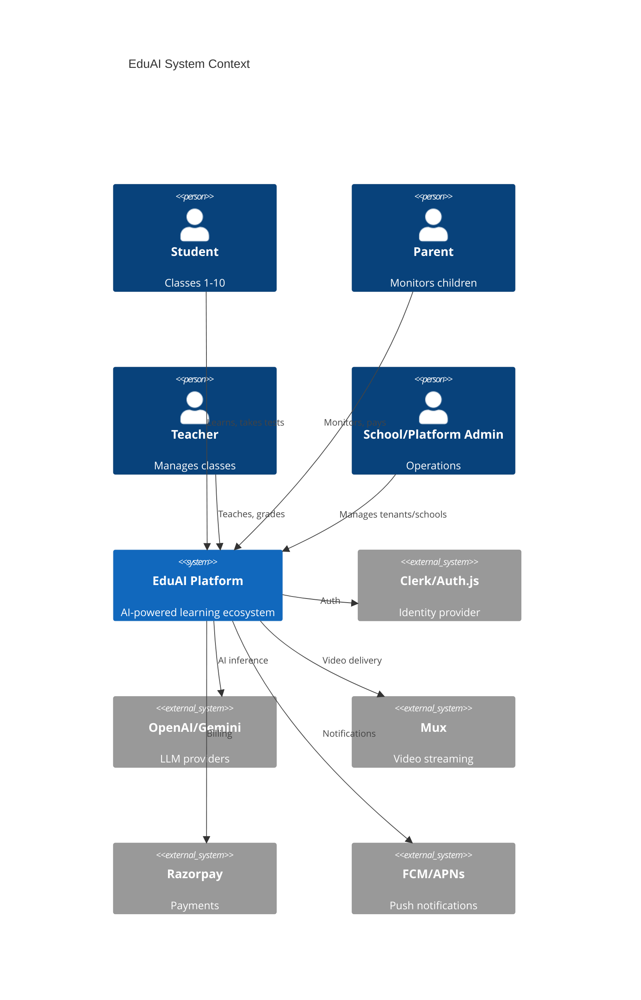
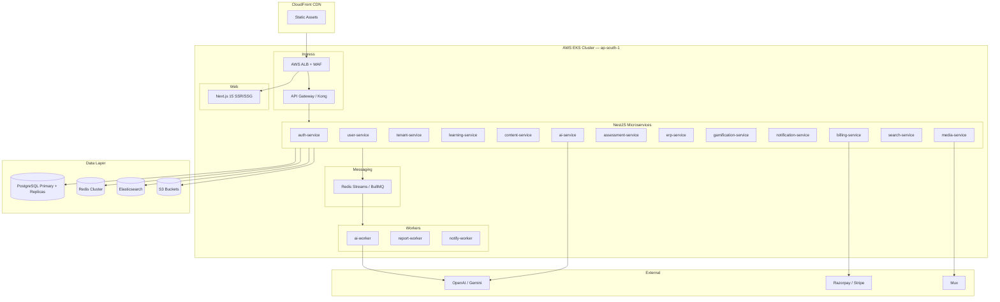
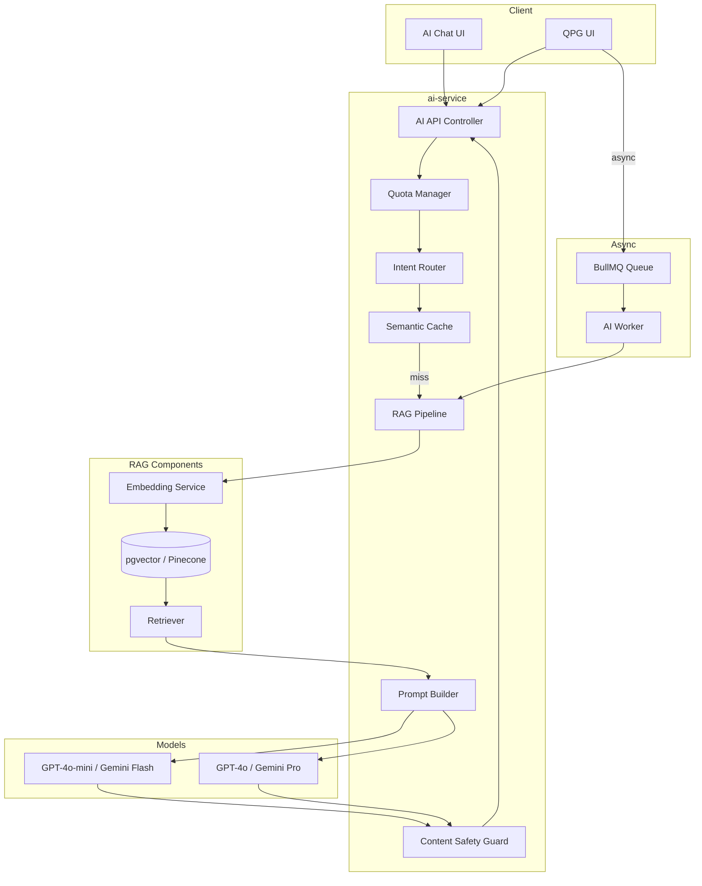
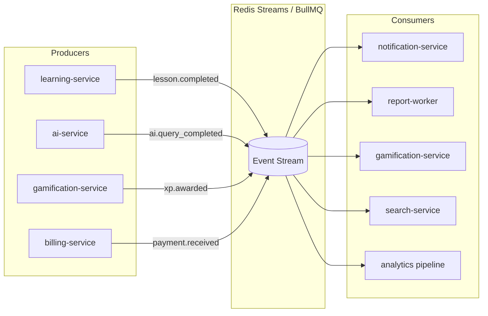
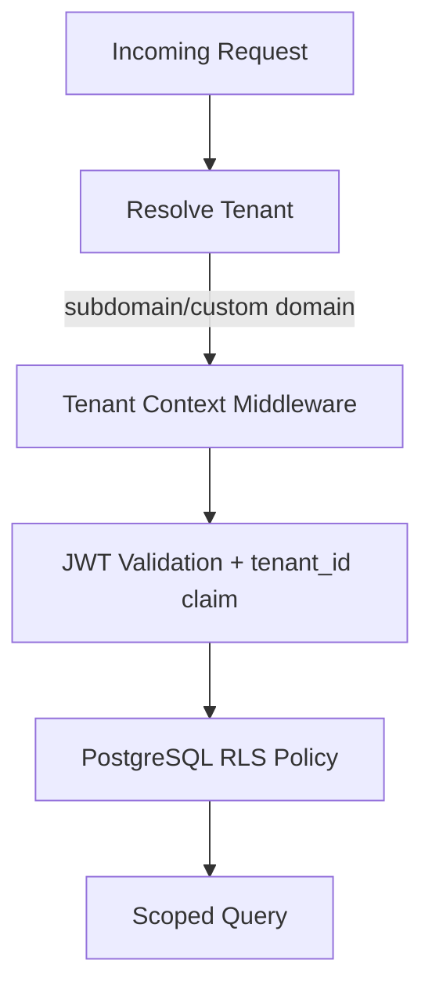
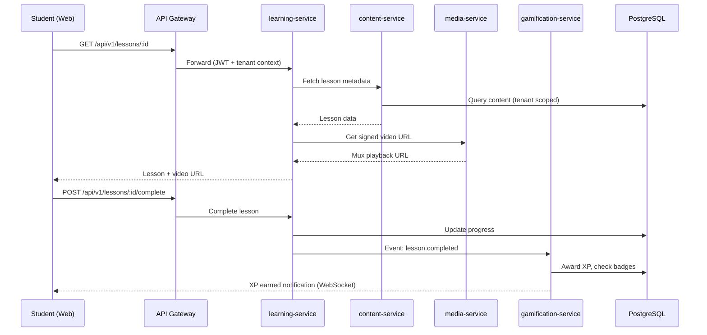

# EduAI — High-Level Design (HLD)

**Document ID:** EDUAI-HLD-001  
**Version:** 1.0.0  
**Date:** June 2025

---

## 1. Architecture Overview

EduAI follows a **modular microservices architecture** deployed on **AWS EKS (Kubernetes)**, with an **API Gateway** fronting NestJS services, **event-driven** communication for async workflows, and a dedicated **AI layer** with model routing and RAG.

### 1.1 Architecture Principles

1. **Multi-tenant by design** — tenant_id on every request and data row
2. **API-first** — all clients consume REST/WebSocket APIs
3. **Event-driven async** — AI generation, notifications, reports via message queue
4. **Polyglot persistence** — PostgreSQL (transactional), Redis (cache), Elasticsearch (search), S3 (media)
5. **Zero-trust security** — authenticate and authorize at gateway and service level
6. **Observability** — structured logging, distributed tracing, metrics on every service

---

## 2. System Context Diagram



---

## 3. Container Diagram



---

## 4. Microservices Catalog

| Service | Responsibility | Database | Events Published |
|---------|---------------|----------|------------------|
| **auth-service** | JWT issuance, session mgmt, RBAC enforcement | Redis (sessions) | `user.logged_in`, `user.logged_out` |
| **user-service** | User profiles, parent-child links, preferences | PostgreSQL | `user.created`, `user.updated` |
| **tenant-service** | Tenant CRUD, white-label config, feature flags | PostgreSQL | `tenant.created`, `tenant.config_updated` |
| **learning-service** | Progress, adaptive paths, lesson completion | PostgreSQL | `lesson.completed`, `progress.updated` |
| **content-service** | CMS, curriculum hierarchy, content metadata | PostgreSQL + S3 | `content.published` |
| **ai-service** | Tutor, homework, QPG, planner; RAG pipeline | PostgreSQL + Redis | `ai.query_completed`, `ai.quota_exceeded` |
| **assessment-service** | Quizzes, mock tests, grading | PostgreSQL | `assessment.submitted`, `assessment.graded` |
| **erp-service** | Attendance, fees, timetable, enrollment | PostgreSQL | `attendance.marked`, `fee.paid` |
| **gamification-service** | XP, badges, streaks, leaderboards | PostgreSQL + Redis | `xp.awarded`, `badge.earned`, `streak.updated` |
| **notification-service** | Email, push, in-app notifications | PostgreSQL + Redis | `notification.sent` |
| **billing-service** | Subscriptions, invoices, Razorpay webhooks | PostgreSQL | `subscription.created`, `payment.received` |
| **search-service** | Full-text content search | Elasticsearch | — |
| **media-service** | S3 upload, Mux transcoding, signed URLs | S3 | `media.processed` |

---

## 5. AI Layer Architecture



### 5.1 AI Design Decisions

| Decision | Rationale |
|----------|-----------|
| RAG over fine-tuning | Faster iteration on curriculum updates; lower cost |
| pgvector in PostgreSQL | Avoid separate vector DB at MVP scale; migrate to Pinecone if needed |
| Intent-based model routing | 70% queries handled by cheaper models |
| Semantic caching (Redis) | Dedup identical/near-identical questions |
| Async workers for QPG/mock tests | Long-running generation doesn't block API |
| Content safety layer | Regex + LLM moderation before response delivery |

---

## 6. Event-Driven Architecture



### 6.1 Key Domain Events

| Event | Payload | Consumers |
|-------|---------|-----------|
| `lesson.completed` | userId, lessonId, score, duration | gamification, notification, analytics |
| `assessment.submitted` | userId, assessmentId, answers | assessment (grade), gamification |
| `ai.quota_exceeded` | userId, tenantId, tier | notification, billing |
| `payment.received` | userId, amount, planId | billing, notification |
| `badge.earned` | userId, badgeId | notification, gamification |
| `content.published` | contentId, board, class | search (index), notification |

---

## 7. Multi-Tenant Architecture Summary

See [Multi-Tenant Architecture](./multi-tenant-architecture.md) for full detail.

**Model:** Shared database, shared schema with `tenant_id` column (Row-Level Security).



**Hierarchy:** Platform → Tenant → School → Class → User

---

## 8. Frontend Architecture

### 8.1 Web (Next.js 15)

```
apps/web/
├── app/                    # App Router
│   ├── (auth)/             # Login, register, consent
│   ├── (student)/          # Student portal routes
│   ├── (parent)/           # Parent portal routes
│   ├── (teacher)/          # Teacher portal routes
│   ├── (admin)/            # Admin CRM routes
│   └── api/                # BFF routes (optional)
├── components/
│   ├── ui/                 # Shadcn components
│   ├── learning/           # Lesson, quiz components
│   └── layouts/            # Portal-specific layouts
├── lib/
│   ├── api/                # API client (fetch wrapper)
│   ├── auth/               # Clerk/Auth.js integration
│   └── i18n/               # i18next config
└── hooks/
```

**Rendering strategy:**
- Marketing/landing pages: SSG + ISR
- Dashboards: SSR with client hydration
- Lesson player: Client-side with streaming video
- AI chat: Client-side with SSE streaming

### 8.2 Mobile (React Native / Expo)

```
apps/mobile/
├── app/                    # Expo Router
├── screens/
├── components/
├── services/               # API client
├── stores/                 # Zustand state
└── offline/                # Download manager
```

---

## 9. Data Flow — Student Learning Session



---

## 10. Deployment Topology (AWS)

| Component | AWS Service |
|-----------|-------------|
| Compute | EKS (Fargate + EC2 node groups) |
| Database | RDS PostgreSQL 16 (Multi-AZ) |
| Cache | ElastiCache Redis 7 |
| Search | OpenSearch (Elasticsearch-compatible) |
| Storage | S3 + CloudFront |
| Secrets | AWS Secrets Manager |
| DNS | Route 53 |
| WAF | AWS WAF on ALB |
| CI/CD | GitHub Actions → ECR → EKS |
| Monitoring | CloudWatch + Grafana + Prometheus |
| Tracing | AWS X-Ray / Jaeger |

---

## 11. Technology Decisions Record

| Decision | Options Considered | Choice | Reason |
|----------|-------------------|--------|--------|
| Backend framework | NestJS, Fastify, Go | NestJS | TypeScript full-stack, modular, DI |
| Monorepo | Turborepo, Nx | Turborepo | Simpler config, Vercel-compatible web |
| Auth | Clerk, Auth.js, custom | Clerk (primary) | Faster MVP; Auth.js fallback documented |
| ORM | Prisma, TypeORM, Drizzle | Prisma | Type-safe, migrations, multi-tenant middleware |
| Queue | BullMQ, SQS, RabbitMQ | BullMQ on Redis | Already using Redis; simpler ops |
| Vector store | pgvector, Pinecone, Weaviate | pgvector | Co-locate with PostgreSQL at MVP |
| Video | Mux, Cloudflare Stream | Mux | Developer experience, adaptive bitrate |

---

## 12. Future Considerations (Post-MVP)

- GraphQL federation layer for mobile bandwidth optimization
- CQRS for analytics read models
- Dedicated vector database at 10M+ embeddings
- Edge caching with Vercel for web frontend
- Service mesh (Istio) at 20+ microservices

---

*Related: [LLD](./low-level-design.md) · [Multi-Tenant](./multi-tenant-architecture.md) · [RBAC](./rbac-design.md)*
