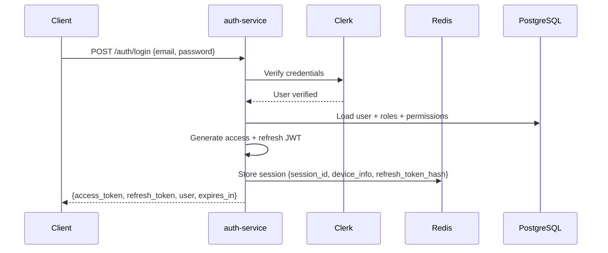
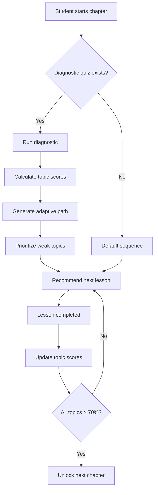
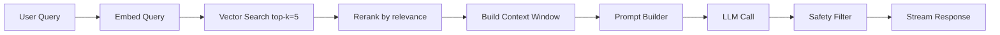
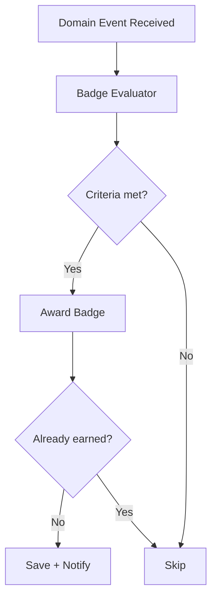
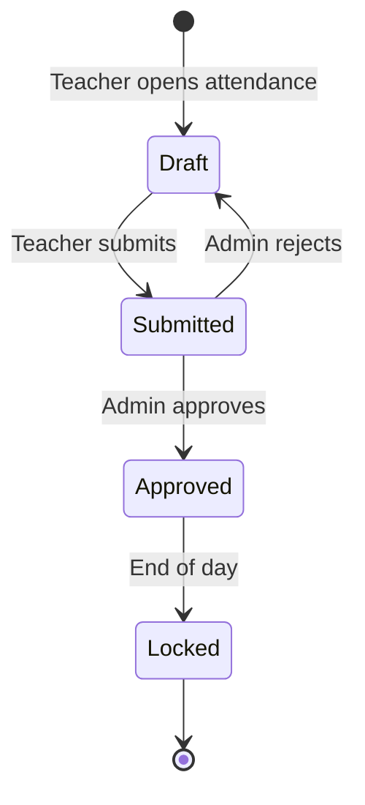
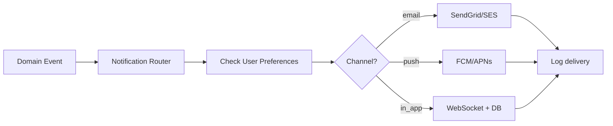
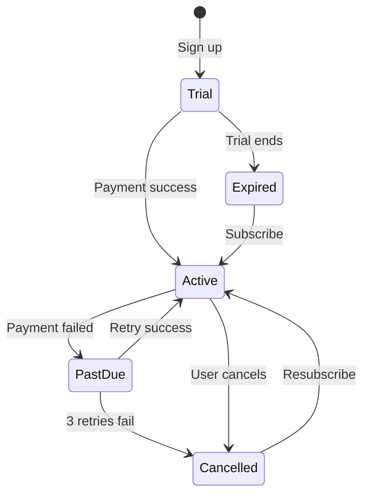

# EduAI — Low-Level Design (LLD)

**Document ID:** EDUAI-LLD-001  
**Version:** 1.0.0  
**Date:** June 2025

---

## 1. Introduction

This document provides low-level design for key EduAI modules: class structures, sequence diagrams, database interactions, and internal API contracts between services.

---

## 2. Auth Service LLD

### 2.1 Module Structure

```
auth-service/
├── src/
│   ├── auth/
│   │   ├── auth.controller.ts
│   │   ├── auth.service.ts
│   │   ├── auth.module.ts
│   │   ├── strategies/
│   │   │   ├── jwt.strategy.ts
│   │   │   └── refresh.strategy.ts
│   │   └── guards/
│   │       ├── jwt-auth.guard.ts
│   │       ├── roles.guard.ts
│   │       └── tenant.guard.ts
│   ├── session/
│   │   ├── session.service.ts
│   │   └── session.repository.ts
│   └── rbac/
│       ├── permission.decorator.ts
│       └── permission.service.ts
```

### 2.2 JWT Token Structure

```typescript
interface AccessTokenPayload {
  sub: string;           // user UUID
  email: string;
  tenant_id: string;
  school_id: string | null;
  roles: Role[];         // ['student'] | ['teacher'] | ['parent', 'student']
  permissions: string[]; // flattened permission codes
  class_ids: string[];   // for teachers/students
  iat: number;
  exp: number;           // 15 minutes
}

interface RefreshTokenPayload {
  sub: string;
  session_id: string;
  tenant_id: string;
  exp: number;           // 7 days
}
```

### 2.3 Login Sequence



### 2.4 Session Management

| Operation | Storage | TTL |
|-----------|---------|-----|
| Active session | Redis hash `session:{session_id}` | 7 days |
| Refresh token | Hashed in Redis | 7 days |
| Token blacklist (logout) | Redis set `blacklist:{jti}` | Access token remaining TTL |
| Failed login counter | Redis `login_attempts:{email}` | 15 min |

---

## 3. Learning Service LLD

### 3.1 Core Entities (Service Layer)

```typescript
interface LearningPath {
  id: string;
  userId: string;
  tenantId: string;
  boardId: string;
  classLevel: number;
  currentChapterId: string;
  completionPercentage: number;
  weakTopics: TopicScore[];
  lastActivityAt: Date;
}

interface LessonProgress {
  id: string;
  userId: string;
  lessonId: string;
  status: 'not_started' | 'in_progress' | 'completed';
  score: number | null;
  timeSpentSeconds: number;
  completedAt: Date | null;
}

interface TopicScore {
  topicId: string;
  score: number;        // 0-100
  attempts: number;
  lastAttemptAt: Date;
}
```

### 3.2 Adaptive Learning Algorithm



**Spaced repetition intervals:** 1 day → 3 days → 7 days → 14 days (based on SM-2 simplified).

### 3.3 Lesson Completion Flow

```typescript
// learning.service.ts — pseudocode
async completeLesson(userId: string, lessonId: string, payload: CompleteLessonDto) {
  // 1. Validate tenant scope
  const progress = await this.progressRepo.findByUserAndLesson(userId, lessonId);
  
  // 2. Update progress
  await this.progressRepo.update({
    status: 'completed',
    score: payload.score,
    timeSpentSeconds: payload.duration,
    completedAt: new Date(),
  });

  // 3. Update adaptive path
  await this.adaptiveService.updateTopicScores(userId, lessonId, payload.score);

  // 4. Publish event
  await this.eventBus.publish('lesson.completed', {
    userId,
    lessonId,
    score: payload.score,
    duration: payload.duration,
    tenantId: this.tenantContext.id,
  });

  return { xpEarned: 0 }; // XP calculated by gamification consumer
}
```

---

## 4. AI Service LLD

### 4.1 Module Structure

```
ai-service/
├── src/
│   ├── tutor/
│   │   ├── tutor.controller.ts
│   │   ├── tutor.service.ts
│   │   └── conversation.repository.ts
│   ├── homework/
│   │   └── homework-assistant.service.ts
│   ├── qpg/
│   │   ├── qpg.controller.ts
│   │   └── qpg.processor.ts      # BullMQ worker
│   ├── planner/
│   │   └── study-planner.service.ts
│   ├── rag/
│   │   ├── embedding.service.ts
│   │   ├── retriever.service.ts
│   │   └── vector.repository.ts
│   ├── routing/
│   │   ├── intent-classifier.ts
│   │   └── model-router.ts
│   ├── safety/
│   │   └── content-guard.service.ts
│   └── quota/
│       └── quota.service.ts
```

### 4.2 RAG Pipeline Detail



**Prompt template (AI Tutor):**

```
System: You are EduAI Tutor, a helpful teacher for Class {class} {subject} 
({board} board). Answer in {language}. Use ONLY the provided context. 
If unsure, say "Let me help you think through this step by step" 
and guide with questions — never give exam answers directly.

Context:
{retrieved_chunks}

Conversation history (last 5 turns):
{history}

Student question: {query}
```

### 4.3 Intent Classification & Model Routing

| Intent | Keywords/Signals | Model | Max Tokens |
|--------|-----------------|-------|------------|
| `greeting` | hi, hello, namaste | Cache/template | 50 |
| `simple_faq` | what is, define | GPT-4o-mini | 500 |
| `explanation` | explain, why, how | GPT-4o-mini | 1000 |
| `complex_problem` | solve, prove, derive | GPT-4o | 2000 |
| `homework_help` | homework, assignment | GPT-4o-mini (strict mode) | 800 |
| `qpg_request` | generate paper | Async worker + GPT-4o | 4000 |

### 4.4 Quota Service

```typescript
interface QuotaConfig {
  tier: 'free' | 'plus' | 'pro' | 'school';
  dailyQueries: number;
  monthlyTokens: number;
}

async checkQuota(userId: string): Promise<QuotaResult> {
  const key = `ai_quota:${userId}:${today}`;
  const used = await redis.get(key) ?? 0;
  const limit = await this.getTierLimit(userId);
  
  if (used >= limit.dailyQueries) {
    return { allowed: false, reason: 'DAILY_LIMIT_EXCEEDED', resetAt: endOfDay };
  }
  return { allowed: true, remaining: limit.dailyQueries - used };
}
```

---

## 5. Gamification Service LLD

### 5.1 XP Rules Engine

```typescript
const XP_RULES: XpRule[] = [
  { action: 'lesson.completed', baseXp: 20, multiplier: (ctx) => ctx.score / 100 },
  { action: 'quiz.completed', baseXp: 15, multiplier: (ctx) => ctx.perfect ? 2 : 1 },
  { action: 'streak.maintained', baseXp: 10, multiplier: (ctx) => Math.min(ctx.streakDays, 7) },
  { action: 'mock_test.completed', baseXp: 50, multiplier: (ctx) => ctx.score / 100 },
  { action: 'brain_game.completed', baseXp: 10, multiplier: () => 1 },
];
```

### 5.2 Badge Evaluation



**Badge criteria examples (JSON):**

```json
{
  "id": "streak_7",
  "name": "Week Warrior",
  "criteria": {
    "type": "streak",
    "minDays": 7
  }
}
{
  "id": "math_master_50",
  "name": "Math Master",
  "criteria": {
    "type": "lessons_completed",
    "subject": "mathematics",
    "count": 50
  }
}
```

### 5.3 Leaderboard (Redis Sorted Sets)

```
Key: leaderboard:{tenant_id}:{school_id}:{class_id}:{period}
Score: total XP in period
Period: daily | weekly | monthly | all_time

Operations:
- ZINCRBY on xp.awarded event
- ZREVRANGE for top 20
- ZRANK for user's position
```

---

## 6. Assessment Service LLD

### 6.1 Mock Test Engine

```typescript
interface MockTest {
  id: string;
  title: string;
  boardId: string;
  classLevel: number;
  subjectId: string;
  durationMinutes: number;
  totalMarks: number;
  sections: TestSection[];
  generatedBy: 'ai' | 'curated';
}

interface TestSection {
  name: string;           // e.g., "Section A - MCQ"
  questionCount: number;
  marksPerQuestion: number;
  questionType: 'mcq' | 'short' | 'long';
  questions: Question[];
}
```

### 6.2 Auto-Grading Logic

| Question Type | Grading Method |
|---------------|----------------|
| MCQ | Exact match against correct option |
| True/False | Exact match |
| Fill in blank | Normalized string match (trim, lowercase, Levenshtein ≤ 1) |
| Short answer | AI-assisted grading (async, teacher review fallback) |
| Long answer | AI rubric grading (async, teacher review required) |

---

## 7. ERP Service LLD

### 7.1 Attendance Module



**Business rules:**
- Attendance can be marked until 11:59 PM IST on the same day
- Admin can edit within 48 hours with audit log
- Absent students trigger parent notification event

### 7.2 Fee Module

```typescript
interface FeeStructure {
  schoolId: string;
  academicYear: string;
  components: FeeComponent[];  // tuition, transport, lab, etc.
}

interface FeePayment {
  studentId: string;
  amount: number;
  razorpayOrderId: string;
  razorpayPaymentId: string;
  status: 'pending' | 'paid' | 'failed' | 'refunded';
}
```

---

## 8. Notification Service LLD

### 8.1 Notification Pipeline



### 8.2 Template Registry

| Template ID | Channel | Trigger |
|-------------|---------|---------|
| `welcome_email` | email | user.created |
| `weekly_progress` | email, in_app | cron (Sunday 8 AM) |
| `streak_reminder` | push | cron (8 PM if no activity) |
| `assignment_due` | push, in_app | 24 hrs before due |
| `badge_earned` | in_app, push | badge.earned |
| `payment_success` | email | payment.received |

---

## 9. Billing Service LLD

### 9.1 Subscription State Machine



### 9.2 Razorpay Webhook Handler

```typescript
async handleWebhook(event: RazorpayEvent) {
  switch (event.event) {
    case 'subscription.activated':
      await this.activateSubscription(event.payload);
      break;
    case 'subscription.charged':
      await this.recordPayment(event.payload);
      break;
    case 'subscription.cancelled':
      await this.cancelSubscription(event.payload);
      break;
    case 'payment.failed':
      await this.handlePaymentFailure(event.payload);
      break;
  }
}
```

---

## 10. Content Service LLD

### 10.1 Curriculum Hierarchy

```
Board (CBSE, ICSE, State)
 └── Class (1-10)
      └── Subject (Math, Science, ...)
           └── Chapter
                └── Topic
                     └── Lesson
                          ├── Video (Mux asset)
                          ├── Text content (Markdown)
                          ├── Interactive (H5P / custom)
                          └── Quiz
```

### 10.2 Content Versioning

- Content items have `version` integer and `status`: draft → review → published → archived
- Published content is immutable; edits create new version
- Students always see latest published version unless pinned by teacher

---

## 11. Shared Packages (Monorepo)

```
packages/
├── shared-types/          # TypeScript interfaces shared across services
├── shared-utils/          # Date, validation, crypto helpers
├── api-client/            # Generated from OpenAPI spec
├── ui/                    # Shadcn component library
├── eslint-config/         # Shared lint rules
└── tsconfig/              # Shared TS configs
```

---

## 12. Error Handling Convention

```typescript
// Standard error response
interface ApiError {
  statusCode: number;
  error: string;           // HTTP status text
  message: string;         // Human-readable
  code: string;            // Machine-readable: AUTH_TOKEN_EXPIRED
  details?: Record<string, string[]>;
  requestId: string;
  timestamp: string;
}
```

| Code Range | Domain |
|------------|--------|
| AUTH_001–099 | Authentication errors |
| TENANT_001–099 | Multi-tenant errors |
| LEARN_001–099 | Learning service |
| AI_001–099 | AI service (incl. quota) |
| BILL_001–099 | Billing |
| VALID_001–099 | Validation |

---

*Related: [HLD](./high-level-design.md) · [Database Schema](../database/database-schema.md) · [API Docs](../api/api-documentation.md)*
