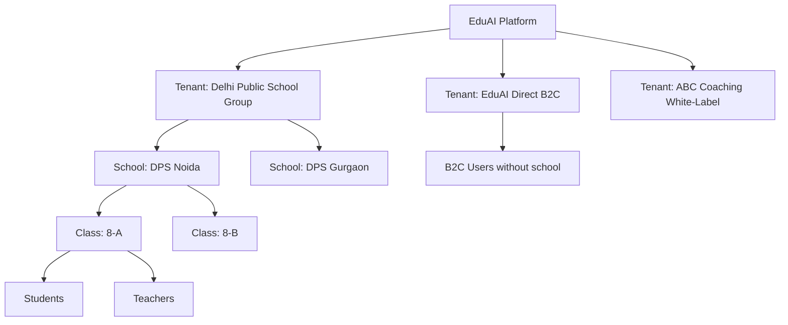
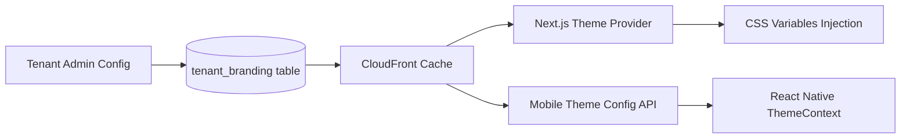
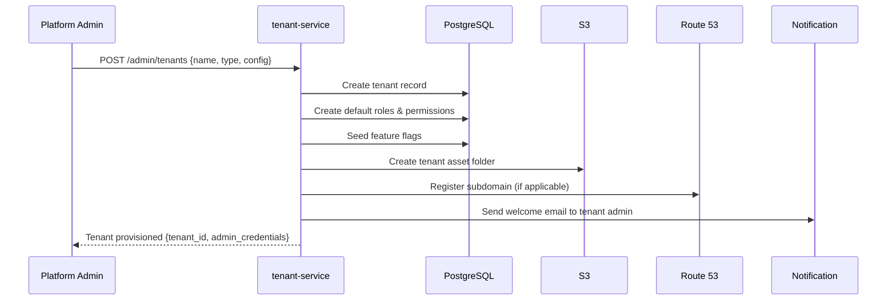
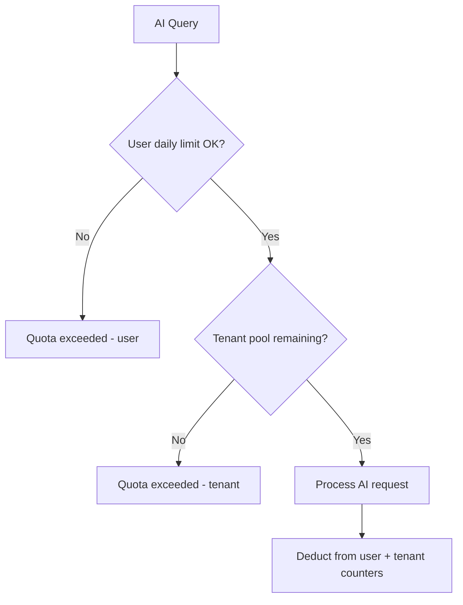
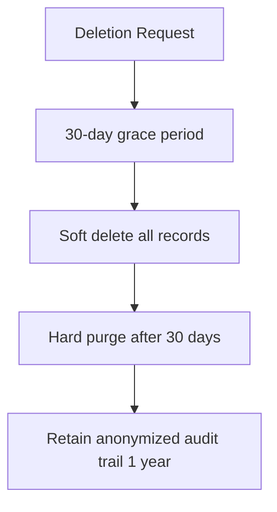

# EduAI — Multi-Tenant Architecture

**Document ID:** EDUAI-MT-001  
**Version:** 1.0.0  
**Date:** June 2025

---

## 1. Overview

EduAI is a **multi-tenant SaaS platform** supporting:

1. **Platform tenant** — EduAI direct B2C users
2. **School tenants** — B2B licensed schools with isolated data
3. **White-label tenants** — Partners with custom branding and domains

**Isolation model:** Shared database, shared schema with `tenant_id` discriminator and PostgreSQL Row-Level Security (RLS).

---

## 2. Tenant Hierarchy



### 2.1 Entity Hierarchy

| Level | Entity | Example | ID Prefix |
|-------|--------|---------|-----------|
| L0 | Platform | EduAI | — |
| L1 | Tenant | `tenant_dps_group` | `ten_` |
| L2 | School | `school_dps_noida` | `sch_` |
| L3 | Class | `class_8a` | `cls_` |
| L4 | User | `user_arjun` | `usr_` |

---

## 3. Tenant Resolution

### 3.1 Resolution Strategy

```mermaid
flowchart TD
    REQ[HTTP Request] --> HOST{Check Host Header}
    HOST -->|app.eduai.in| DEFAULT[Default Platform Tenant]
    HOST -->|learn.dpsschool.in| CUSTOM[Lookup Custom Domain Map]
    HOST -->|partner.eduai.in/{tenantSlug}| SLUG[Resolve by Slug]
    
    DEFAULT --> CTX[Set Tenant Context]
    CUSTOM --> CTX
    SLUG --> CTX
    
    CTX --> JWT{JWT Present?}
    JWT -->|Yes| VALIDATE[Validate tenant_id in JWT matches context]
    JWT -->|No| PUBLIC[Public routes only]
    VALIDATE -->|Match| PROCEED[Proceed to handler]
    VALIDATE -->|Mismatch| REJECT[403 Forbidden]
```

### 3.2 Tenant Context Object

```typescript
interface TenantContext {
  tenantId: string;
  tenantSlug: string;
  tenantType: 'platform' | 'school_group' | 'white_label';
  branding: TenantBranding;
  featureFlags: Record<string, boolean>;
  subscriptionTier: 'starter' | 'professional' | 'enterprise';
  aiQuotaPool: number;          // tenant-level AI token budget
  customDomain: string | null;
}

interface TenantBranding {
  logoUrl: string;
  faviconUrl: string;
  primaryColor: string;         // HSL value
  secondaryColor: string;
  appName: string;                // e.g., "DPS Learning Hub"
  supportEmail: string;
}
```

---

## 4. Data Isolation

### 4.1 Row-Level Security (PostgreSQL)

```sql
-- Enable RLS on all tenant-scoped tables
ALTER TABLE users ENABLE ROW LEVEL SECURITY;

-- Policy: users can only see rows matching their tenant
CREATE POLICY tenant_isolation ON users
  USING (tenant_id = current_setting('app.current_tenant_id')::uuid);

-- Set tenant context at connection level (via middleware)
SET app.current_tenant_id = 'ten_uuid_here';
```

### 4.2 Application-Level Enforcement

Defense in depth — RLS + application middleware:

```typescript
// tenant.middleware.ts
@Injectable()
export class TenantMiddleware implements NestMiddleware {
  use(req: Request, res: Response, next: NextFunction) {
    const tenant = this.resolveTenant(req);
    req.tenantContext = tenant;
    
    // Set PostgreSQL session variable for RLS
    this.prisma.$executeRaw`SET app.current_tenant_id = ${tenant.tenantId}`;
    
    next();
  }
}

// All repository queries include tenant_id filter
async findUsers(tenantId: string, filters: UserFilters) {
  return this.prisma.user.findMany({
    where: { tenant_id: tenantId, deleted_at: null, ...filters },
  });
}
```

### 4.3 Isolation Boundaries

| Data Type | Isolation Level | Cross-Tenant Access |
|-----------|----------------|---------------------|
| User profiles | tenant_id | Never |
| Learning progress | tenant_id + user_id | Never |
| Content (custom) | tenant_id | Platform content shared read-only |
| School ERP data | tenant_id + school_id | Never |
| AI conversations | tenant_id + user_id | Never |
| Analytics aggregates | tenant_id | Platform admin only |
| Audit logs | tenant_id | Platform admin only |

---

## 5. White-Label Configuration

### 5.1 Branding Pipeline



### 5.2 Custom Domain Setup

1. Tenant admin enters custom domain (e.g., `learn.schoolname.in`)
2. System generates CNAME target: `{tenant_slug}.cdn.eduai.in`
3. Tenant admin configures DNS CNAME
4. Automated SSL via AWS ACM + ALB
5. Domain verified → tenant resolution active

### 5.3 White-Label Feature Matrix

| Feature | Platform Default | White-Label Configurable |
|---------|-----------------|---------------------------|
| Logo / Favicon | EduAI | ✅ Custom |
| Primary/Secondary colors | EduAI brand | ✅ Custom |
| App name | "EduAI" | ✅ Custom |
| Email sender name | EduAI | ✅ Custom |
| Custom domain | app.eduai.in | ✅ Custom |
| Content library | Full | ✅ Subset or full |
| AI features | All | ✅ Feature flags |
| Gamification | Enabled | ✅ Toggle |
| Payment gateway | EduAI Razorpay | ✅ Own Razorpay keys (Enterprise) |
| Support contact | EduAI support | ✅ Custom |

---

## 6. Tenant Provisioning Flow



---

## 7. Feature Flags per Tenant

```typescript
interface TenantFeatureFlags {
  ai_tutor: boolean;
  ai_qpg: boolean;
  ai_homework: boolean;
  ai_study_planner: boolean;
  gamification: boolean;
  leaderboards: boolean;
  brain_development: boolean;
  skill_development: boolean;
  erp_module: boolean;
  erp_fees: boolean;
  parent_portal: boolean;
  mobile_offline: boolean;
  custom_content: boolean;
  white_label_domain: boolean;
  max_students: number;
  max_ai_queries_per_day: number;
}
```

**Default flags by tier:**

| Flag | Starter | Professional | Enterprise |
|------|---------|-------------|------------|
| ai_tutor | ✅ (limited) | ✅ | ✅ |
| ai_qpg | ❌ | ✅ | ✅ |
| erp_module | ❌ | ✅ (lite) | ✅ (full) |
| white_label_domain | ❌ | ❌ | ✅ |
| max_students | 500 | 2000 | unlimited |

---

## 8. Tenant-Level AI Quota Pool

Schools receive a shared AI token pool rather than purely per-user limits:



**Redis keys:**
- `ai_quota:user:{userId}:{date}` — daily user count
- `ai_quota:tenant:{tenantId}:{month}` — monthly tenant token count

---

## 9. Data Migration & Tenant Offboarding

### 9.1 Tenant Export

- Platform admin can export all tenant data as JSON/CSV bundle
- Includes: users, progress, content, ERP records, audit logs
- Export stored in S3 with 7-day signed URL

### 9.2 Tenant Deletion (DPDP Right to Erasure)



---

## 10. Multi-Tenant Testing Strategy

| Test Case | Validation |
|-----------|------------|
| Tenant A user cannot access Tenant B data | API returns 403/404 |
| RLS prevents cross-tenant SQL | Direct DB query test |
| Custom domain resolves correct tenant | DNS + branding test |
| White-label branding applies | Visual regression |
| Feature flags respected per tenant | Feature on/off test |
| AI quota isolated per tenant | Quota exhaustion test |

---

## 11. Scaling Considerations

| Scale | Strategy |
|-------|----------|
| 1–100 tenants | Single PostgreSQL instance with RLS |
| 100–500 tenants | Read replicas; connection pooling (PgBouncer) |
| 500–1000 tenants | Evaluate schema-per-tenant for enterprise tier |
| 1000+ tenants | Shard by tenant group; dedicated DB for enterprise |

---

*Related: [HLD](./high-level-design.md) · [RBAC](./rbac-design.md) · [Database Schema](../database/database-schema.md)*
