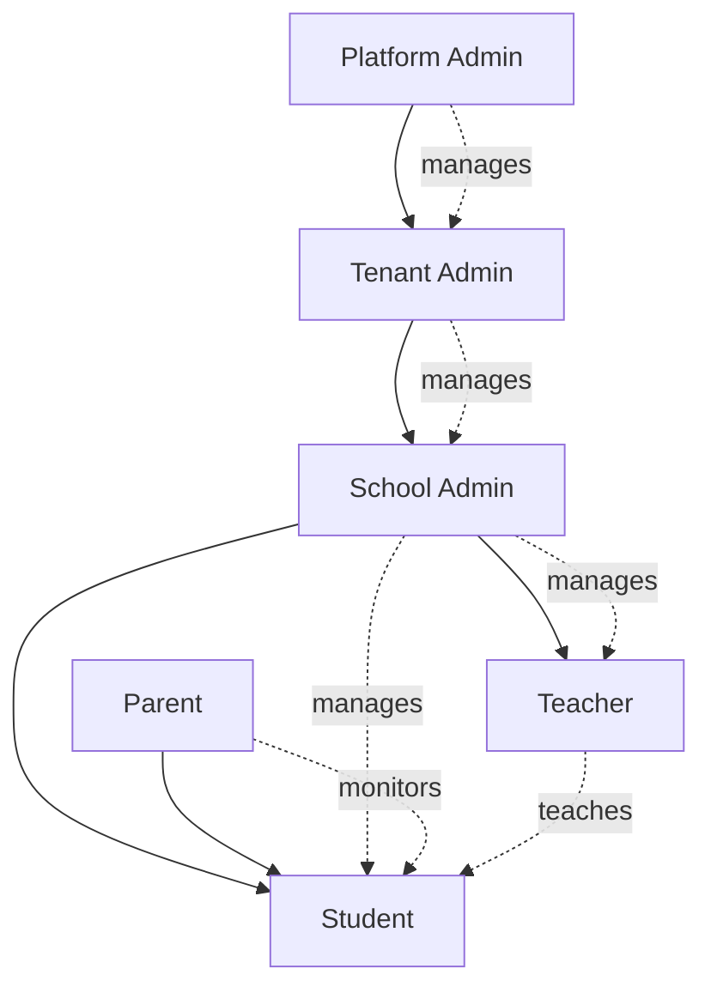
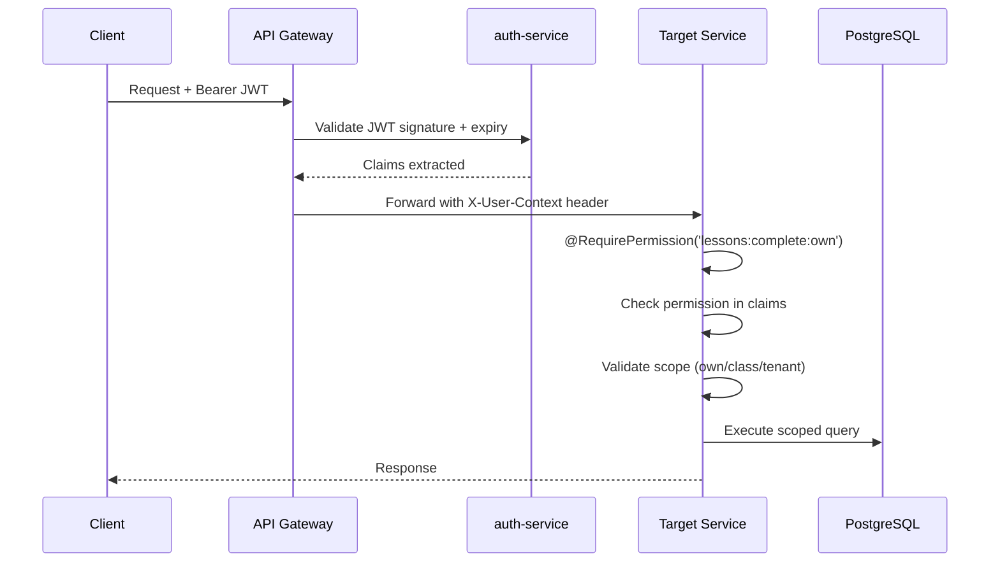

# EduAI — RBAC Design & Permission Matrix

**Document ID:** EDUAI-RBAC-001  
**Version:** 1.0.0  
**Date:** June 2025

---

## 1. Overview

EduAI implements **Role-Based Access Control (RBAC)** with:

- **Roles** assigned to users (a user may hold multiple roles)
- **Permissions** as granular action codes
- **Scope** constraints (tenant, school, class level)
- **JWT claims** carrying roles and flattened permissions
- **Guards** enforcing permissions at API and UI levels

---

## 2. Role Hierarchy



### 2.1 Role Definitions

| Role | Code | Description | Scope |
|------|------|-------------|-------|
| Platform Admin | `platform_admin` | EduAI internal ops | Global (all tenants) |
| Tenant Admin | `tenant_admin` | White-label partner admin | Single tenant |
| School Admin | `school_admin` | School principal/administrator | Single school |
| Teacher | `teacher` | Classroom teacher | Assigned classes |
| Student | `student` | Learner | Own data + class resources |
| Parent | `parent` | Guardian | Linked student data |
| Content Admin | `content_admin` | CMS content manager | Platform or tenant content |
| Support Agent | `support_agent` | Customer support (read-mostly) | Assigned tenants |

---

## 3. Permission Model

### 3.1 Permission Code Format

```
{resource}:{action}:{scope?}

Examples:
  users:read:tenant       — Read users within tenant
  lessons:complete:own    — Complete own lessons
  attendance:write:class  — Mark attendance for assigned class
  tenants:manage:global   — Platform-level tenant management
```

### 3.2 Scope Levels

| Scope | Description |
|-------|-------------|
| `global` | Platform-wide (platform_admin only) |
| `tenant` | Within user's tenant |
| `school` | Within user's school |
| `class` | Within assigned class(es) |
| `own` | User's own resources only |
| `linked` | Linked accounts (parent → child) |

---

## 4. Complete Permission Matrix

### 4.1 User Management

| Permission | Platform Admin | Tenant Admin | School Admin | Teacher | Student | Parent |
|------------|:---:|:---:|:---:|:---:|:---:|:---:|
| `users:create:tenant` | ✅ | ✅ | ✅ | ❌ | ❌ | ❌ |
| `users:read:tenant` | ✅ | ✅ | ✅ | ❌ | ❌ | ❌ |
| `users:read:school` | ✅ | ✅ | ✅ | ✅* | ❌ | ❌ |
| `users:read:class` | ✅ | ✅ | ✅ | ✅ | ❌ | ❌ |
| `users:read:own` | ✅ | ✅ | ✅ | ✅ | ✅ | ✅ |
| `users:update:tenant` | ✅ | ✅ | ❌ | ❌ | ❌ | ❌ |
| `users:update:school` | ✅ | ✅ | ✅ | ❌ | ❌ | ❌ |
| `users:update:own` | ✅ | ✅ | ✅ | ✅ | ✅ | ✅ |
| `users:delete:tenant` | ✅ | ✅ | ❌ | ❌ | ❌ | ❌ |
| `users:assign_role:school` | ✅ | ✅ | ✅ | ❌ | ❌ | ❌ |
| `users:link_parent:own` | ❌ | ❌ | ❌ | ❌ | ❌ | ✅ |

*Teacher sees students in assigned classes only

### 4.2 Learning & Content

| Permission | Platform Admin | Tenant Admin | School Admin | Teacher | Student | Parent |
|------------|:---:|:---:|:---:|:---:|:---:|:---:|
| `content:create:tenant` | ✅ | ✅ | ❌ | ❌ | ❌ | ❌ |
| `content:read:tenant` | ✅ | ✅ | ✅ | ✅ | ✅ | ❌ |
| `content:publish:tenant` | ✅ | ✅ | ❌ | ❌ | ❌ | ❌ |
| `lessons:read:class` | ✅ | ✅ | ✅ | ✅ | ✅ | ❌ |
| `lessons:complete:own` | ❌ | ❌ | ❌ | ❌ | ✅ | ❌ |
| `lessons:assign:class` | ✅ | ✅ | ✅ | ✅ | ❌ | ❌ |
| `progress:read:own` | ✅ | ✅ | ✅ | ✅ | ✅ | ❌ |
| `progress:read:class` | ✅ | ✅ | ✅ | ✅ | ❌ | ❌ |
| `progress:read:linked` | ❌ | ❌ | ❌ | ❌ | ❌ | ✅ |

### 4.3 AI Features

| Permission | Platform Admin | Tenant Admin | School Admin | Teacher | Student | Parent |
|------------|:---:|:---:|:---:|:---:|:---:|:---:|
| `ai:tutor:use:own` | ✅ | ✅ | ✅ | ✅ | ✅* | ❌ |
| `ai:homework:use:own` | ✅ | ✅ | ✅ | ✅ | ✅* | ❌ |
| `ai:qpg:use:school` | ✅ | ✅ | ✅ | ✅ | ❌ | ❌ |
| `ai:planner:use:own` | ✅ | ✅ | ✅ | ✅ | ✅* | ❌ |
| `ai:quota:manage:tenant` | ✅ | ✅ | ❌ | ❌ | ❌ | ❌ |
| `ai:conversations:read:own` | ✅ | ✅ | ✅ | ✅ | ✅ | ❌ |

*Subject to subscription tier quota

### 4.4 Assessment

| Permission | Platform Admin | Tenant Admin | School Admin | Teacher | Student | Parent |
|------------|:---:|:---:|:---:|:---:|:---:|:---:|
| `assessments:create:class` | ✅ | ✅ | ✅ | ✅ | ❌ | ❌ |
| `assessments:take:own` | ❌ | ❌ | ❌ | ❌ | ✅ | ❌ |
| `assessments:grade:class` | ✅ | ✅ | ✅ | ✅ | ❌ | ❌ |
| `assessments:read:own` | ✅ | ✅ | ✅ | ✅ | ✅ | ❌ |
| `assessments:read:class` | ✅ | ✅ | ✅ | ✅ | ❌ | ❌ |
| `assessments:read:linked` | ❌ | ❌ | ❌ | ❌ | ❌ | ✅ |
| `mock_tests:take:own` | ❌ | ❌ | ❌ | ❌ | ✅ | ❌ |

### 4.5 School ERP

| Permission | Platform Admin | Tenant Admin | School Admin | Teacher | Student | Parent |
|------------|:---:|:---:|:---:|:---:|:---:|:---:|
| `attendance:write:class` | ✅ | ✅ | ✅ | ✅ | ❌ | ❌ |
| `attendance:read:school` | ✅ | ✅ | ✅ | ✅* | ❌ | ❌ |
| `attendance:read:linked` | ❌ | ❌ | ❌ | ❌ | ❌ | ✅ |
| `fees:manage:school` | ✅ | ✅ | ✅ | ❌ | ❌ | ❌ |
| `fees:pay:linked` | ❌ | ❌ | ❌ | ❌ | ❌ | ✅ |
| `timetable:manage:school` | ✅ | ✅ | ✅ | ❌ | ❌ | ❌ |
| `timetable:read:school` | ✅ | ✅ | ✅ | ✅ | ✅ | ❌ |
| `enrollment:manage:school` | ✅ | ✅ | ✅ | ❌ | ❌ | ❌ |

### 4.6 Gamification

| Permission | Platform Admin | Tenant Admin | School Admin | Teacher | Student | Parent |
|------------|:---:|:---:|:---:|:---:|:---:|:---:|
| `gamification:read:own` | ✅ | ✅ | ✅ | ✅ | ✅ | ❌ |
| `gamification:read:class` | ✅ | ✅ | ✅ | ✅ | ✅ | ❌ |
| `gamification:configure:school` | ✅ | ✅ | ✅ | ❌ | ❌ | ❌ |
| `leaderboard:read:class` | ✅ | ✅ | ✅ | ✅ | ✅ | ❌ |

### 4.7 Billing & Subscription

| Permission | Platform Admin | Tenant Admin | School Admin | Teacher | Student | Parent |
|------------|:---:|:---:|:---:|:---:|:---:|:---:|
| `billing:manage:own` | ✅ | ✅ | ✅ | ✅ | ❌ | ✅ |
| `billing:manage:tenant` | ✅ | ✅ | ❌ | ❌ | ❌ | ❌ |
| `billing:read:school` | ✅ | ✅ | ✅ | ❌ | ❌ | ❌ |
| `billing:manage:linked` | ❌ | ❌ | ❌ | ❌ | ❌ | ✅ |

### 4.8 Admin & Platform

| Permission | Platform Admin | Tenant Admin | School Admin | Teacher | Student | Parent |
|------------|:---:|:---:|:---:|:---:|:---:|:---:|
| `tenants:manage:global` | ✅ | ❌ | ❌ | ❌ | ❌ | ❌ |
| `tenants:read:own` | ✅ | ✅ | ❌ | ❌ | ❌ | ❌ |
| `tenants:configure:own` | ✅ | ✅ | ❌ | ❌ | ❌ | ❌ |
| `audit:read:tenant` | ✅ | ✅ | ✅ | ❌ | ❌ | ❌ |
| `audit:read:global` | ✅ | ❌ | ❌ | ❌ | ❌ | ❌ |
| `analytics:read:tenant` | ✅ | ✅ | ❌ | ❌ | ❌ | ❌ |
| `analytics:read:school` | ✅ | ✅ | ✅ | ✅* | ❌ | ❌ |
| `analytics:read:global` | ✅ | ❌ | ❌ | ❌ | ❌ | ❌ |
| `notifications:send:school` | ✅ | ✅ | ✅ | ✅ | ❌ | ❌ |
| `consent:manage:linked` | ❌ | ❌ | ❌ | ❌ | ❌ | ✅ |

---

## 5. Role-Permission Mapping (Database)

```sql
-- Core tables
CREATE TABLE roles (
    id UUID PRIMARY KEY DEFAULT gen_random_uuid(),
    code VARCHAR(50) NOT NULL,
    name VARCHAR(100) NOT NULL,
    description TEXT,
    tenant_id UUID REFERENCES tenants(id),  -- NULL = system role
    is_system BOOLEAN DEFAULT false,
    created_at TIMESTAMPTZ DEFAULT NOW(),
    updated_at TIMESTAMPTZ DEFAULT NOW(),
    deleted_at TIMESTAMPTZ,
    UNIQUE(code, tenant_id)
);

CREATE TABLE permissions (
    id UUID PRIMARY KEY DEFAULT gen_random_uuid(),
    code VARCHAR(100) NOT NULL UNIQUE,
    resource VARCHAR(50) NOT NULL,
    action VARCHAR(50) NOT NULL,
    scope VARCHAR(20) NOT NULL,
    description TEXT,
    created_at TIMESTAMPTZ DEFAULT NOW()
);

CREATE TABLE role_permissions (
    role_id UUID REFERENCES roles(id),
    permission_id UUID REFERENCES permissions(id),
    PRIMARY KEY (role_id, permission_id)
);

CREATE TABLE user_roles (
    id UUID PRIMARY KEY DEFAULT gen_random_uuid(),
    user_id UUID NOT NULL REFERENCES users(id),
    role_id UUID NOT NULL REFERENCES roles(id),
    school_id UUID REFERENCES schools(id),  -- scope constraint
    class_id UUID REFERENCES classes(id),   -- scope constraint
    granted_by UUID REFERENCES users(id),
    granted_at TIMESTAMPTZ DEFAULT NOW(),
    expires_at TIMESTAMPTZ,
    UNIQUE(user_id, role_id, school_id, class_id)
);
```

---

## 6. JWT Claims Structure

```json
{
  "sub": "usr_abc123",
  "email": "arjun@example.com",
  "tenant_id": "ten_dps_group",
  "school_id": "sch_dps_noida",
  "roles": ["student"],
  "permissions": [
    "lessons:read:class",
    "lessons:complete:own",
    "ai:tutor:use:own",
    "ai:homework:use:own",
    "assessments:take:own",
    "progress:read:own",
    "gamification:read:own"
  ],
  "class_ids": ["cls_8a"],
  "linked_student_ids": [],
  "subscription_tier": "plus",
  "iat": 1718880000,
  "exp": 1718880900
}
```

---

## 7. Authorization Flow



---

## 8. NestJS Guard Implementation

```typescript
// permission.decorator.ts
export const RequirePermission = (...permissions: string[]) =>
  SetMetadata('permissions', permissions);

// permission.guard.ts
@Injectable()
export class PermissionGuard implements CanActivate {
  canActivate(context: ExecutionContext): boolean {
    const required = this.reflector.get<string[]>('permissions', context.getHandler());
    if (!required) return true;

    const { user } = context.switchToHttp().getRequest();
    return required.every(p => user.permissions.includes(p));
  }
}

// Usage
@Post(':id/complete')
@RequirePermission('lessons:complete:own')
async completeLesson(@Param('id') id: string, @CurrentUser() user: UserContext) {
  // Scope validation: ensure lesson belongs to user
  return this.learningService.complete(user.id, id);
}
```

---

## 9. UI-Level RBAC

Frontend hides/disables UI elements based on permissions:

```typescript
// usePermission hook
function usePermission(permission: string): boolean {
  const { user } = useAuth();
  return user.permissions.includes(permission);
}

// Component usage
{hasPermission('ai:qpg:use:school') && <QuestionPaperGeneratorButton />}
```

**Important:** UI hiding is UX only — all authorization enforced server-side.

---

## 10. Special Access Rules

| Scenario | Rule |
|----------|------|
| Parent viewing child progress | Requires `users:link_parent` relationship + `progress:read:linked` |
| Teacher grading | Requires `assessments:grade:class` + class assignment match |
| Platform admin impersonation | Requires `users:impersonate:tenant` + audit log entry |
| Content admin publishing | Requires `content:publish:tenant` + content review workflow |
| Minor account creation | Requires `consent:manage:linked` from parent first |
| AI quota override | Requires `ai:quota:manage:tenant` (tenant admin) |

---

## 11. Audit Requirements

All permission-sensitive actions logged:

```json
{
  "action": "attendance:write:class",
  "actor_id": "usr_teacher_123",
  "target_id": "cls_8a",
  "tenant_id": "ten_dps",
  "metadata": { "date": "2025-06-20", "present": 28, "absent": 2 },
  "ip_address": "203.0.113.42",
  "timestamp": "2025-06-20T09:15:00Z"
}
```

---

*Related: [Multi-Tenant Architecture](./multi-tenant-architecture.md) · [Security Architecture](../security/security-architecture.md)*
