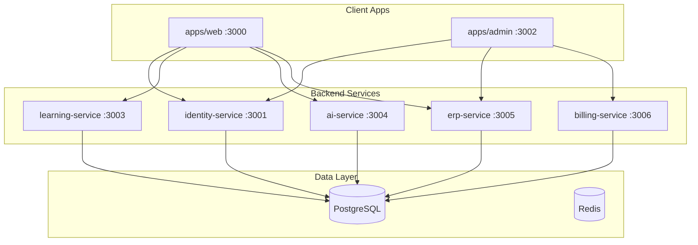
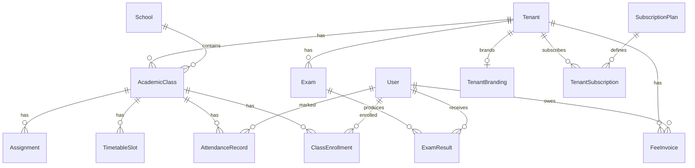

# Sprint 4 ERP Architecture

**Version:** 1.0  
**Services:** `erp-service` (:3005), `billing-service` (:3006)

---

## System Context

---

## ERD (Core ERP)

---

## API Contracts (ERP Service)

| Method | Path | Permission | Description |
|--------|------|------------|-------------|
| GET | `/classes` | attendance:read:school | List classes |
| GET | `/classes/mine` | attendance:write:class | Teacher classes |
| GET | `/classes/:id` | attendance:read:school | Class roster |
| POST | `/attendance` | attendance:write:class | Mark attendance |
| GET | `/attendance/class/:id` | attendance:read:school | Class attendance |
| GET | `/attendance/student/:id` | attendance:read:linked | Student attendance |
| GET | `/timetable/me` | authenticated | My schedule |
| GET | `/fees/me` | billing:manage:own | Student fees |
| GET | `/fees/children` | billing:manage:linked | Parent fees |
| GET | `/exams/student/:id/results` | assessments:read:linked | Exam results |
| POST | `/assignments` | lessons:assign:class | Create assignment |
| GET | `/teacher/dashboard` | attendance:write:class | Teacher KPIs |
| GET | `/parent/children/:id/dashboard` | progress:read:linked | Parent child view |
| GET | `/analytics/tenant` | analytics:read:tenant | Tenant analytics |

---

## API Contracts (Billing Service)

| Method | Path | Description |
|--------|------|-------------|
| GET | `/plans` | List subscription plans (public) |
| GET | `/subscriptions/me` | Tenant subscription |
| GET | `/invoices` | Billing invoices |
| POST | `/webhooks/stripe` | Stripe webhook handler |
| POST | `/webhooks/razorpay` | Razorpay webhook handler |
| GET | `/coupons/validate/:code` | Validate coupon |
| GET | `/crm/leads` | Lead management |
| GET | `/analytics/revenue` | MRR/ARR metrics |

---

## User Flows

### Teacher: Mark Attendance
1. Login → Teacher Dashboard
2. Navigate to Attendance
3. Select class → mark each student present/absent/late
4. Save → `POST /attendance` → activity log

### Parent: View Child Progress
1. Login → Parent Dashboard → link child
2. Open Child Dashboard
3. Aggregates attendance, fees, homework, exam results

### Admin: Revenue Overview
1. Login to admin → Revenue page
2. Fetches MRR/ARR from billing-service

---

## Multi-Tenant Isolation

- All ERP tables include `tenant_id`
- PostgreSQL RLS policies: `tenant_id = app_current_tenant_id()`
- `PrismaService.withTenantContext()` sets session variable
- Tenant types: `single_school`, `coaching_institute`, `franchise`, `white_label`

---

## Database Migrations

- `20250621100000_sprint4_erp` — ERP + billing + CRM tables
- `20250621110000_sprint4_rls` — Row Level Security policies

---

*Architecture approved for Sprint 4 implementation.*
