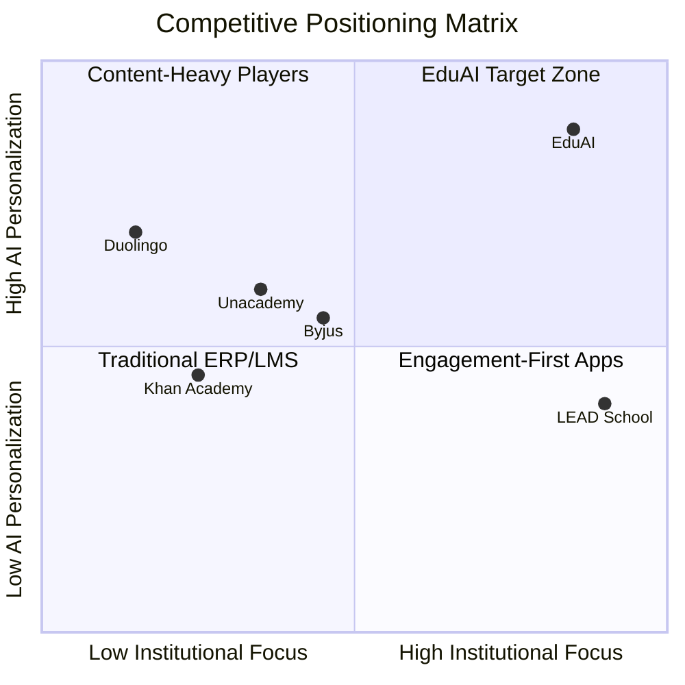
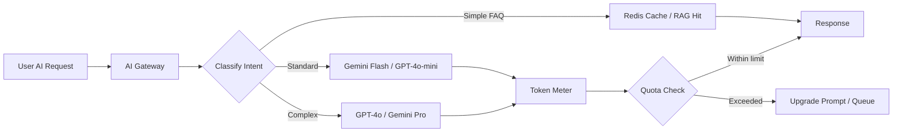

# EduAI — Business Requirements Document (BRD)

**Document ID:** EDUAI-BRD-001  
**Version:** 1.0.0  
**Status:** Approved for Pre-Development  
**Date:** June 2025  
**Owner:** Product & Business Strategy

---

## Executive Summary

EduAI is an AI-powered digital learning ecosystem designed for the Indian K-10 education market, serving **Classes 1–10** (and pre-primary age 3–6) across **CBSE, ICSE, and State Boards** in **English, Hindi, and Marathi** (with roadmap for Gujarati, Tamil, Telugu, and Kannada).

The platform addresses a fragmented ed-tech landscape where existing players excel in either content depth (Byju's), engagement (Duolingo), or institutional tools (school ERPs) — but rarely combine **personalized AI tutoring**, **multi-stakeholder portals**, **white-label SaaS**, and **board-aligned curriculum** in one cohesive product.

EduAI targets **1M+ students, 100K+ parents, 10K+ teachers, and 1K+ schools** as a scalable SaaS platform with B2C subscriptions, B2B school licensing, and white-label partnerships.

**Investment thesis:** Capture the post-pandemic digital learning permanence in India ($10B+ ed-tech market by 2027) with a platform that reduces teacher workload via AI while improving student outcomes through adaptive learning — compliant with India's **Digital Personal Data Protection (DPDP) Act 2023**.

---

## 1. Business Context

### 1.1 Problem Statement

| Stakeholder | Pain Point |
|-------------|------------|
| **Students** | One-size-fits-all content; limited 1:1 help; disengaging UX for younger learners |
| **Parents** | No visibility into daily progress; difficulty supporting homework; subscription fatigue |
| **Teachers** | Manual grading, question paper creation, attendance; no unified analytics |
| **Schools** | Fragmented tools (ERP + LMS + communication apps); high vendor lock-in; no white-label |
| **Platform operators** | High AI inference costs without usage controls; compliance complexity for child data |

### 1.2 Business Objectives

1. **Launch MVP** (Sprint 16) with core student, teacher, parent portals and AI tutor
2. **Achieve 10K paid B2C subscribers** within 12 months of GA
3. **Onboard 50 schools** (B2B) in Year 1 with average 500 students per school
4. **Maintain gross margin > 60%** through AI token cost management and tiered plans
5. **NPS ≥ 45** among parents; teacher time savings ≥ 5 hrs/week reported

### 1.3 Success Metrics (Business KPIs)

| KPI | Target (Year 1) | Measurement |
|-----|-----------------|-------------|
| Monthly Active Students (MAS) | 250K | Analytics |
| Paid Conversion Rate (B2C) | 8% freemium → paid | Billing |
| School Contract Value (ACV) | ₹8–15L/year | CRM |
| Churn Rate (B2C monthly) | < 5% | Subscription analytics |
| AI Cost per Active User | < ₹45/month | Token metering |
| Content Completion Rate | > 65% | Learning analytics |
| Teacher Adoption (per school) | > 80% active weekly | Portal analytics |

---

## 2. Market Analysis

### 2.1 Market Size

- **India K-12 digital learning:** ~$2.8B (2024), projected $6.5B by 2028 ( CAGR ~23%)
- **Addressable segments:** Urban + Tier-2 cities; 260M+ school-age children; 1.5M+ schools
- **Digital penetration:** Post-COVID baseline ~35% regular digital tool usage in urban schools

### 2.2 Competitive Positioning

| Competitor | Strengths | Weaknesses | EduAI Differentiation |
|------------|-----------|------------|----------------------|
| **Byju's** | Brand, video content depth | Cost, engagement drop-off, B2C focus | AI tutor + gamification + affordable tiers; school white-label |
| **Duolingo** | Gamification, streak psychology | Not curriculum-aligned for Indian boards | Board-aligned content with Duolingo-style engagement |
| **Unacademy** | Live classes, test prep | Less K-6 focus; limited ERP | Full K-10 + ERP + parent portal |
| **LEAD School** | B2B school integration | Limited AI personalization | AI ecosystem (tutor, QPG, planner) at scale |
| **Khan Academy** | Free, quality content | No Indian board alignment; no ERP | CBSE/ICSE/State mapped curriculum + Hindi/Marathi |

**EduAI positioning statement:**  
*"The only AI-native, board-aligned learning ecosystem that delights students like Duolingo, empowers teachers like an ERP, and scales for schools as white-label SaaS — built for India, compliant by design."*

### 2.3 Target Segments

| Segment | Profile | Go-to-Market |
|---------|---------|--------------|
| **B2C Direct** | Urban parents, Classes 3–10 | App store, SEO, influencer, freemium |
| **B2B Schools** | Private schools 500–3000 students | Direct sales, demos, pilot programs |
| **White-Label** | Ed-tech resellers, coaching chains | Partner API, custom branding |
| **Government (Phase 2)** | State board digitization | RFP, SI partnerships |

---

## 3. Revenue Model

### 3.1 B2C Subscription Tiers

| Plan | Price (INR/month) | Features |
|------|-------------------|----------|
| **Free** | ₹0 | Limited lessons/day, basic progress, ads-free trial content |
| **Student Plus** | ₹499 | Full curriculum, AI tutor (50 queries/day), mock tests |
| **Student Pro** | ₹899 | Unlimited AI, study planner, brain games, offline mobile |
| **Family** | ₹1,299 | Up to 3 student profiles, parent analytics dashboard |

Annual billing: 20% discount. UPI auto-pay via Razorpay.

### 3.2 B2B School Licensing

| Tier | Price (INR/student/year) | Includes |
|------|--------------------------|----------|
| **Starter** | ₹800 | LMS, teacher portal, basic analytics |
| **Professional** | ₹1,500 | + AI tutor quota, ERP lite, parent portal |
| **Enterprise** | ₹2,200 | + full ERP, white-label, API access, dedicated support |

Minimum contract: 200 students. Volume discounts above 1,000 students.

### 3.3 White-Label Partnership

- **Setup fee:** ₹5–15L (branding, domain, initial content mapping)
- **Revenue share:** 70/30 (partner/platform) or fixed per-seat licensing
- **SLA:** 99.9% uptime, dedicated tenant isolation

### 3.4 Ancillary Revenue (Phase 2)

- Premium content packs (olympiad, coding)
- Certified teacher training courses
- Marketplace for third-party content creators (30% platform fee)

---

## 4. AI Token Cost Management Strategy

AI inference is the largest variable cost. EduAI implements a **tiered, metered AI architecture**:

| Control | Implementation |
|---------|----------------|
| **Per-user daily quotas** | Free: 5 queries; Plus: 50; Pro: unlimited (fair use 500/day) |
| **Model routing** | Route 70% of queries to cheaper models via intent classification |
| **Response caching** | Semantic cache for repeated curriculum questions (Redis + vector store) |
| **RAG over fine-tuning** | Board-aligned content retrieval reduces prompt tokens by 60% |
| **Batch processing** | QPG and mock test generation run async via job queue |
| **Cost dashboards** | Real-time token spend per tenant, school, user — admin alerts at 80% budget |
| **Pre-generated content** | 80% of Class 1–4 interactions use pre-authored responses |

**Target:** AI COGS < 25% of subscription ARPU at scale.

---

## 5. Regulatory & Compliance

### 5.1 DPDP Act 2023 (India)

| Requirement | EduAI Implementation |
|-------------|---------------------|
| Consent | Explicit consent flows; parental consent for minors |
| Purpose limitation | Data used only for stated educational purposes |
| Data minimization | Collect only required fields; pseudonymize analytics |
| Right to erasure | Self-service deletion with 30-day grace; audit trail retained |
| Data breach notification | Incident response plan; notify within 72 hours |
| Data Protection Officer | Appointed DPO; privacy policy in English + Hindi |

### 5.2 Data Residency

- **Primary region:** AWS `ap-south-1` (Mumbai)
- **PII storage:** India-only; no cross-border transfer without explicit consent
- **Backups:** Encrypted, geo-restricted to India regions

### 5.3 Child Safety

- COPPA-inspired practices (India has no COPPA but aligns with best practices)
- No behavioral advertising to minors
- Content moderation on AI outputs (guardrails + human review queue)
- Age-gated features; chat logs retained 90 days max

### 5.4 Accessibility

- WCAG 2.1 AA compliance target
- Screen reader support, high contrast, font scaling
- Regional language support for UI and content

---

## 6. Scope

### 6.1 In Scope (Phase 1 — Sprints 1–16)

- Multi-tenant SaaS with white-label branding
- Auth (RBAC, JWT, multi-device)
- Student, Parent, Teacher, Admin portals (web)
- Smart Learning Hub + Class 1–4, 5–7, 8–10 systems
- Brain Development & Skill Development modules
- AI Ecosystem: Tutor, Homework Assistant, QPG, Mock Tests, Study Planner
- School ERP (attendance, fees, timetable — core modules)
- Gamification (XP, badges, streaks, leaderboards)
- React Native mobile app (core flows)
- English, Hindi, Marathi UI and content framework
- CBSE, ICSE, State Board content structure
- Payments (Razorpay primary)

### 6.2 Out of Scope (Phase 1)

- Live 1:1 video tutoring marketplace
- Full government tender compliance (Phase 2)
- Gujarati, Tamil, Telugu, Kannada content (Phase 2 — framework ready)
- Blockchain certificates
- Hardware integrations (smart boards)

---

## 7. Stakeholders

| Stakeholder | Interest | Engagement |
|-------------|----------|------------|
| CEO / Founders | Vision, funding, partnerships | Monthly steering |
| Product | Roadmap, prioritization | Sprint ceremonies |
| Engineering | Architecture, delivery | Daily standups |
| Design | UX, design system | Sprint design reviews |
| Sales (B2B) | School pilots | Quarterly roadmap preview |
| Legal / Compliance | DPDP, contracts | Milestone reviews |
| Customer Success | Onboarding, retention | Post-launch |

---

## 8. Risks & Mitigations

| Risk | Impact | Probability | Mitigation |
|------|--------|-------------|------------|
| AI cost overrun | High | Medium | Token metering, model routing, caching |
| Slow school sales cycles | High | High | B2C parallel track; pilot program incentives |
| Content creation bottleneck | High | Medium | AI-assisted authoring; partner content deals |
| Competitor price war | Medium | High | Differentiate on AI + ERP + white-label |
| DPDP non-compliance | High | Low | Privacy-by-design; legal review each sprint |
| Scale infrastructure failure | High | Low | K8s auto-scaling; load testing Sprint 15 |

---

## 9. Budget Overview (Year 1 Estimate)

| Category | Allocation |
|----------|------------|
| Engineering (12 FTE) | 45% |
| Content & Curriculum | 20% |
| AI / Cloud Infrastructure | 15% |
| Sales & Marketing | 12% |
| Design & QA | 8% |

---

## 10. Approval

| Role | Name | Signature | Date |
|------|------|-----------|------|
| CEO | _TBD_ | | |
| Product Owner | _TBD_ | | |
| Tech Lead | _TBD_ | | |
| Legal | _TBD_ | | |

---

## Appendix A: Glossary

| Term | Definition |
|------|------------|
| **Tenant** | Top-level SaaS customer (platform, white-label partner, or direct school group) |
| **School** | Institution within a tenant |
| **Board** | Curriculum authority (CBSE, ICSE, State) |
| **RAG** | Retrieval-Augmented Generation for AI responses |
| **White-label** | Custom branding per tenant (logo, colors, domain) |

---

*Next document: [Product Requirements Document (PRD)](../prd/product-requirements-document.md)*
