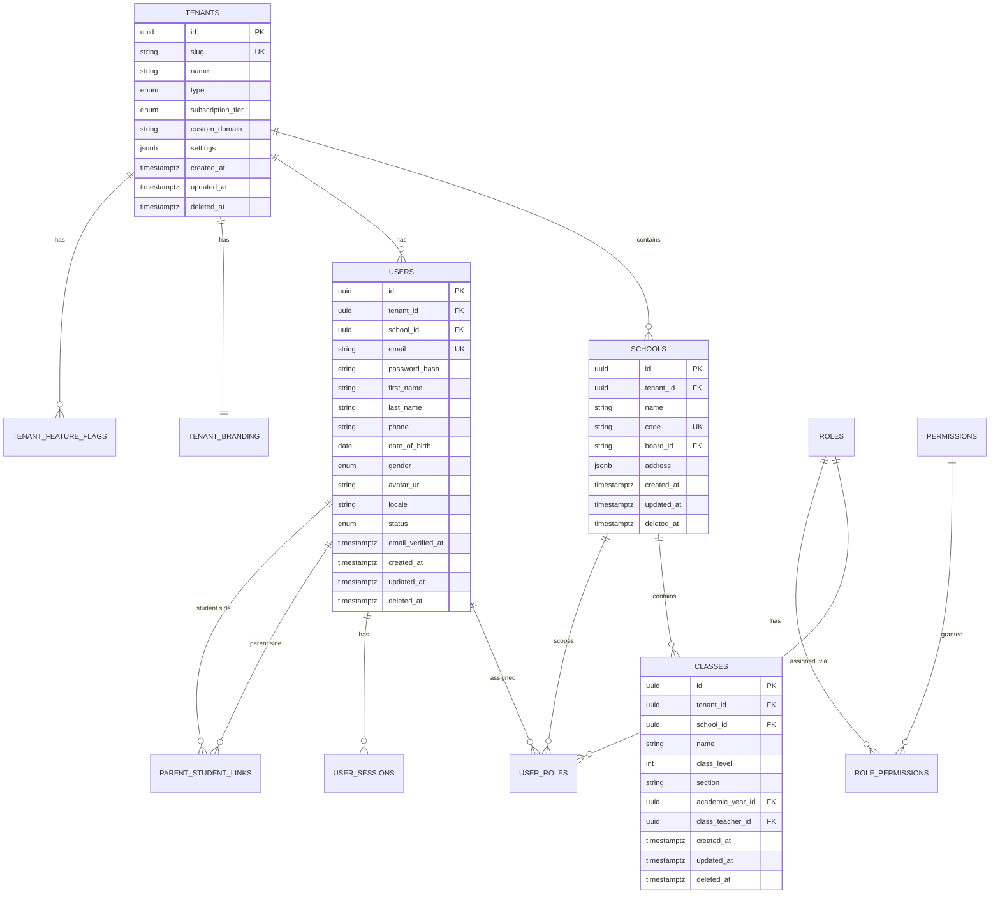
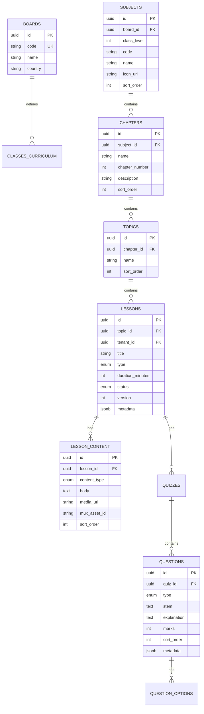
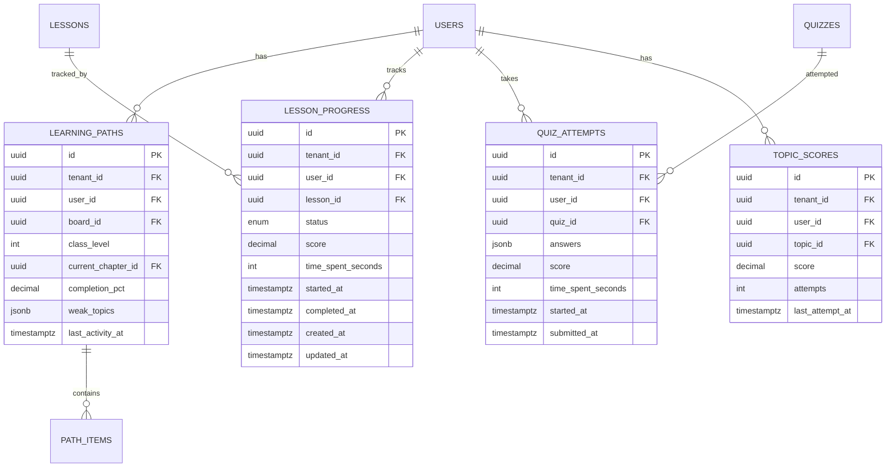
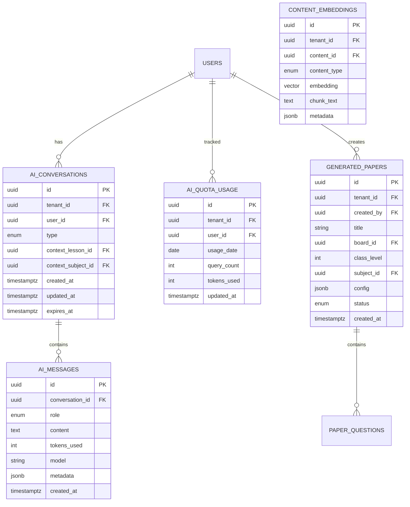
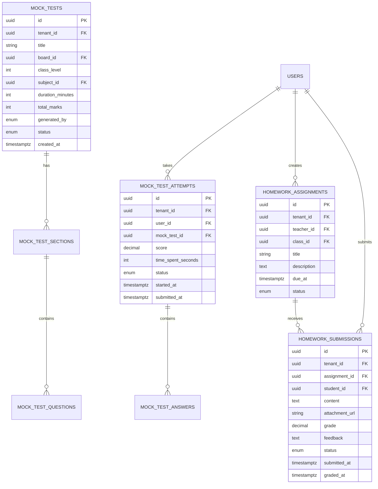
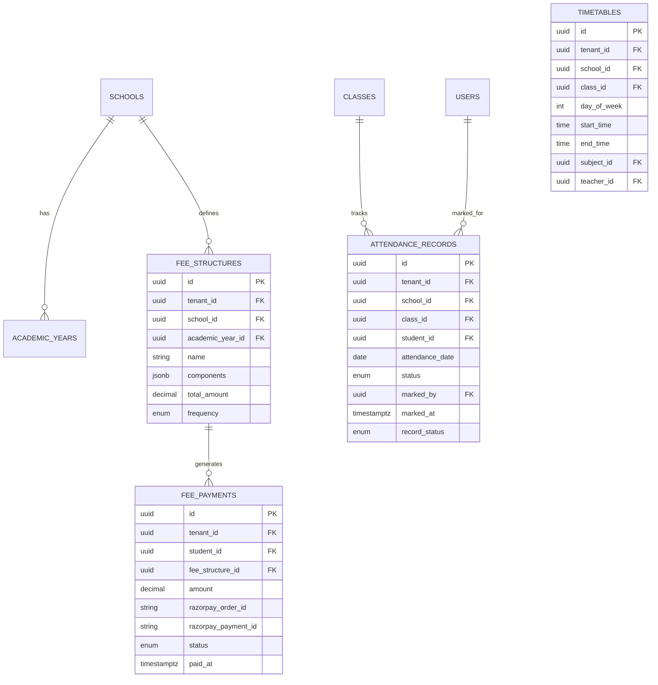
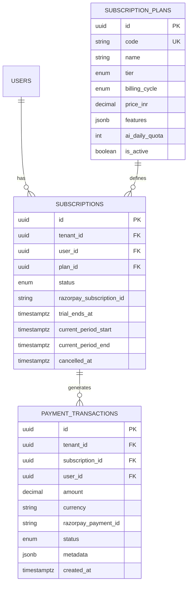
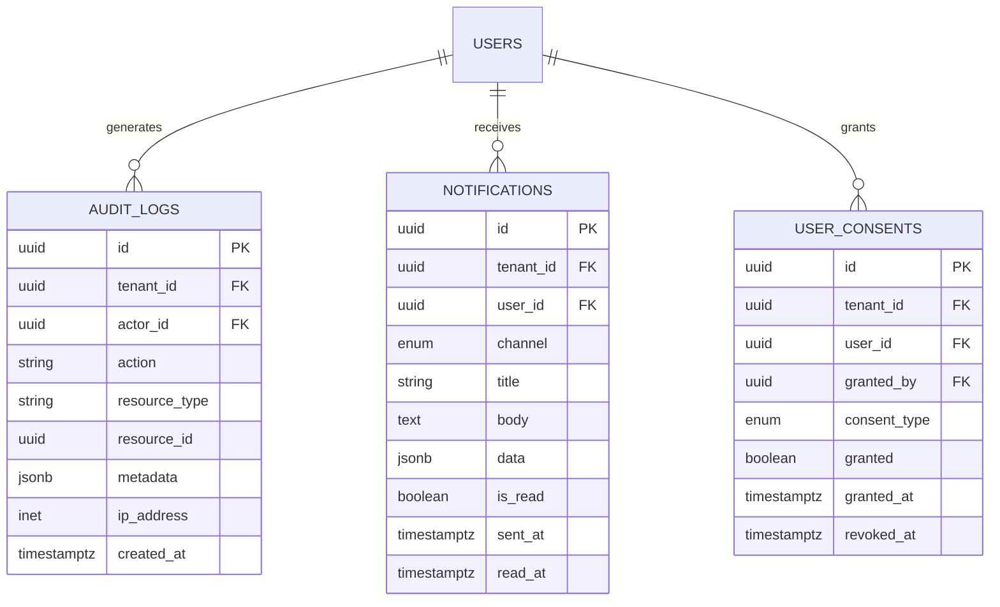

# EduAI — Entity Relationship Diagram (ERD)

**Document ID:** EDUAI-ERD-001  
**Version:** 1.0.0  
**Date:** June 2025

---

## 1. Overview

This document defines the core entity relationships for EduAI's PostgreSQL database. All tenant-scoped tables include `tenant_id`. All tables include audit columns (`created_at`, `updated_at`, `deleted_at`).

---

## 2. Core Platform ERD



---

## 3. Curriculum & Content ERD



---

## 4. Learning Progress ERD



---

## 5. AI Ecosystem ERD



---

## 6. Assessment & Mock Tests ERD



---

## 7. Gamification ERD

```mermaid
erDiagram
    USERS ||--|| USER_XP : has
    USERS ||--o{ USER_BADGES : earns
    USERS ||--|| USER_STREAKS : has
    BADGES ||--o{ USER_BADGES : awarded
    
    USER_XP {
        uuid id PK
        uuid tenant_id FK
        uuid user_id FK UK
        int total_xp
        int current_level
        timestamptz updated_at
    }
    
    BADGES {
        uuid id PK
        uuid tenant_id FK
        string code UK
        string name
        string description
        string icon_url
        jsonb criteria
        int xp_reward
        enum category
    }
    
    USER_BADGES {
        uuid id PK
        uuid tenant_id FK
        uuid user_id FK
        uuid badge_id FK
        timestamptz earned_at
    }
    
    USER_STREAKS {
        uuid id PK
        uuid tenant_id FK
        uuid user_id FK UK
        int current_streak
        int longest_streak
        date last_activity_date
        int freeze_tokens
        timestamptz updated_at
    }
```

---

## 8. ERP ERD



---

## 9. Billing & Subscription ERD



---

## 10. Audit & Notifications ERD



---

## 11. Key Relationships Summary

| Relationship | Cardinality | Notes |
|--------------|-------------|-------|
| Tenant → Schools | 1:N | School belongs to one tenant |
| Tenant → Users | 1:N | User belongs to one tenant |
| School → Classes | 1:N | Class belongs to one school |
| User → Roles | M:N | Via user_roles with scope |
| Parent → Student | M:N | Via parent_student_links |
| Subject → Chapters → Topics → Lessons | 1:N chain | Curriculum hierarchy |
| User → Lesson Progress | 1:N | One progress record per lesson per user |
| User → AI Conversations | 1:N | Multiple conversation threads |
| Class → Homework Assignments | 1:N | Teacher assigns to class |
| User → Subscriptions | 1:N | History of subscriptions |

---

## 12. Indexing Strategy

| Table | Index | Purpose |
|-------|-------|---------|
| All tenant tables | `(tenant_id)` | Tenant isolation queries |
| users | `(tenant_id, email)` UNIQUE | Login lookup |
| users | `(tenant_id, school_id)` | School user lists |
| lesson_progress | `(tenant_id, user_id, lesson_id)` UNIQUE | Progress lookup |
| attendance_records | `(tenant_id, class_id, attendance_date)` | Daily attendance |
| ai_quota_usage | `(tenant_id, user_id, usage_date)` UNIQUE | Quota check |
| audit_logs | `(tenant_id, created_at DESC)` | Audit queries |
| content_embeddings | `(embedding vector_cosine_ops)` | RAG similarity search |

---

*Related: [Database Schema](./database-schema.md) · [Multi-Tenant Architecture](../architecture/multi-tenant-architecture.md)*
