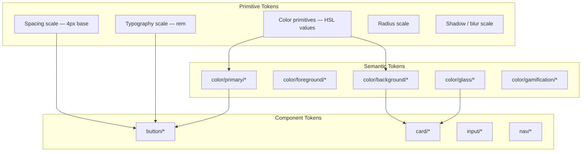

# EduAI — Design System

**Document ID:** EDUAI-DS-001  
**Version:** 1.0.0  
**Date:** June 2025  
**Owner:** Design Systems Team  
**Stack:** Next.js 15 · Shadcn/ui · Tailwind CSS · Material Design 3 · Google Stitch

---

## 1. Overview

The EduAI Design System defines visual language, interaction patterns, and implementation tokens for a multi-tenant, multi-portal learning platform serving 1M+ students. It merges Material Design 3 (MD3) semantic structure with Google Stitch-inspired generative UI polish, Duolingo-style engagement micro-interactions, and glass morphism surface treatment — all while meeting WCAG 2.1 AA accessibility standards.

### 1.1 Design Goals

1. **Age-adaptive** — Visual density scales from playful (Class 1–4) to exam-focused (Class 8–10) using shared tokens.
2. **Tenant-flexible** — White-label partners override brand colors without breaking contrast or glass effects.
3. **Implementation-aligned** — Every token maps to Tailwind utilities and CSS custom properties in code.
4. **Accessible by default** — Color pairs, focus states, and motion preferences baked into foundations.
5. **Engaging, not distracting** — Gamification accents use semantic success/warning colors, not arbitrary rainbow palettes.

---

## 2. Design Token Architecture



Tokens are defined in three layers:
- **Primitive** — Raw values (never used directly in components)
- **Semantic** — Role-based (background, primary, destructive)
- **Component** — Scoped overrides (button-primary-background)

---

## 3. Color System

### 3.1 Color Format

All colors stored as **HSL without `hsl()` wrapper** for Tailwind alpha support:

```css
/* globals.css */
:root {
  --primary: 262 83% 58%;
  --primary-foreground: 0 0% 100%;
}
```

Usage: `bg-primary` → `hsl(var(--primary))`

### 3.2 Brand Palette (EduAI Default)

| Token | Light Mode HSL | Hex (approx) | Usage |
|-------|----------------|----------------|-------|
| `--primary` | 262 83% 58% | #7C3AED | CTAs, active nav, links |
| `--primary-foreground` | 0 0% 100% | #FFFFFF | Text on primary |
| `--secondary` | 220 14% 96% | #F1F5F9 | Secondary surfaces |
| `--secondary-foreground` | 220 9% 46% | #64748B | Text on secondary |
| `--accent` | 172 66% 50% | #2DD4BF | Highlights, streaks, XP |
| `--accent-foreground` | 172 66% 15% | #134E4A | Text on accent |
| `--destructive` | 0 84% 60% | #EF4444 | Errors, destructive actions |
| `--success` | 142 71% 45% | #22C55E | Correct answers, completion |
| `--warning` | 38 92% 50% | #F59E0B | Due dates, streak at risk |
| `--info` | 199 89% 48% | #0EA5E9 | Informational banners |

### 3.3 Surface Colors (Light Mode)

| Token | HSL | Usage |
|-------|-----|-------|
| `--background` | 0 0% 100% | Page background |
| `--foreground` | 224 71% 4% | Primary text |
| `--card` | 0 0% 100% | Card backgrounds |
| `--card-foreground` | 224 71% 4% | Card text |
| `--muted` | 220 14% 96% | Subtle backgrounds |
| `--muted-foreground` | 220 9% 46% | Secondary text, placeholders |
| `--border` | 220 13% 91% | Borders, dividers |
| `--input` | 220 13% 91% | Input borders |
| `--ring` | 262 83% 58% | Focus rings |

### 3.4 Surface Colors (Dark Mode)

| Token | HSL | Usage |
|-------|-----|-------|
| `--background` | 224 71% 4% | Page background |
| `--foreground` | 210 20% 98% | Primary text |
| `--card` | 224 47% 8% | Card backgrounds |
| `--card-foreground` | 210 20% 98% | Card text |
| `--muted` | 215 28% 12% | Subtle backgrounds |
| `--muted-foreground` | 217 10% 65% | Secondary text |
| `--border` | 215 28% 17% | Borders |
| `--input` | 215 28% 17% | Input borders |
| `--primary` | 262 83% 65% | Slightly lighter for dark contrast |
| `--ring` | 262 83% 65% | Focus rings |

### 3.5 Gamification Colors

Duolingo-inspired but semantically mapped:

| Token | HSL | Usage |
|-------|-----|-------|
| `--xp` | 45 93% 47% | XP bars, level indicators |
| `--xp-foreground` | 45 93% 15% | Text on XP surfaces |
| `--streak` | 25 95% 53% | Streak flame, fire icon |
| `--streak-glow` | 25 95% 53% / 0.4 | Streak widget glow |
| `--badge-gold` | 45 93% 47% | Gold tier badges |
| `--badge-silver` | 220 9% 65% | Silver tier badges |
| `--badge-bronze` | 25 60% 45% | Bronze tier badges |
| `--leaderboard-up` | 142 71% 45% | Rank improvement |
| `--leaderboard-down` | 0 84% 60% | Rank decline |

### 3.6 Tenant White-Label Overrides

Tenants override only these tokens at runtime via CSS injection:

```css
[data-tenant="dps-pune"] {
  --primary: 217 91% 45%;        /* School blue */
  --primary-foreground: 0 0% 100%;
  --accent: 45 93% 47%;          /* Keep gamification accent OR override */
  --ring: 217 91% 45%;
}
```

**Constraint:** Tenant primary must pass WCAG AA contrast (4.5:1) against `--primary-foreground`. Validation runs in tenant branding admin panel.

---

## 4. Glass Morphism Guidelines

Glass morphism is EduAI's signature surface treatment — modern, depth-aware, and compatible with both light and dark modes.

### 4.1 Glass Token Set

| Token | Light Mode | Dark Mode |
|-------|------------|-----------|
| `--glass-bg` | `0 0% 100% / 0.7` | `224 47% 8% / 0.6` |
| `--glass-border` | `0 0% 100% / 0.3` | `0 0% 100% / 0.08` |
| `--glass-blur` | `16px` | `16px` |
| `--glass-shadow` | `0 8px 32px hsl(224 71% 4% / 0.08)` | `0 8px 32px hsl(0 0% 0% / 0.3)` |

### 4.2 Glass Card Implementation

```css
.glass-card {
  background: hsl(var(--glass-bg));
  backdrop-filter: blur(var(--glass-blur));
  -webkit-backdrop-filter: blur(var(--glass-blur));
  border: 1px solid hsl(var(--glass-border));
  box-shadow: var(--glass-shadow);
  border-radius: var(--radius-lg);
}
```

Tailwind utility (in `tailwind.config.ts`):

```typescript
glass: {
  DEFAULT: 'bg-glass-bg backdrop-blur-glass border border-glass-border shadow-glass',
  sm: '...',  // reduced blur (8px) for nested elements
  lg: '...',  // increased blur (24px) for hero cards
}
```

### 4.3 When to Use Glass

| Use Glass | Avoid Glass |
|-----------|-------------|
| Dashboard widgets | Data tables (use solid `--card`) |
| Floating nav / header | Form inputs (use solid for clarity) |
| Modal overlays | Long-form text content areas |
| AI chat bubbles (assistant) | Accessibility-critical warnings |
| Streak / XP celebration cards | Print / PDF report views |

### 4.4 Glass + Background Requirements

Glass surfaces require a **gradient or textured background** behind them to show the blur effect:

```css
.portal-background {
  background:
    radial-gradient(ellipse at 20% 50%, hsl(262 83% 58% / 0.08) 0%, transparent 50%),
    radial-gradient(ellipse at 80% 20%, hsl(172 66% 50% / 0.06) 0%, transparent 50%),
    hsl(var(--background));
}
```

Dark mode uses lower opacity gradients (0.04–0.06).

### 4.5 Fallback (Reduced Transparency)

For `prefers-reduced-transparency` or browsers without `backdrop-filter` support:

```css
@media (prefers-reduced-transparency: reduce) {
  .glass-card {
    backdrop-filter: none;
    background: hsl(var(--card));
    border: 1px solid hsl(var(--border));
  }
}
```

---

## 5. Typography

### 5.1 Font Stack

| Role | Font | Fallback | Notes |
|------|------|----------|-------|
| Primary (UI) | **Inter** | system-ui, sans-serif | Latin + Devanagari via subset |
| Devanagari | **Noto Sans Devanagari** | sans-serif | Hindi, Marathi body text |
| Display (Headlines) | **Plus Jakarta Sans** | Inter, sans-serif | Marketing, dashboard greetings |
| Monospace | **JetBrains Mono** | monospace | Code blocks (coding skills module) |
| Dyslexia-friendly | **OpenDyslexic** | sans-serif | Optional user setting |

Google Fonts loaded via `next/font` with `display: swap`.

### 5.2 Type Scale (MD3-Aligned)

| Token | Size | Line Height | Weight | Tailwind | Usage |
|-------|------|-------------|--------|----------|-------|
| `display-lg` | 3.5625rem (57px) | 1.12 | 400 | `text-display-lg` | Marketing hero |
| `display-md` | 2.8125rem (45px) | 1.16 | 400 | `text-display-md` | Portal welcome |
| `display-sm` | 2.25rem (36px) | 1.22 | 400 | `text-display-sm` | Section heroes |
| `headline-lg` | 2rem (32px) | 1.25 | 600 | `text-headline-lg` | Page titles |
| `headline-md` | 1.75rem (28px) | 1.29 | 600 | `text-headline-md` | Card headers |
| `headline-sm` | 1.5rem (24px) | 1.33 | 600 | `text-headline-sm` | Widget titles |
| `title-lg` | 1.375rem (22px) | 1.27 | 500 | `text-title-lg` | Dialog titles |
| `title-md` | 1rem (16px) | 1.5 | 500 | `text-title-md` | List item titles |
| `title-sm` | 0.875rem (14px) | 1.43 | 500 | `text-title-sm` | Compact labels |
| `body-lg` | 1rem (16px) | 1.5 | 400 | `text-body-lg` | Primary body |
| `body-md` | 0.875rem (14px) | 1.43 | 400 | `text-body-md` | Secondary body |
| `body-sm` | 0.75rem (12px) | 1.33 | 400 | `text-body-sm` | Captions, metadata |
| `label-lg` | 0.875rem (14px) | 1.43 | 500 | `text-label-lg` | Button text |
| `label-md` | 0.75rem (12px) | 1.33 | 500 | `text-label-md` | Chips, badges |
| `label-sm` | 0.6875rem (11px) | 1.45 | 500 | `text-label-sm` | Overline text |

### 5.3 Age Band Typography Adjustments

| Band | Base Body | Touch Label Min | Notes |
|------|-----------|-------------------|-------|
| Pre-primary / 1–4 | `body-lg` (16px) | 16px | Larger display for headings (+2px) |
| 5–7 | `body-lg` (16px) | 14px | Standard scale |
| 8–10 | `body-md` (14px) | 14px | Compact for data density |
| Parent / Teacher / Admin | `body-md` (14px) | 14px | Data-dense dashboards |

### 5.4 i18n Typography Rules

| Language | Font Override | Line Height Adjustment | Expansion Factor |
|----------|---------------|------------------------|------------------|
| English (en-IN) | Inter | Default | 1.0× (baseline) |
| Hindi (hi-IN) | Noto Sans Devanagari | +0.05 | ~1.3× width |
| Marathi (mr-IN) | Noto Sans Devanagari | +0.05 | ~1.3× width |

Buttons and nav items use `min-width` instead of fixed width to accommodate Devanagari text.

---

## 6. Spacing & Layout

### 6.1 Spacing Scale (4px Base)

| Token | Value | Tailwind | Usage |
|-------|-------|----------|-------|
| `space-0` | 0px | `0` | — |
| `space-0.5` | 2px | `0.5` | Hairline gaps |
| `space-1` | 4px | `1` | Icon-to-text inline |
| `space-2` | 8px | `2` | Compact padding |
| `space-3` | 12px | `3` | Input padding |
| `space-4` | 16px | `4` | Card padding (sm) |
| `space-5` | 20px | `5` | — |
| `space-6` | 24px | `6` | Card padding (md), section gap |
| `space-8` | 32px | `8` | Section spacing |
| `space-10` | 40px | `10` | Large section gap |
| `space-12` | 48px | `12` | Page section padding |
| `space-16` | 64px | `16` | Hero spacing |
| `space-20` | 80px | `20` | Marketing sections |

### 6.2 Layout Grid

| Breakpoint | Columns | Gutter | Margin | Max Width |
|------------|---------|--------|--------|-----------|
| `< sm` (390) | 4 | 16px | 16px | 100% |
| `sm` (640) | 8 | 16px | 16px | 100% |
| `md` (768) | 8 | 16px | 24px | 100% |
| `lg` (1024) | 12 | 24px | 24px | 100% |
| `xl` (1280) | 12 | 24px | 32px | 1280px |
| `2xl` (1440) | 12 | 24px | auto | 1280px centered |

### 6.3 Sidebar Dimensions

| Portal | Expanded Width | Collapsed Width |
|--------|---------------|-----------------|
| Student | 240px | 64px (icons only) |
| Parent | 260px | 64px |
| Teacher | 260px | 64px |
| Admin | 280px | 64px |

---

## 7. Border Radius (MD3 Shape Scale)

| Token | Value | Tailwind | Usage |
|-------|-------|----------|-------|
| `--radius-none` | 0px | `rounded-none` | Tables |
| `--radius-xs` | 4px | `rounded-sm` | Chips, tags |
| `--radius-sm` | 6px | `rounded-md` | Inputs, buttons (sm) |
| `--radius-md` | 8px | `rounded-lg` | Buttons, cards (sm) |
| `--radius-lg` | 12px | `rounded-xl` | Cards, dialogs |
| `--radius-xl` | 16px | `rounded-2xl` | Glass cards, modals |
| `--radius-2xl` | 24px | `rounded-3xl` | Hero cards, mobile bottom sheets |
| `--radius-full` | 9999px | `rounded-full` | Avatars, pills, streak dots |

---

## 8. Elevation & Shadows

MD3 elevation mapped to shadow tokens (used alongside glass):

| Level | Shadow | Usage |
|-------|--------|-------|
| 0 | none | Flat surfaces, inline elements |
| 1 | `0 1px 2px hsl(224 71% 4% / 0.05)` | Cards at rest (non-glass) |
| 2 | `0 4px 6px hsl(224 71% 4% / 0.07)` | Dropdowns, popovers |
| 3 | `0 10px 15px hsl(224 71% 4% / 0.1)` | Modals, dialogs |
| 4 | `0 20px 25px hsl(224 71% 4% / 0.12)` | Command palette |

Dark mode shadows use higher opacity (`/ 0.3`–`/ 0.5`).

---

## 9. Motion & Animation

### 9.1 Duration Tokens

| Token | Value | Usage |
|-------|-------|-------|
| `--duration-instant` | 100ms | Toggle, checkbox |
| `--duration-fast` | 150ms | Button hover, tooltip |
| `--duration-normal` | 250ms | Panel slide, tab switch |
| `--duration-slow` | 400ms | Modal enter, page transition |
| `--duration-celebration` | 800ms | Badge earned, level up |

### 9.2 Easing

| Token | Value | Usage |
|-------|-------|-------|
| `--ease-default` | `cubic-bezier(0.4, 0, 0.2, 1)` | General transitions |
| `--ease-in` | `cubic-bezier(0.4, 0, 1, 1)` | Exit animations |
| `--ease-out` | `cubic-bezier(0, 0, 0.2, 1)` | Enter animations |
| `--ease-bounce` | `cubic-bezier(0.34, 1.56, 0.64, 1)` | Streak, badge celebrations |

### 9.3 Reduced Motion

```css
@media (prefers-reduced-motion: reduce) {
  *, *::before, *::after {
    animation-duration: 0.01ms !important;
    transition-duration: 0.01ms !important;
  }
}
```

Celebration animations (confetti, badge reveal) are replaced with static icon + text announcement.

---

## 10. Component Specifications

### 10.1 Button

Built on Shadcn `<Button>` with EduAI extensions.

| Variant | Background | Text | Border | Usage |
|---------|------------|------|--------|-------|
| `default` | `--primary` | `--primary-foreground` | none | Primary CTA |
| `secondary` | `--secondary` | `--secondary-foreground` | none | Secondary actions |
| `outline` | transparent | `--foreground` | `--border` | Tertiary actions |
| `ghost` | transparent | `--foreground` | none | Nav items, icon buttons |
| `destructive` | `--destructive` | white | none | Delete, cancel subscription |
| `accent` | `--accent` | `--accent-foreground` | none | Gamification CTAs |
| `glass` | `--glass-bg` | `--foreground` | `--glass-border` | Overlay actions |

| Size | Height | Padding X | Font |
|------|--------|-----------|------|
| `sm` | 32px | 12px | `label-md` |
| `md` | 40px | 16px | `label-lg` |
| `lg` | 48px | 24px | `label-lg` |
| `icon` | 40px | 0 (square) | — |

**States:** default → hover (brightness 0.95) → focus (ring-2 `--ring`, offset-2) → disabled (opacity 0.5) → loading (spinner, pointer-events none).

**Min touch target:** 44×44px on mobile (use `lg` size or expand hit area).

### 10.2 Input

| Property | Value |
|----------|-------|
| Height | 40px (md), 48px (lg for Class 1–4) |
| Border | 1px `--input` |
| Radius | `--radius-sm` |
| Focus | ring-2 `--ring`, border `--primary` |
| Error | border `--destructive`, ring `--destructive/20` |
| Placeholder | `--muted-foreground` |

### 10.3 Card

| Variant | Treatment | Usage |
|---------|-----------|-------|
| `default` | Solid `--card`, shadow level 1 | Tables, forms |
| `glass` | Glass morphism (§4) | Dashboard widgets |
| `interactive` | Glass + hover elevation increase | Clickable cards |
| `stat` | Glass + left accent border (4px `--primary`) | KPI metrics |

Padding: `space-4` (sm), `space-6` (md), `space-8` (lg).

### 10.4 Navigation

**Sidebar Item**

```
[Icon 20px] [Label]                    [Badge?]
  │            │                           │
  12px gap     flex-1                     optional count
```

- Active: `bg-primary/10`, text `--primary`, font-weight 500
- Hover: `bg-muted`
- Focus: ring inset 2px `--ring`

**Mobile Tab Bar**

- Height: 56px + safe area inset
- Active icon: `--primary`; inactive: `--muted-foreground`
- Label: `label-sm`

### 10.5 AI Chat Bubble

| Role | Background | Alignment | Max Width |
|------|------------|-----------|-----------|
| User | `--primary` | Right | 80% |
| Assistant | `--glass-bg` (glass) | Left | 85% |
| System | `--muted` | Center | 90% |

Assistant bubbles include source citation chips below content.

### 10.6 Gamification Components

**Streak Widget**
- Flame icon in `--streak` with `--streak-glow` box-shadow
- Day dots: 24px circles, completed = `--success`, today = `--primary` ring, future = `--muted`

**XP Bar**
- Track: `--muted`, height 8px, radius full
- Fill: gradient from `--xp` to `--accent`
- Level badge: `--xp` background, `--xp-foreground` text

**Leaderboard Row**
- Rank 1–3: gold/silver/bronze left border accent
- Current user: `--primary/10` background highlight

---

## 11. Iconography

**Library:** Lucide React (consistent with Shadcn).

| Category | Icons | Size |
|----------|-------|------|
| Navigation | home, book-open, sparkles, clipboard-check, trophy | 20px (sidebar), 24px (mobile tab) |
| Actions | plus, send, download, upload, edit, trash-2 | 16px (inline), 20px (buttons) |
| Status | check-circle, alert-triangle, x-circle, info | 16px |
| Gamification | flame, star, award, trending-up | 20–24px |
| AI | sparkles, bot, message-circle | 20px |

Stroke width: 1.5px (default Lucide). Do not mix icon libraries.

---

## 12. Accessibility (WCAG 2.1 AA)

### 12.1 Color Contrast Requirements

| Element | Minimum Ratio | Standard |
|---------|---------------|----------|
| Body text | 4.5:1 | WCAG AA |
| Large text (≥18px bold / 24px) | 3:1 | WCAG AA |
| UI components (borders, icons) | 3:1 | WCAG AA |
| Focus indicators | 3:1 against adjacent | WCAG AA |

All semantic color pairs in §3 are pre-validated. Tenant overrides must pass the same validation.

### 12.2 Focus Management

- All interactive elements have visible focus: `ring-2 ring-ring ring-offset-2 ring-offset-background`
- Skip link: "Skip to main content" as first focusable element
- Modal focus trap via Shadcn Dialog
- Route changes announce via `aria-live="polite"` region

### 12.3 Screen Reader Patterns

| Component | ARIA |
|-----------|------|
| Sidebar nav | `<nav aria-label="Main navigation">` |
| Tab bar | `role="tablist"`, tabs with `aria-selected` |
| XP bar | `role="progressbar"`, `aria-valuenow`, `aria-valuemax` |
| Streak | `aria-label="7 day streak, 1 freeze token remaining"` |
| AI chat | `role="log"`, `aria-live="polite"` for new messages |
| Leaderboard | `<table>` with proper `<th scope="col">` or list with rank announced |

### 12.4 Additional Inclusive Features

| Feature | Implementation |
|---------|----------------|
| Dyslexia-friendly font | User setting → `font-opendyslexic` class on `<html>` |
| High contrast mode | Respects `prefers-contrast: more` → solid cards, no glass |
| Reduced motion | §9.3 |
| Reduced transparency | §4.5 |
| Screen reader-only text | `.sr-only` Tailwind utility for icon-only buttons |
| Touch targets | Minimum 44×44px on mobile |

### 12.5 Language & Localization

- `<html lang="hi-IN">` set dynamically per user locale
- `dir="ltr"` for en/hi/mr (RTL-ready architecture for future Urdu)
- Date/number formatting via `Intl` API (Indian numbering: lakhs/crores option in admin)

---

## 13. Light / Dark Mode

### 13.1 Mode Switching

```typescript
// ThemeProvider (next-themes)
<ThemeProvider attribute="class" defaultTheme="system" enableSystem>
```

| Mode | Class | Behavior |
|------|-------|----------|
| Light | (none) | Default `:root` tokens |
| Dark | `.dark` | Dark token overrides on `<html>` |
| System | auto | `prefers-color-scheme` media query |

### 13.2 Complete Dark Mode Token Map

```css
.dark {
  --background: 224 71% 4%;
  --foreground: 210 20% 98%;
  --card: 224 47% 8%;
  --card-foreground: 210 20% 98%;
  --popover: 224 47% 8%;
  --popover-foreground: 210 20% 98%;
  --primary: 262 83% 65%;
  --primary-foreground: 0 0% 100%;
  --secondary: 215 28% 12%;
  --secondary-foreground: 210 20% 98%;
  --muted: 215 28% 12%;
  --muted-foreground: 217 10% 65%;
  --accent: 172 66% 45%;
  --accent-foreground: 172 66% 90%;
  --destructive: 0 62% 50%;
  --destructive-foreground: 0 0% 100%;
  --border: 215 28% 17%;
  --input: 215 28% 17%;
  --ring: 262 83% 65%;

  /* Glass dark overrides */
  --glass-bg: 224 47% 8% / 0.6;
  --glass-border: 0 0% 100% / 0.08;
  --glass-shadow: 0 8px 32px hsl(0 0% 0% / 0.3);

  /* Gamification dark adjustments */
  --xp: 45 93% 50%;
  --streak: 25 95% 55%;
}
```

### 13.3 Portal-Specific Dark Mode Notes

| Portal | Dark Mode Default | Notes |
|--------|:-----------------:|-------|
| Student (8–10) | System | Popular with teens |
| Student (1–4) | Light | Younger users, parental preference |
| Parent | System | — |
| Teacher | Light | Professional preference for grading |
| Admin | Light | Data-heavy tables, print-friendly |

---

## 14. Tailwind Configuration Reference

Key extensions in `tailwind.config.ts`:

```typescript
theme: {
  extend: {
    colors: {
      background: 'hsl(var(--background))',
      foreground: 'hsl(var(--foreground))',
      primary: {
        DEFAULT: 'hsl(var(--primary))',
        foreground: 'hsl(var(--primary-foreground))',
      },
      glass: {
        bg: 'hsl(var(--glass-bg))',
        border: 'hsl(var(--glass-border))',
      },
      xp: 'hsl(var(--xp))',
      streak: 'hsl(var(--streak))',
    },
    borderRadius: {
      lg: 'var(--radius-lg)',
      xl: 'var(--radius-xl)',
    },
    backdropBlur: {
      glass: 'var(--glass-blur)',
    },
    fontFamily: {
      sans: ['var(--font-inter)', 'var(--font-noto-devanagari)', 'system-ui'],
      display: ['var(--font-plus-jakarta)', 'var(--font-inter)', 'sans-serif'],
    },
  },
},
```

---

## 15. Shadcn Component Mapping

Components installed from Shadcn registry with EduAI customizations:

| Shadcn Component | EduAI Customization |
|------------------|---------------------|
| Button | Added `accent`, `glass` variants |
| Card | Added `glass`, `interactive`, `stat` variants |
| Dialog | Glass backdrop overlay |
| Sheet | Mobile navigation, notification panel |
| Tabs | Portal sub-navigation |
| Table | Admin/teacher data views (solid, no glass) |
| Toast | Sonner integration with gamification toasts |
| Command | ⌘K command palette |
| Avatar | Fallback initials with `--primary` background |
| Progress | XP bar variant with gradient fill |
| Badge | Gamification badge tiers |

Install command: `npx shadcn@latest add button card dialog sheet tabs table toast command avatar progress badge`

---

## 16. Engagement Patterns (Duolingo-Inspired)

Applied sparingly to support learning, not replace it:

| Pattern | Trigger | Visual Treatment |
|---------|---------|------------------|
| Streak celebration | Daily first activity | Flame animation + toast (800ms) |
| XP popup | Lesson/quiz complete | `+50 XP` floating text, `--xp` color |
| Badge reveal | Criteria met | Modal with badge icon scale-in |
| Leaderboard climb | Rank improvement | Trend arrow in `--leaderboard-up` |
| Streak freeze | Missed day with token | Ice crystal animation on streak widget |
| Progress milestone | 25/50/75/100% chapter | Progress ring pulse |

All celebrations respect `prefers-reduced-motion`.

---

## 17. Responsive Component Behavior

| Component | Mobile | Tablet | Desktop |
|-----------|--------|--------|---------|
| Sidebar | Hidden (hamburger → Sheet) | Collapsible | Expanded |
| Dashboard grid | 1 column | 2 columns | 3–4 columns |
| AI Chat | Full screen | Split 60/40 | Split 65/35 |
| Lesson Player | Full screen video, tabs below | Side panel | Side panel |
| Data tables | Card list view | Horizontal scroll | Full table |
| Command palette | Full screen | Centered modal | Centered modal |

---

## 18. Quality Checklist

Before shipping any UI:

- [ ] Light and dark mode verified
- [ ] Hindi/Marathi text overflow checked on buttons, nav, cards
- [ ] Contrast ratios pass (use Stark or Figma contrast plugin)
- [ ] Focus order logical; focus visible on all interactives
- [ ] Touch targets ≥ 44px on mobile
- [ ] Glass has solid fallback for reduced transparency
- [ ] Animations respect reduced motion
- [ ] Tenant primary color validated if white-label screen
- [ ] Component uses Shadcn primitive (not one-off styling)
- [ ] Empty, loading, error states implemented

---

*Related: [Figma Structure](./figma-structure.md) · [Wireframes](./wireframes.md) · [Information Architecture](./information-architecture.md) · [PRD](../prd/product-requirements-document.md)*
