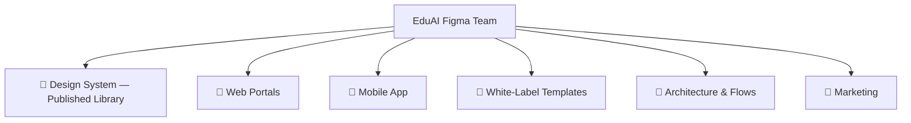
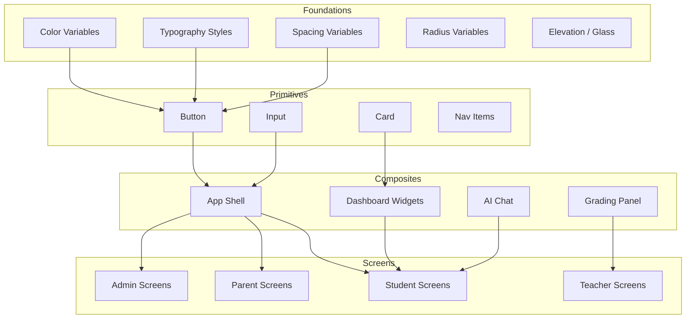
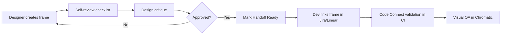

# EduAI — Figma File & Component Organization

**Document ID:** EDUAI-FIGMA-001  
**Version:** 1.0.0  
**Date:** June 2025  
**Owner:** Design Systems Team

---

## 1. Purpose

This guide defines how the EduAI design team organizes Figma files, pages, frames, and components. It ensures consistency across Student, Parent, Teacher, Admin, and Mobile surfaces while supporting white-label tenant customization and alignment with the Next.js 15 + Shadcn implementation.

### 1.1 Related Documents

| Document | Relationship |
|----------|--------------|
| [Design System](./design-system.md) | Tokens referenced by Figma variables |
| [Information Architecture](./information-architecture.md) | Page hierarchy mapped to Figma pages |
| [Wireframes](./wireframes.md) | Low-fi layouts upgraded to hi-fi frames |
| [PRD](../prd/product-requirements-document.md) | Feature scope per portal |

---

## 2. Figma Team Structure



| File | Type | Published | Access |
|------|------|:---------:|--------|
| **EduAI — Design System** | Library | ✅ | All designers + devs (view) |
| **EduAI — Web Portals** | Project file | ❌ | Product design |
| **EduAI — Mobile** | Project file | ❌ | Product design |
| **EduAI — White-Label Templates** | Project file | ❌ | Tenant onboarding |
| **EduAI — User Flows** | FigJam | ❌ | Product + eng |
| **EduAI — Marketing** | Project file | ❌ | Marketing |

---

## 3. Design System Library File

**File name:** `EduAI — Design System`  
**Purpose:** Single source of truth for tokens, primitives, and composite components. Published as a Figma library consumed by all project files.

### 3.1 Page Structure

```
📄 Cover & Changelog
📄 🎨 Foundations
    ├── Colors (Light / Dark modes)
    ├── Typography
    ├── Spacing & Grid
    ├── Elevation & Glass
    ├── Icons (Lucide set)
    ├── Motion (duration, easing)
    └── Accessibility (focus rings, contrast pairs)
📄 🧩 Primitives
    ├── Button (variants, sizes, states)
    ├── Input / Textarea / Select
    ├── Checkbox / Radio / Switch
    ├── Badge / Tag / Chip
    ├── Avatar
    ├── Tooltip / Popover
    ├── Dialog / Sheet / Drawer
    ├── Tabs / Accordion
    ├── Card (base glass card)
    ├── Table
    ├── Progress / Skeleton
    ├── Toast / Alert
    └── Navigation (sidebar item, tab bar item, breadcrumb)
📄 📦 Composite Components
    ├── App Shell (sidebar + header)
    ├── Dashboard Widgets (stat card, streak, continue learning)
    ├── Lesson Player Chrome
    ├── AI Chat Bubble & Input
    ├── Leaderboard Row
    ├── Grading Panel
    ├── Notification Item
    ├── Empty States
    └── Error States
📄 🎭 Portal Themes
    ├── Student (Playful / Standard / Exam)
    ├── Parent (Calm, data-dense)
    ├── Teacher (Professional, action-oriented)
    └── Admin (Enterprise, table-heavy)
📄 🌐 i18n Reference
    ├── English (en-IN) — baseline
    ├── Hindi (hi-IN) — text expansion examples
    └── Marathi (mr-IN) — text expansion examples
📄 🔗 Code Connect
    └── Component → Shadcn/Tailwind mapping (see §8)
📄 🗑 Archive
    └── Deprecated components (do not delete; mark deprecated)
```

### 3.2 Naming Conventions

| Element | Convention | Example |
|---------|------------|---------|
| Component | `Category/Name/Variant` | `Button/Primary/Default` |
| Variant property | camelCase | `size`, `state`, `iconPosition` |
| Color variable | `color/{role}/{prominence}` | `color/primary/default` |
| Spacing variable | `space/{scale}` | `space/4` (16px) |
| Frame (screen) | `{Portal}/{Route}/{Breakpoint}` | `Student/Dashboard/Desktop-1280` |
| Prototype link | `{Flow}-{Version}` | `Student-Onboarding-v2` |

---

## 4. Web Portals Project File

**File name:** `EduAI — Web Portals`

### 4.1 Page Organization

```
📄 Cover & Status
📄 🎓 Student Portal
    ├── Dashboard (Class 1-4 / 5-7 / 8-10 variants)
    ├── Learn — Subject List
    ├── Learn — Chapter List
    ├── Learn — Lesson Player
    ├── Learn — Quiz / Checkpoint
    ├── AI Tutor — Chat
    ├── AI Tutor — History
    ├── Tests — Mock Test List
    ├── Tests — Attempt (Timed)
    ├── Tests — Results
    ├── Homework — List & Submit
    ├── Study Planner — Calendar
    ├── Rewards — Hub
    ├── Rewards — Badges
    ├── Rewards — Leaderboard
    ├── Brain Hub (Class 1-4)
    ├── Skills Hub (Class 5+)
    └── Profile & Settings
📄 👨‍👩‍👧 Parent Portal
    ├── Dashboard (Multi-child)
    ├── Child Progress — Overview
    ├── Child Progress — Subjects
    ├── Child Progress — Activity Log
    ├── Reports — Weekly AI Report
    ├── Reports — Archive
    ├── Messages — Inbox & Thread
    ├── Controls — Screen Time
    ├── Controls — Feature Restrictions
    ├── Billing — Subscription
    ├── Billing — Invoices
    ├── Consent — DPDP Management
    └── Profile & Settings
📄 👩‍🏫 Teacher Portal
    ├── Dashboard
    ├── Classes — List
    ├── Classes — Class View
    ├── Classes — Roster
    ├── Classes — Attendance Marking
    ├── Assignments — List & Create
    ├── Assignments — Grading Interface
    ├── Question Papers — Generator
    ├── Question Papers — Review & Edit
    ├── Analytics — Class Performance
    ├── Analytics — Skill Gaps
    ├── Analytics — Individual Student
    ├── Content — Library Browser
    ├── Communication — Announcements
    ├── Communication — Parent Messages
    └── Profile & Settings
📄 🏫 School Admin
    ├── Dashboard (ERP Overview)
    ├── Users & Enrollment
    ├── Classes Management
    ├── ERP — Attendance Reports
    ├── ERP — Fee Management
    ├── ERP — Timetable
    ├── ERP — Announcements
    ├── ERP — Report Cards
    ├── Reports & Analytics
    └── Settings (Branding, Gamification Policy)
📄 🌐 Platform Admin
    ├── Dashboard (KPIs)
    ├── Tenants — List
    ├── Tenants — Detail & Branding
    ├── Tenants — Feature Flags
    ├── CMS — Content Pipeline
    ├── CMS — Board & Curriculum Tree
    ├── AI Operations — Cost Monitor
    ├── AI Operations — Quota Management
    ├── AI Operations — Safety Logs
    ├── Analytics — Cross-Tenant
    ├── Billing — Platform Revenue
    ├── Support — Ticket Queue
    ├── Audit — Log Viewer
    └── System — Health Dashboard
📄 🔐 Auth & Onboarding
    ├── Login
    ├── Register (Student / Parent / Teacher)
    ├── Parental Consent Flow
    ├── Forgot / Reset Password
    ├── Role Selection
    └── First-Time Onboarding Wizards
📄 🧩 Shared Patterns
    ├── App Shell — Sidebar Layouts (per portal)
    ├── Header — Search, Notifications, Profile
    ├── Command Palette (⌘K)
    ├── Notification Panel
    ├── Empty / Loading / Error States
    ├── Paywall / Upgrade Prompts
    └── Language Switcher
📄 📱 Responsive Specs
    ├── Breakpoint: 390 (Mobile)
    ├── Breakpoint: 768 (Tablet)
    ├── Breakpoint: 1280 (Desktop)
    └── Breakpoint: 1440 (Wide)
```

### 4.2 Frame Standards

| Property | Desktop | Tablet | Mobile (web) |
|----------|---------|--------|--------------|
| Frame width | 1280px | 768px | 390px |
| Frame height | 800px (min) | 1024px | 844px |
| Layout grid | 12 col, 24px gutter | 8 col, 16px gutter | 4 col, 16px gutter |
| Safe area | 24px padding | 16px padding | 16px padding |
| Background | `color/background/default` | Same | Same |

Each screen frame includes:
- **Status annotation** (Draft / In Review / Approved / Handoff Ready)
- **Route label** (matches Next.js path from IA doc)
- **Permission badge** (RBAC gate if applicable)
- **Class band badge** (Student screens only)

---

## 5. Mobile App Project File

**File name:** `EduAI — Mobile`

### 5.1 Page Structure

```
📄 Cover & Platform Notes (iOS + Android)
📄 📱 Student — Core Flows
    ├── Home / Dashboard
    ├── Learn — Subject → Chapter → Lesson
    ├── Lesson Player (Fullscreen video)
    ├── AI Tutor — Chat
    ├── Tests — Mock Test Flow
    ├── Rewards — Badges & Leaderboard
    ├── Offline Downloads
    └── Profile & Settings
📄 📱 Parent — Core Flows
    ├── Dashboard (Multi-child)
    ├── Child Detail
    ├── Weekly Report
    ├── Messages
    ├── Screen Time Controls
    └── Billing
📄 📱 Shared Mobile
    ├── Tab Bar (Student / Parent variants)
    ├── Navigation Header
    ├── Bottom Sheet Patterns
    ├── Push Notification Previews
    ├── Biometric Login
    ├── Splash & App Icon
    └── Onboarding Carousel
📄 📱 Platform Specs
    ├── iOS — Safe Areas (notch, home indicator)
    ├── Android — Navigation bar, status bar
    └── Haptic Feedback Annotations
```

### 5.2 Mobile Component Instances

Mobile project file **instances** (does not duplicate) these library components:

- Tab bar items
- Chat bubbles
- Streak widget (compact)
- Continue learning card (compact)
- Leaderboard row (compact)
- Notification item

Mobile-specific components live in the library under `Composite/Mobile/`.

---

## 6. White-Label Templates File

**File name:** `EduAI — White-Label Templates`

Used by tenant onboarding team to generate branded previews without modifying core design files.

```
📄 Instructions & Checklist
📄 Template — Tenant Branding Swap
    ├── Logo placement zones
    ├── Primary / Secondary color swap
    ├── App name text layers
    └── Domain preview mockup
📄 Template — Branded Screens (10 key screens)
    ├── Login
    ├── Student Dashboard
    ├── Parent Dashboard
    ├── AI Tutor
    └── Mobile Home
📄 Approved Tenant Previews (Archive)
    ├── DPS Pune
    ├── Ryan International
    └── ...
```

**Workflow:**
1. Duplicate template page → rename to tenant slug.
2. Swap brand variables (bound to tenant color tokens).
3. Export preview PDF for sales / onboarding.
4. Engineering configures matching values in `tenant_branding` table.

---

## 7. Component Library Architecture



### 7.1 Component Variant Matrix

**Button**

| Property | Values |
|----------|--------|
| variant | primary, secondary, outline, ghost, destructive, link |
| size | sm, md, lg, icon |
| state | default, hover, focus, disabled, loading |

**Card (Glass)**

| Property | Values |
|----------|--------|
| elevation | sm, md, lg |
| mode | light, dark |
| padding | sm, md, lg |
| interactive | true, false |

**Dashboard Widget**

| Property | Values |
|----------|--------|
| type | stat, streak, continue-learning, leaderboard, task-list |
| size | compact, standard, hero |
| portal | student, parent, teacher, admin |

---

## 8. Code Connect Integration

Figma components map to Shadcn/ui implementations via Code Connect (`.figma.tsx` files in the monorepo).

| Figma Component | Code Component | Path |
|-----------------|----------------|------|
| `Button/Primary/Default` | `<Button variant="default">` | `components/ui/button.tsx` |
| `Card/Glass/Md` | `<GlassCard>` | `components/ui/glass-card.tsx` |
| `Input/Default` | `<Input>` | `components/ui/input.tsx` |
| `App Shell/Sidebar` | `<PortalSidebar>` | `components/layouts/portal-sidebar.tsx` |
| `Composite/ContinueLearning` | `<ContinueLearningCard>` | `components/learning/continue-learning-card.tsx` |
| `Composite/AIChatBubble` | `<ChatMessage>` | `components/ai/chat-message.tsx` |
| `Composite/StreakWidget` | `<StreakWidget>` | `components/gamification/streak-widget.tsx` |
| `Composite/LeaderboardRow` | `<LeaderboardRow>` | `components/gamification/leaderboard-row.tsx` |

Code Connect files live at:

```
apps/web/components/**/*.figma.tsx
```

Designers should not rename component layers bound by Code Connect without notifying engineering.

---

## 9. Variables & Token Binding

All color, spacing, and radius values use Figma Variables bound to modes:

| Collection | Modes | Maps To |
|------------|-------|---------|
| `Color` | Light, Dark | CSS custom properties in `globals.css` |
| `Spacing` | Default | Tailwind spacing scale |
| `Radius` | Default | Tailwind rounded-* |
| `Typography` | Default | Tailwind text-* + font-family |
| `Tenant/Brand` | Per-tenant (White-label file) | Runtime CSS variable injection |

**Rule:** Never hardcode hex values in screen frames. Always reference variables.

---

## 10. Review & Handoff Workflow



### 10.1 Handoff Checklist

- [ ] Frame uses library components (no detached instances)
- [ ] All text uses typography styles (no orphan font sizes)
- [ ] Colors reference variables (light + dark mode checked)
- [ ] Interactive states documented (hover, focus, disabled, error)
- [ ] Responsive behavior annotated (or separate breakpoint frames)
- [ ] i18n: Hindi/Marathi text expansion verified on key screens
- [ ] Accessibility: contrast ≥ 4.5:1, focus indicators visible
- [ ] Route label matches Information Architecture doc
- [ ] Edge cases: empty, loading, error states included

### 10.2 Dev Mode Annotations

Use Figma Dev Mode to annotate:
- Spacing between elements (Tailwind class equivalent)
- Component props / variants to use
- API data bindings (which field populates which element)
- Animation specs (duration, easing from motion tokens)

---

## 11. Versioning & Changelog

Design System library follows semver:

| Change Type | Version Bump | Example |
|-------------|--------------|---------|
| New component | Minor | 1.3.0 → 1.4.0 |
| Token value change | Minor (review required) | Primary color shift |
| Breaking rename/removal | Major | Button variant removed |
| Screen-only change | No library bump | Update Web Portals file |

Changelog maintained on the **Cover & Changelog** page in the Design System file.

---

## 12. File Access & Permissions

| Role | Design System | Web/Mobile | White-Label | FigJam |
|------|:-------------:|:----------:|:-----------:|:------:|
| Lead Designer | Edit | Edit | Edit | Edit |
| Product Designer | Edit | Edit | Edit | Edit |
| Engineer | View | View | View | View |
| Product Manager | View | View | View | Edit |
| External (tenant) | — | — | View (their page only) | — |

---

## 13. Alignment with Google Stitch

EduAI adopts Material Design 3 structure with Google Stitch generative UI influences:

| MD3 Concept | Figma Implementation |
|-------------|---------------------|
| Dynamic color | Tenant brand variables feed primary/secondary |
| Shape scale | Radius tokens: extra-small (4) → full (9999) |
| Type scale | Display, Headline, Title, Body, Label styles |
| Elevation | Glass morphism replaces traditional shadow-only elevation |
| Motion | Shared duration/easing variables |

Stitch-generated layout suggestions are imported into **Draft** frames, then rebuilt with library components before promotion to **Approved**.

---

*Related: [Design System](./design-system.md) · [Information Architecture](./information-architecture.md) · [Wireframes](./wireframes.md)*
