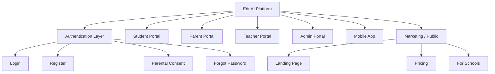
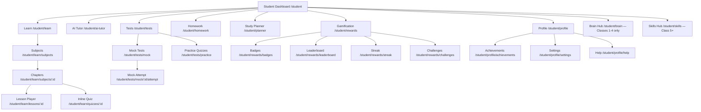
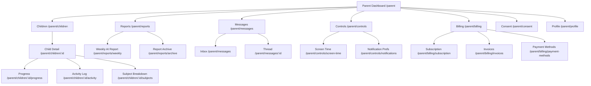
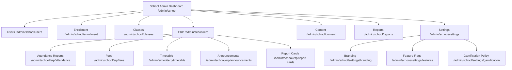
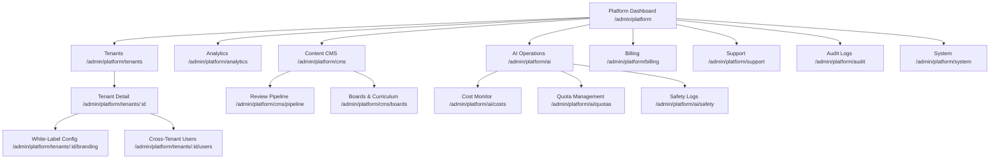
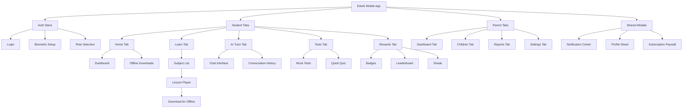
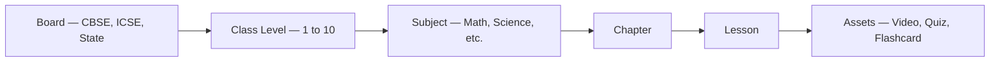

# EduAI — Information Architecture

**Document ID:** EDUAI-IA-001  
**Version:** 1.0.0  
**Date:** June 2025  
**Owner:** Product Design

---

## 1. Purpose

This document defines the navigation structure, route hierarchy, and information organization for all EduAI client surfaces: Student, Parent, Teacher, Admin (School + Platform), and Mobile. It ensures consistent mental models across web portals while respecting age-appropriate UX density and role-based access.

### 1.1 Design Principles

1. **Role-first routing** — Each portal is a distinct route group with its own layout shell and navigation chrome.
2. **Progressive disclosure** — Class band (Pre-primary 1–4, Middle 5–7, Senior 8–10) controls nav depth and feature visibility.
3. **Shared patterns, distinct emphasis** — All portals use the same component library but prioritize different primary actions.
4. **Mobile parity with focus** — Mobile emphasizes learn, AI tutor, and parent monitoring; admin ERP remains web-first.
5. **i18n-ready labels** — All nav labels externalized for English, Hindi, and Marathi.

---

## 2. Global Structure

### 2.1 URL Convention (Web)

| Portal | Base Path | Layout Group |
|--------|-----------|--------------|
| Marketing | `/` | `(marketing)` |
| Auth | `/login`, `/register`, `/consent` | `(auth)` |
| Student | `/student/*` | `(student)` |
| Parent | `/parent/*` | `(parent)` |
| Teacher | `/teacher/*` | `(teacher)` |
| School Admin | `/admin/school/*` | `(admin-school)` |
| Platform Admin | `/admin/platform/*` | `(admin-platform)` |

Tenant white-label domains resolve branding but preserve path structure.

---

## 3. Student Portal

Primary persona: Classes 1–10 learners. Navigation adapts by class band.

### 3.1 Site Hierarchy

### 3.2 Primary Navigation (Web Sidebar / Mobile Tab Bar)

| Nav Item | Route | Class Band | Priority |
|----------|-------|------------|----------|
| Home | `/student` | All | P0 |
| Learn | `/student/learn` | All | P0 |
| AI Tutor | `/student/ai-tutor` | 5–10 (limited 1–4) | P0 |
| Tests | `/student/tests` | 5–10 | P0 |
| Rewards | `/student/rewards` | All | P0 |
| Homework | `/student/homework` | 5–10 | P1 |
| Planner | `/student/planner` | 8–10 | P1 |
| Brain Games | `/student/brain` | 1–4 | P0 |
| Profile | `/student/profile` | All | P1 |

### 3.3 Class Band UX Variations

| Band | Nav Style | Max Depth | Special Routes |
|------|-----------|-----------|----------------|
| Pre-primary / 1–4 | Icon-only bottom nav (mobile), large tiles (web) | 2 levels | `/student/brain`, voice-guided lessons |
| 5–7 | Icon + label nav, story-driven cards | 3 levels | Group challenges, subject mascots |
| 8–10 | Compact sidebar, exam-focused CTAs | 4 levels | Mock tests, study planner, peer leaderboard |

---

## 4. Parent Portal

Primary persona: Guardians monitoring one or more children.

### 4.1 Site Hierarchy

### 4.2 Primary Navigation

| Nav Item | Route | Description |
|----------|-------|-------------|
| Dashboard | `/parent` | Multi-child overview, alerts |
| My Children | `/parent/children` | Per-child drill-down |
| Reports | `/parent/reports` | AI-generated weekly narratives |
| Messages | `/parent/messages` | Teacher communication |
| Controls | `/parent/controls` | Screen time, notification limits |
| Billing | `/parent/billing` | Subscription, invoices, UPI |
| Consent | `/parent/consent` | DPDP consent management |

---

## 5. Teacher Portal

Primary persona: Classroom teachers (Classes 1–10).

### 5.1 Site Hierarchy

```mermaid
graph TB
    TD[Teacher Dashboard /teacher]

    TD --> CLASSES[My Classes /teacher/classes]
    TD --> ASSIGN[Assignments /teacher/assignments]
    TD --> QPG[Question Papers /teacher/question-papers]
    TD --> ANALYTICS[Analytics /teacher/analytics]
    TD --> CONTENT[Content Library /teacher/content]
    TD --> COMMS[Communication /teacher/communication]
    TD --> PROFILE[Profile /teacher/profile]

    CLASSES --> CLASS[Class View /teacher/classes/:id]
    CLASS --> ROSTER[Roster /teacher/classes/:id/roster]
    CLASS --> ATTEND[Attendance /teacher/classes/:id/attendance]
    CLASS --> CLASSAN[Class Analytics /teacher/classes/:id/analytics]

    ASSIGN --> CREATE[Create Assignment /teacher/assignments/new]
    ASSIGN --> GRADE[Grade Submissions /teacher/assignments/:id/grade]

    QPG --> GENERATE[Generate Paper /teacher/question-papers/new]
    QPG --> EDIT[Edit Paper /teacher/question-papers/:id]
    QPG --> PUBLISH[Publish to Class /teacher/question-papers/:id/publish]

    ANALYTICS --> CLASSPERF[Class Performance /teacher/analytics/classes]
    ANALYTICS --> GAPS[Skill Gaps /teacher/analytics/gaps]
    ANALYTICS --> INDIV[Individual Reports /teacher/analytics/students/:id]

    COMMS --> ANNOUNCE[Announcements /teacher/communication/announcements]
    COMMS --> PARENTMSG[Parent Messages /teacher/communication/messages]
```

### 5.2 Primary Navigation

| Nav Item | Route | Description |
|----------|-------|-------------|
| Dashboard | `/teacher` | Today's classes, pending grading |
| Classes | `/teacher/classes` | Roster, attendance, class analytics |
| Assignments | `/teacher/assignments` | Create, assign, grade homework |
| Question Papers | `/teacher/question-papers` | AI QPG workflow |
| Analytics | `/teacher/analytics` | Performance dashboards |
| Content | `/teacher/content` | Assign from library |
| Messages | `/teacher/communication` | Parent announcements |

---

## 6. Admin Portal

Two sub-portals share `/admin` prefix with role-gated visibility.

### 6.1 School Admin Hierarchy

### 6.2 Platform Admin Hierarchy

### 6.3 Admin Navigation Matrix

| Section | School Admin | Tenant Admin | Platform Admin |
|---------|:------------:|:------------:|:--------------:|
| Dashboard | ✅ | ✅ | ✅ |
| Users / Enrollment | ✅ | ✅ | ✅ |
| ERP (Fees, Timetable) | ✅ | View | View |
| Tenant Management | ❌ | ✅ (own) | ✅ (all) |
| Content CMS Pipeline | ❌ | ✅ | ✅ |
| AI Cost Monitor | ❌ | ✅ | ✅ |
| Cross-Tenant Analytics | ❌ | ✅ | ✅ |
| Audit Logs | ❌ | ✅ | ✅ |
| System Health | ❌ | ❌ | ✅ |

---

## 7. Mobile App (React Native / Expo)

Mobile uses Expo Router with tab-based navigation for Student and Parent roles. Teacher and Admin functions are web-only in Phase 1.

### 7.1 Mobile Hierarchy

### 7.2 Mobile Tab Configuration

**Student (Class 8–10 — primary mobile persona)**

| Tab | Icon | Stack Routes |
|-----|------|--------------|
| Home | house | Dashboard, Continue Learning, Streak |
| Learn | book-open | Subjects → Chapters → Lesson Player |
| AI | sparkles | Chat, History |
| Tests | clipboard-check | Mock Tests, Practice |
| Rewards | trophy | Badges, Leaderboard, Streak |

**Parent**

| Tab | Icon | Stack Routes |
|-----|------|--------------|
| Home | layout-dashboard | Multi-child overview |
| Children | users | Per-child progress |
| Reports | file-text | Weekly AI reports |
| Settings | settings | Billing, Controls, Consent |

---

## 8. Cross-Portal Shared Patterns

### 8.1 Global Utilities (All Authenticated Portals)

| Utility | Location | Behavior |
|---------|----------|----------|
| Search | Header command palette (`⌘K`) | Content search, quick nav |
| Notifications | Header bell icon | Slide-over panel |
| Language Switcher | Header / Settings | en-IN, hi-IN, mr-IN |
| Theme Toggle | Settings | Light / Dark / System |
| Help & Support | Footer / Profile | FAQ, ticket creation |
| Logout | Profile menu | Session termination |

### 8.2 Breadcrumb Strategy

| Portal | Max Breadcrumb Depth | Example |
|--------|------------------------|---------|
| Student (1–4) | Hidden | — |
| Student (5–10) | 3 | Learn → Mathematics → Fractions |
| Parent | 3 | Children → Arjun → Mathematics |
| Teacher | 4 | Classes → 8-A → Assignments → Grade |
| Admin | 4 | Tenants → DPS Pune → Branding |

---

## 9. Content Taxonomy

Curriculum content follows a fixed hierarchy referenced across Learn, Content CMS, and AI context:

Search and filters expose Board → Class → Subject as primary facets. Chapter and Lesson are navigational, not filter top-level.

---

## 10. Access Control Mapping

Navigation items are gated by RBAC permissions. UI hides unavailable items rather than showing disabled states (except upgrade prompts for billing-gated features).

| Nav Item | Minimum Permission |
|----------|-------------------|
| AI Tutor | `ai:tutor:use:own` |
| QPG | `ai:qpg:use:class` |
| Attendance | `attendance:write:class` |
| Tenant Management | `tenants:manage:global` |
| CMS Pipeline | `content:publish:tenant` |
| Billing | `billing:manage:own` |

Refer to [RBAC Design](../architecture/rbac-design.md) for the complete permission matrix.

---

## 11. SEO & Public Routes

| Route | Indexable | Purpose |
|-------|:---------:|---------|
| `/` | Yes | Marketing landing |
| `/pricing` | Yes | Plan comparison |
| `/for-schools` | Yes | B2B landing |
| `/login`, `/register` | No | Auth flows |
| `/student/*`, `/parent/*`, etc. | No | Authenticated app |

---

## 12. Future IA Considerations (Phase 2)

- **Live Doubt Sessions** — New top-level nav under Student `/student/live`
- **SSO Entry** — School-specific login at `/login/{school-slug}`
- **Government Board Hub** — Dedicated `/boards/{state}` marketing + content entry
- **Teacher Mobile** — Reduced tab set mirroring web priorities

---

*Related: [Wireframes](./wireframes.md) · [Figma Structure](./figma-structure.md) · [Design System](./design-system.md) · [PRD](../prd/product-requirements-document.md)*
