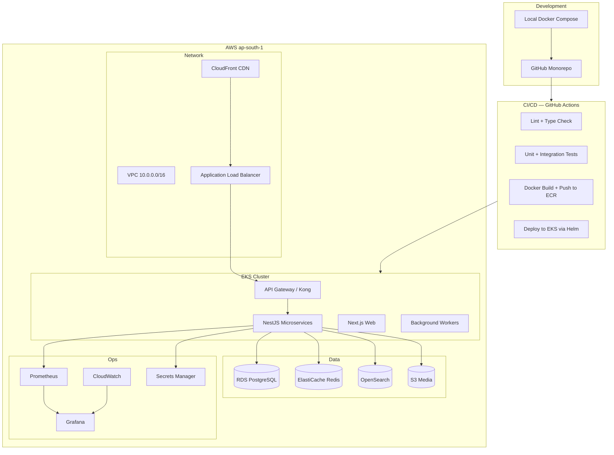
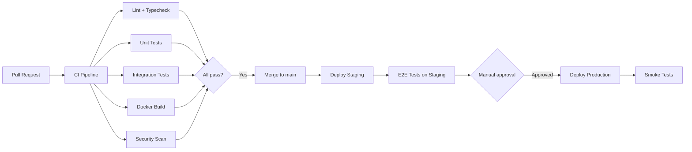
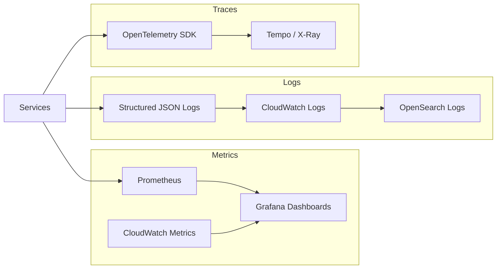

# EduAI — DevOps Architecture

**Document ID:** EDUAI-DEVOPS-001  
**Version:** 1.0.0  
**Status:** Approved for Pre-Development  
**Date:** June 2025  
**Owner:** Platform Engineering

---

## 1. Overview

This document defines EduAI's DevOps architecture: containerization, Kubernetes orchestration, CI/CD pipelines, AWS infrastructure, monitoring, and monorepo structure. It supports deployment of all Phase 1 services (Sprints 1–16) with 99.9% uptime SLA.

**Related:** [HLD](../architecture/high-level-design.md) · [Security Architecture](../security/security-architecture.md) · [Performance Targets](../testing/performance-targets.md)

---

## 2. Architecture Overview



---

## 3. Monorepo Structure

EduAI uses **Turborepo** for monorepo management with npm workspaces.

```
eduai/
├── apps/
│   ├── web/                    # Next.js 15 — all web portals
│   ├── mobile/                 # React Native — iOS + Android
│   ├── auth-service/           # NestJS — authentication, sessions
│   ├── user-service/           # NestJS — user profiles, roles
│   ├── tenant-service/         # NestJS — multi-tenant management
│   ├── learning-service/       # NestJS — lessons, progress, curriculum
│   ├── content-service/        # NestJS — CMS pipeline
│   ├── ai-service/             # NestJS — AI tutor, RAG, QPG
│   ├── assessment-service/     # NestJS — mock tests, grading
│   ├── erp-service/            # NestJS — school ERP
│   ├── gamification-service/   # NestJS — XP, badges, streaks
│   ├── notification-service/   # NestJS — email, push, in-app
│   ├── billing-service/        # NestJS — Razorpay, subscriptions
│   ├── search-service/         # NestJS — Elasticsearch queries
│   ├── media-service/          # NestJS — Mux, S3 uploads
│   ├── ai-worker/              # BullMQ worker — AI generation jobs
│   ├── report-worker/          # BullMQ worker — progress reports
│   └── notify-worker/          # BullMQ worker — notification dispatch
├── packages/
│   ├── ui/                     # Shared React components (shadcn/ui)
│   ├── types/                  # Shared TypeScript types and DTOs
│   ├── config/                 # ESLint, Prettier, TS configs
│   ├── utils/                  # Shared utilities
│   ├── api-client/             # Generated API client from OpenAPI
│   └── i18n/                   # Translation files (en, hi, mr)
├── infra/
│   ├── terraform/              # AWS infrastructure as code
│   │   ├── modules/
│   │   │   ├── vpc/
│   │   │   ├── eks/
│   │   │   ├── rds/
│   │   │   ├── elasticache/
│   │   │   └── s3/
│   │   ├── environments/
│   │   │   ├── staging/
│   │   │   └── production/
│   │   └── main.tf
│   ├── helm/                   # Kubernetes Helm charts
│   │   ├── eduai-platform/     # Umbrella chart
│   │   └── charts/             # Per-service subcharts
│   └── docker/
│       ├── Dockerfile.service    # Multi-stage NestJS build
│       ├── Dockerfile.web        # Next.js standalone
│       └── docker-compose.yml  # Local development
├── .github/
│   └── workflows/
│       ├── ci.yml              # Lint, test, build on PR
│       ├── deploy-staging.yml  # Auto-deploy staging on main merge
│       ├── deploy-prod.yml     # Manual approval deploy to production
│       └── security-scan.yml   # SAST, dependency, container scans
├── turbo.json
├── package.json
└── tsconfig.base.json
```

### 3.1 Turborepo Pipeline

```json
{
  "pipeline": {
    "build": { "dependsOn": ["^build"], "outputs": ["dist/**", ".next/**"] },
    "test": { "dependsOn": ["build"], "outputs": [] },
    "lint": { "outputs": [] },
    "typecheck": { "dependsOn": ["^build"], "outputs": [] },
    "deploy": { "dependsOn": ["build", "test", "lint"], "cache": false }
  }
}
```

### 3.2 Shared Packages

| Package | Purpose | Consumers |
|---------|---------|-----------|
| `@eduai/types` | DTOs, enums, API contracts | All apps and services |
| `@eduai/ui` | React component library | web, mobile (via RN Web subset) |
| `@eduai/api-client` | Auto-generated REST client | web, mobile |
| `@eduai/config` | ESLint, Prettier, TS configs | All workspaces |
| `@eduai/i18n` | Translation namespaces | web, mobile, notification templates |

---

## 4. Docker

### 4.1 Container Strategy

| Image | Base | Size Target | Notes |
|-------|------|-------------|-------|
| NestJS services | `node:20-alpine` | < 200MB | Multi-stage: build → production |
| Next.js web | `node:20-alpine` | < 300MB | Standalone output mode |
| Workers | `node:20-alpine` | < 150MB | Same codebase, different entrypoint |
| N/A (mobile) | — | — | React Native builds via EAS, not Docker |

### 4.2 Multi-Stage Dockerfile (NestJS Service)

```dockerfile
# Stage 1: Build
FROM node:20-alpine AS builder
WORKDIR /app
COPY package*.json turbo.json ./
COPY apps/auth-service ./apps/auth-service
COPY packages ./packages
RUN npm ci && npx turbo run build --filter=auth-service

# Stage 2: Production
FROM node:20-alpine AS production
RUN addgroup -S eduai && adduser -S eduai -G eduai
WORKDIR /app
COPY --from=builder /app/apps/auth-service/dist ./dist
COPY --from=builder /app/node_modules ./node_modules
USER eduai
EXPOSE 3000
HEALTHCHECK CMD wget -qO- http://localhost:3000/health || exit 1
CMD ["node", "dist/main.js"]
```

### 4.3 Docker Compose (Local Development)

```yaml
# docker-compose.yml (summary)
services:
  postgres:
    image: postgres:16-alpine
    ports: ["5432:5432"]
    volumes: [pgdata:/var/lib/postgresql/data]

  redis:
    image: redis:7-alpine
    ports: ["6379:6379"]

  elasticsearch:
    image: opensearchproject/opensearch:2.11.0
    ports: ["9200:9200"]

  auth-service:
    build: { context: ., dockerfile: infra/docker/Dockerfile.service, args: { SERVICE: auth-service } }
    ports: ["3001:3000"]
    depends_on: [postgres, redis]
    env_file: .env.local

  # ... other services follow same pattern

  web:
    build: { context: ., dockerfile: infra/docker/Dockerfile.web }
    ports: ["3000:3000"]
    depends_on: [auth-service, learning-service]
```

### 4.4 Container Registry

- **AWS ECR** in ap-south-1
- Image tagging: `{service}:{git-sha}` + `{service}:latest-staging` / `{service}:latest-prod`
- Lifecycle policy: keep last 30 images per repository
- Image scanning: Trivy in CI; block deploy on critical CVEs

---

## 5. Kubernetes (AWS EKS)

### 5.1 Cluster Configuration

| Setting | Staging | Production |
|---------|---------|------------|
| K8s version | 1.29 | 1.29 |
| Node type | `t3.large` (2 vCPU, 8GB) | `m6i.xlarge` (4 vCPU, 16GB) |
| Min nodes | 2 | 3 |
| Max nodes | 5 | 20 |
| AZs | 2 (ap-south-1a, 1b) | 3 (ap-south-1a, 1b, 1c) |
| Autoscaling | Cluster Autoscaler + HPA | Cluster Autoscaler + HPA |

### 5.2 Namespace Strategy

| Namespace | Contents |
|-----------|----------|
| `eduai-staging` | All staging services |
| `eduai-production` | All production services |
| `eduai-monitoring` | Prometheus, Grafana |
| `eduai-ingress` | Kong gateway, cert-manager |
| `kube-system` | Core K8s components |

### 5.3 Deployment Pattern

```yaml
# Helm values excerpt (auth-service)
replicaCount: 2
resources:
  requests: { cpu: 250m, memory: 512Mi }
  limits: { cpu: 1000m, memory: 1Gi }
autoscaling:
  enabled: true
  minReplicas: 2
  maxReplicas: 10
  targetCPUUtilization: 70
  targetMemoryUtilization: 80
probes:
  liveness: { path: /health, initialDelaySeconds: 15, periodSeconds: 10 }
  readiness: { path: /ready, initialDelaySeconds: 5, periodSeconds: 5 }
```

### 5.4 Service Mesh & Ingress

- **Ingress:** AWS ALB Ingress Controller → Kong API Gateway
- **Kong plugins:** JWT validation, rate limiting, CORS, request logging
- **Internal communication:** K8s ClusterIP services; mTLS via service mesh (Phase 2 — Istio evaluation)
- **TLS:** cert-manager with Let's Encrypt for staging; ACM for production

### 5.5 Background Workers

| Worker | Queue | Concurrency | Scaling |
|--------|-------|-------------|---------|
| ai-worker | `ai:generate` | 5 per pod | HPA on queue depth > 100 |
| report-worker | `reports:weekly` | 3 per pod | CronJob + HPA |
| notify-worker | `notify:dispatch` | 10 per pod | HPA on queue depth > 500 |

Queue backend: **BullMQ** on Redis Streams.

---

## 6. CI/CD (GitHub Actions)

### 6.1 Pipeline Overview



### 6.2 CI Pipeline (`ci.yml`)

Triggered on: pull request to `main`, push to `main`.

| Stage | Tool | Gate |
|-------|------|------|
| Lint | ESLint + Prettier check | Block merge |
| Type check | TypeScript `tsc --noEmit` | Block merge |
| Unit tests | Jest (backend 80%, frontend 70% coverage) | Block merge |
| Integration tests | Jest + Testcontainers (PostgreSQL, Redis) | Block merge |
| Build | Turborepo `turbo run build` | Block merge |
| Docker build | Build all service images (no push on PR) | Block merge |
| Security scan | Semgrep SAST + Snyk deps + Trivy containers | Block on critical |

### 6.3 Deploy Pipeline (`deploy-staging.yml`)

Triggered on: push to `main` (after CI passes).

1. Build Docker images with `{git-sha}` tag
2. Push to ECR
3. Update Helm values with new image tag
4. `helm upgrade --install eduai-platform infra/helm/eduai-platform -n eduai-staging`
5. Wait for rollout (max 5 min)
6. Run smoke tests against staging URL
7. Notify Slack #deploys channel

### 6.4 Deploy Pipeline (`deploy-prod.yml`)

Triggered on: manual workflow dispatch with approval gate.

1. Require approval from 2 designated reviewers
2. Deploy to `eduai-production` namespace
3. Rolling update with maxUnavailable=0, maxSurge=1
4. Run smoke tests + synthetic monitoring check
5. Auto-rollback if smoke tests fail within 10 minutes

### 6.5 Environment Promotion

| Environment | Branch | Auto-deploy | URL |
|-------------|--------|-------------|-----|
| Local | feature/* | No | localhost:3000 |
| Staging | main | Yes | staging.eduai.in |
| Production | main (manual) | No | app.eduai.in |

---

## 7. AWS Services

### 7.1 Service Map

| AWS Service | Purpose | Configuration |
|-------------|---------|---------------|
| **EKS** | Container orchestration | 1.29, managed node groups |
| **ECR** | Container registry | ap-south-1, image scanning |
| **RDS PostgreSQL** | Primary database | 16.x, db.r6g.large (prod), Multi-AZ, 2 read replicas |
| **ElastiCache Redis** | Cache, sessions, queues | 7.x, cluster mode, 3 shards |
| **S3** | Media, uploads, backups | SSE-KMS, lifecycle policies |
| **CloudFront** | CDN for static assets + SSR | Origin: ALB + S3 |
| **ALB** | Load balancing | WAF attached, TLS termination |
| **WAF** | Web application firewall | OWASP managed rules |
| **Route 53** | DNS | eduai.in + tenant custom domains |
| **ACM** | TLS certificates | Auto-renewal |
| **Secrets Manager** | Credentials, API keys | Auto-rotation 90 days |
| **KMS** | Encryption key management | CMK per environment |
| **CloudWatch** | Logs, metrics, alarms | Log groups per service |
| **SNS** | Alert notifications | → PagerDuty, Slack |
| **SES** | Transactional email | Verified domain, DKIM/SPF |
| **OpenSearch** | Full-text search | 3-node cluster (prod) |
| **GuardDuty** | Threat detection | Enabled account-wide |
| **Backup** | RDS automated backups | 35-day retention, cross-region copy |

### 7.2 Infrastructure as Code (Terraform)

```
infra/terraform/
├── main.tf                 # Provider, backend (S3 + DynamoDB lock)
├── variables.tf
├── outputs.tf
├── modules/
│   ├── vpc/                # VPC, subnets, NAT, security groups
│   ├── eks/                # Cluster, node groups, IRSA
│   ├── rds/                # PostgreSQL, parameter groups, replicas
│   ├── elasticache/        # Redis cluster
│   ├── s3/                 # Buckets, policies, lifecycle
│   ├── cloudfront/         # CDN distribution
│   ├── waf/                # WAF rules
│   └── monitoring/         # CloudWatch dashboards, alarms
└── environments/
    ├── staging/
    │   └── terraform.tfvars
    └── production/
        └── terraform.tfvars
```

**State management:** S3 backend with DynamoDB locking. Separate state files per environment.

### 7.3 Cost Optimization

| Strategy | Savings | Implementation |
|----------|---------|----------------|
| Spot instances for workers | ~60% on worker nodes | EKS managed spot node group for ai-worker |
| Reserved instances for RDS | ~40% | 1-year RI for production RDS |
| S3 lifecycle | ~30% storage | Move to IA after 90 days, Glacier after 1 year |
| AI model tier routing | Variable | Mini model for simple queries (US-106) |
| CloudFront caching | CDN egress savings | Aggressive cache for static assets (1 year) |
| Right-sizing | Ongoing | Monthly review via AWS Cost Explorer |

---

## 8. Monitoring & Observability

### 8.1 Three Pillars



### 8.2 Prometheus Metrics

| Metric | Type | Alert Threshold |
|--------|------|-----------------|
| `http_request_duration_seconds` | Histogram | p95 > 300ms for 5 min |
| `http_requests_total{status=~"5.."}` | Counter | Error rate > 1% for 5 min |
| `ai_query_duration_seconds` | Histogram | p95 > 4s for 5 min |
| `ai_token_spend_total` | Counter | Daily spend > budget |
| `db_query_duration_seconds` | Histogram | p95 > 100ms for 5 min |
| `queue_depth` | Gauge | Depth > 1000 for 10 min |
| `pod_cpu_usage` | Gauge | > 80% for 10 min → HPA |
| `pod_memory_usage` | Gauge | > 85% for 10 min → alert |

### 8.3 Grafana Dashboards

| Dashboard | Panels |
|-----------|--------|
| Platform Overview | Request rate, error rate, latency p50/p95/p99, active users |
| Service Health | Per-service CPU, memory, pod count, restart count |
| AI Operations | Query rate, latency, token spend, model tier distribution, safety filter blocks |
| Database | Connections, query time, replication lag, storage |
| Business Metrics | DAU, lesson completions, subscription events, conversion funnel |
| Infrastructure | EKS node utilization, RDS metrics, Redis hit rate, S3 storage |

### 8.4 CloudWatch Alarms

| Alarm | Condition | Action |
|-------|-----------|--------|
| High error rate | 5xx > 1% for 5 min | PagerDuty P1 |
| High latency | API p95 > 500ms for 10 min | PagerDuty P2 |
| RDS storage | > 80% capacity | Slack + auto-scale storage |
| RDS replication lag | > 30 seconds | PagerDuty P2 |
| Certificate expiry | < 14 days | Slack |
| AI budget exceeded | Daily spend > 120% of budget | Slack + throttle |

### 8.5 Logging Standards

```json
{
  "timestamp": "2025-06-20T10:30:00.000Z",
  "level": "info",
  "service": "learning-service",
  "correlation_id": "req-abc-123",
  "tenant_id": "tenant-uuid",
  "user_id": "user-uuid",
  "message": "Lesson completed",
  "duration_ms": 45,
  "metadata": { "lesson_id": "lesson-uuid", "xp_awarded": 25 }
}
```

- **Log levels:** ERROR (alert), WARN (monitor), INFO (default), DEBUG (dev only)
- **Retention:** 30 days in CloudWatch; 90 days in OpenSearch for search/analysis
- **PII:** Never log passwords, tokens, full AI conversation content for minors

### 8.6 Distributed Tracing

- **OpenTelemetry** SDK in all NestJS services and Next.js
- Trace context propagated via `correlation_id` header
- Sample rate: 10% in production, 100% in staging
- Backend: AWS X-Ray (Phase 1) → Grafana Tempo (Phase 2 evaluation)

---

## 9. Deployment Strategy

### 9.1 Rolling Updates

- Default for all services
- `maxUnavailable: 0`, `maxSurge: 1` — zero-downtime deploys
- Readiness probe gates traffic to new pods

### 9.2 Database Migrations

- **Tool:** Prisma Migrate (or TypeORM migrations)
- Migrations run as K8s Job before service rollout
- Backward-compatible migrations only (expand → contract pattern)
- Rollback: revert migration Job if service health check fails

### 9.3 Feature Flags

- **LaunchDarkly** or self-hosted **Unleash** (evaluate Sprint 3)
- Per-tenant feature flags for white-label module enablement
- Gradual rollout: 5% → 25% → 100% for risky features

### 9.4 Disaster Recovery

| Scenario | RPO | RTO | Procedure |
|----------|-----|-----|-----------|
| Single pod failure | 0 | < 1 min | K8s auto-restart |
| AZ failure | 0 | < 5 min | Multi-AZ RDS + pod rescheduling |
| Region failure | 1 hour | 4 hours | Cross-region RDS replica promotion (Phase 2) |
| Data corruption | 1 hour | 4 hours | RDS point-in-time recovery |

---

## 10. Environment Configuration

| Variable | Source | Rotation |
|----------|--------|----------|
| Database credentials | Secrets Manager | 90 days auto |
| JWT signing key | Secrets Manager | Manual, 180 days |
| OpenAI/Gemini API keys | Secrets Manager | Manual |
| Razorpay keys | Secrets Manager | Manual |
| Mux credentials | Secrets Manager | Manual |
| Clerk/Auth.js keys | Secrets Manager | Manual |

Environment-specific config injected via K8s ConfigMaps (non-secret) and Secrets (from Secrets Manager via External Secrets Operator).

---

## 11. DevOps Maturity Roadmap

| Sprint | DevOps Milestone |
|--------|------------------|
| 1 | Monorepo, CI, Docker, EKS staging, local dev |
| 3 | Staging auto-deploy, Prometheus + Grafana |
| 8 | Production Terraform, WAF, GuardDuty |
| 10 | Integration test suite in CI |
| 14 | Load test infrastructure (k6 in CI) |
| 15 | Mobile CI/CD via EAS Build |
| 16 | Production deploy, DR drill, on-call runbooks |

---

*Related: [Security Architecture](../security/security-architecture.md) · [Performance Targets](../testing/performance-targets.md) · [Testing Strategy](../testing/testing-strategy.md)*
