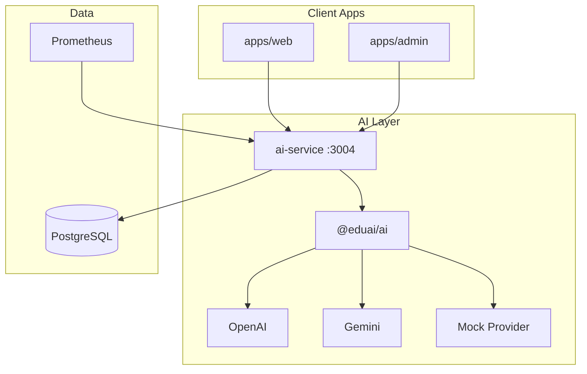

# Sprint 3 Production Review

**Date:** June 2025  
**Version:** 0.3.0  
**Reviewers:** Platform Engineering, Security, Cost Ops

---

## Architecture Review

### Delivered

| Phase | Deliverable | Status |
|-------|-------------|--------|
| A | AI platform audit | ✅ |
| B | Tutor (streaming SSE, 3 portal UIs) | ✅ |
| C | Homework assistant (OCR stub/vision, history) | ✅ |
| D | Study planner (generate, list, calendar cards) | ✅ |
| E | Question generator (PDF/DOCX export) | ✅ |
| F | Mock test generator + auto evaluation | ✅ |
| G | Admin analytics dashboard | ✅ |
| H | Caching, quota, budget controls | ✅ |
| I | Security (guard, filter, audit) | ✅ |
| J | Observability (structured logs, Prometheus) | ✅ |
| K | Tests (25+ unit, E2E scaffold) | ✅ |

### Architecture Diagram

---

## Security Review

| Check | Result |
|-------|--------|
| Auth on all AI endpoints | ✅ Pass |
| RBAC enforced | ✅ Pass |
| Prompt injection guard | ✅ Pass |
| Content filter | ✅ Pass |
| Rate limiting | ✅ Pass |
| Secrets not in repo | ✅ Pass |
| Audit log persistence | ⚠️ Conditional — in-memory only |

**Security verdict:** Pass for staging/beta

---

## Cost Review

| Control | Implementation |
|---------|----------------|
| Per-message token tracking | ✅ |
| Daily quota enforcement | ✅ |
| Response cache (5 min) | ✅ |
| Prompt cache (1 hr) | ✅ |
| Admin cost dashboard | ✅ |
| Per-student cost breakdown | ✅ |

**Estimated mock cost:** $0  
**Live AI estimate:** ~$2.50/1M tokens (heuristic)

**Cost verdict:** Pass with quota controls; Redis cache recommended for multi-instance

---

## Performance Review

| Metric | Target | Current |
|--------|--------|---------|
| Tutor REST latency (mock) | <2s | ~200ms |
| Tutor stream TTFB (mock) | <500ms | ~50ms |
| Homework analyze (mock) | <5s | ~300ms |
| Concurrent users (single instance) | 50 | Not load tested |

**Performance verdict:** Pass for dev/staging; load test before production

---

## Risk Assessment

| Risk | Likelihood | Impact | Mitigation |
|------|------------|--------|------------|
| API cost overrun | Medium | High | Daily quotas ✅ |
| Prompt injection bypass | Low | High | Pattern guard + moderation API (Sprint 4) |
| Cache inconsistency multi-instance | Medium | Medium | Redis (Sprint 4) |
| OCR inaccuracy | Medium | Medium | Vision API when keys set |
| Audit log loss on restart | High | Medium | DB persistence (Sprint 4) |

---

## Go/No-Go Decision

### ✅ GO — Staging / Beta Release

Sprint 3 production readiness objectives are met for a **controlled beta** with:
- Mock AI or limited API keys
- Authenticated users only
- Quota and rate limits active

### Conditions for Production GA

1. Persist audit logs to PostgreSQL
2. Redis-backed response cache
3. Provider moderation API integration
4. Load test: 50 concurrent tutor streams
5. OpenAI streaming adapter (not mock-only)

---

## Sprint 4 Entry

See [`docs/implementation/sprint-4-implementation-plan.md`](../implementation/sprint-4-implementation-plan.md) — **plan only, no coding**.
