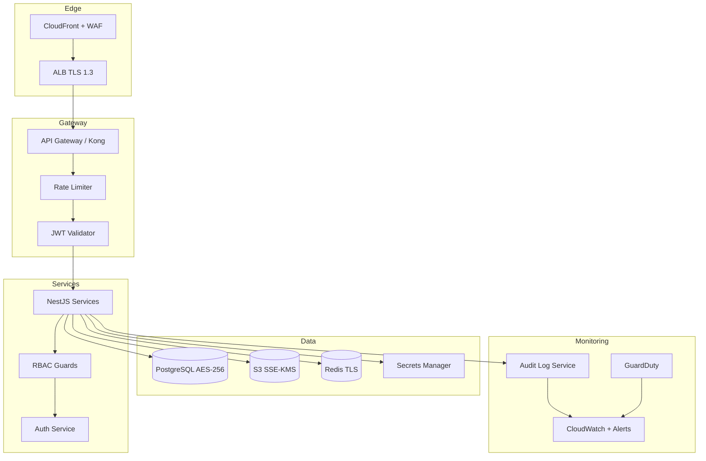
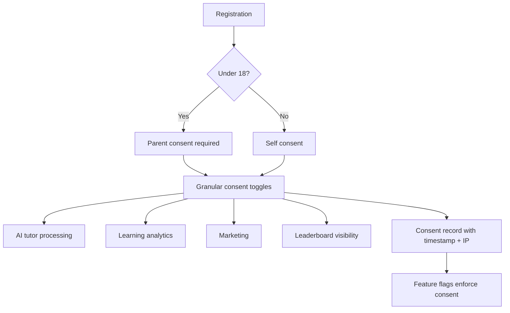

# EduAI — Security Architecture

**Document ID:** EDUAI-SEC-001  
**Version:** 1.0.0  
**Status:** Approved for Pre-Development  
**Date:** June 2025  
**Owner:** Security Engineering

---

## 1. Overview

This document defines EduAI's security architecture covering threat mitigation, encryption, audit logging, regulatory compliance (DPDP Act 2023), child data protection, and penetration testing. It implements NFR-SEC requirements from the [SRS](../srs/software-requirements-specification.md).

**Security principles:**
1. **Zero trust** — verify identity and authorization at every layer
2. **Defense in depth** — multiple controls; no single point of failure
3. **Least privilege** — minimum permissions required for each role
4. **Privacy by design** — child data treated as highest sensitivity class
5. **Assume breach** — logging, monitoring, and incident response ready

**Related:** [RBAC Design](../architecture/rbac-design.md) · [Multi-Tenant Architecture](../architecture/multi-tenant-architecture.md) · [DevOps Architecture](../devops/devops-architecture.md)

---

## 2. Security Architecture Diagram



---

## 3. OWASP Top 10 (2021) Mitigation

| # | Risk | EduAI Mitigation | Implementation |
|---|------|------------------|----------------|
| A01 | Broken Access Control | RBAC on every endpoint; tenant_id enforced in queries; scope guards | NestJS `@RequirePermission()` guards; row-level tenant isolation; integration tests per role matrix |
| A02 | Cryptographic Failures | TLS 1.3 in transit; AES-256 at rest; no custom crypto | AWS ALB + CloudFront TLS; RDS/S3 encryption; bcrypt/Argon2 for passwords |
| A03 | Injection | Parameterized queries; input validation; ORM usage | TypeORM/Prisma parameterized queries; class-validator DTOs; no raw SQL without review |
| A04 | Insecure Design | Threat modeling per sprint; security review gate | STRIDE reviews for auth, AI, billing flows; security checklist in PR template |
| A05 | Security Misconfiguration | IaC defaults; hardened containers; CSP headers | Terraform security groups; non-root Docker containers; Helmet.js + strict CSP |
| A06 | Vulnerable Components | Dependency scanning in CI; monthly patch cycle | Dependabot + Snyk in GitHub Actions; block merge on critical CVEs |
| A07 | Auth Failures | JWT short TTL; refresh rotation; lockout; MFA roadmap | 15-min access token; 7-day refresh with rotation; 5-attempt lockout; MFA Phase 2 |
| A08 | Software/Data Integrity | Signed commits; CI artifact verification; webhook signature validation | GitHub branch protection; Razorpay HMAC webhook verification |
| A09 | Logging Failures | Structured audit logs; centralized aggregation; alerting | All write ops logged; CloudWatch Logs; PagerDuty on auth anomalies |
| A10 | SSRF | Allowlist external URLs; no user-controlled fetch to internal networks | AI service URL allowlist; block metadata endpoint access from pods |

### 3.1 Additional Application Controls

- **CSRF:** SameSite=Strict cookies; CSRF tokens on state-changing web forms
- **XSS:** React auto-escaping; DOMPurify for rich text; Content-Security-Policy headers
- **Clickjacking:** `X-Frame-Options: DENY` on all portals
- **CORS:** Strict origin allowlist per tenant domain
- **File upload:** MIME validation, size limits (10MB homework), virus scan via ClamAV sidecar
- **AI prompt injection:** Input sanitization; system prompt hardening; output content safety filter

---

## 4. Encryption

### 4.1 Encryption in Transit

| Layer | Protocol | Configuration |
|-------|----------|---------------|
| Client → CDN | TLS 1.3 | CloudFront security policy `TLSv1.3_2024` |
| CDN → ALB | TLS 1.3 | ACM certificates, auto-renewal |
| ALB → Pods | TLS 1.2+ | mTLS between gateway and services (Istio/service mesh) |
| Service → RDS | TLS 1.2+ | `sslmode=require` on PostgreSQL connections |
| Service → Redis | TLS | ElastiCache in-transit encryption enabled |
| Service → S3 | HTTPS | AWS SDK enforced HTTPS |
| Mobile app | Certificate pinning | Pin CloudFront cert on React Native (Sprint 15) |

### 4.2 Encryption at Rest

| Asset | Method | Key Management |
|-------|--------|----------------|
| PostgreSQL (RDS) | AES-256 | AWS RDS encryption with KMS CMK |
| S3 (media, uploads) | SSE-KMS | Per-tenant KMS key optional for enterprise |
| EBS volumes | AES-256 | Default EKS node encryption |
| Redis (ElastiCache) | AES-256 | At-rest encryption enabled |
| Secrets | AES-256 | AWS Secrets Manager with automatic rotation (90 days) |
| Backups | AES-256 | Encrypted RDS snapshots; cross-region replication |
| Application-level PII | AES-256-GCM | Field-level encryption for Aadhaar-adjacent IDs, phone numbers |

### 4.3 Key Management

- **AWS KMS** customer-managed keys (CMK) for production
- Key rotation: automatic annual rotation for CMKs
- Access: IAM roles per service; no human access to raw keys
- Break-glass: dual-control procedure documented in runbook (US-208)

---

## 5. Authentication & Session Security

| Control | Specification |
|---------|---------------|
| Access token TTL | 15 minutes |
| Refresh token TTL | 7 days with rotation on use |
| Password policy | Min 8 chars, 1 upper, 1 lower, 1 digit; breached password check (HaveIBeenPwned API) |
| OAuth | Google OAuth 2.0 with PKCE; scoped to email + profile |
| Session storage | Refresh tokens hashed (SHA-256) in database; httpOnly Secure SameSite cookies on web |
| Multi-device | Device registry with IP, user-agent, last active; remote revoke |
| Account lockout | 5 failed attempts → 15-minute lockout; alert after 3 attempts |
| API authentication | Bearer JWT; validated at gateway and service level (defense in depth) |

---

## 6. Audit Logging

### 6.1 What Is Logged

| Category | Events | Retention |
|----------|--------|-----------|
| Authentication | Login, logout, failed attempts, password reset, token refresh | 1 year |
| Authorization | Permission denied (403), role changes | 1 year |
| Data access | PII read by admin/support (who accessed which student record) | 2 years |
| Data mutation | All CREATE, UPDATE, DELETE on user, tenant, billing, consent records | 2 years |
| AI interactions | Query metadata (not full content for minors without consent); token spend | 90 days content / 1 year metadata |
| Admin actions | Tenant CRUD, feature flag changes, bulk imports | 2 years |
| Billing | Payment events, subscription changes, webhook receipts | 7 years (tax compliance) |

### 6.2 Audit Log Schema

```json
{
  "id": "uuid",
  "timestamp": "2025-06-20T10:30:00Z",
  "tenant_id": "uuid",
  "actor_id": "uuid",
  "actor_role": "platform_admin",
  "action": "tenants:update",
  "resource_type": "tenant",
  "resource_id": "uuid",
  "ip_address": "203.0.113.42",
  "user_agent": "Mozilla/5.0...",
  "correlation_id": "req-abc-123",
  "changes": { "status": { "old": "active", "new": "suspended" } },
  "outcome": "success"
}
```

### 6.3 Audit Log Protection

- Append-only storage (no UPDATE/DELETE on audit table)
- Separate database schema with restricted write access
- Platform admin audit viewer (US-033) with export for compliance requests
- Real-time alerts: >10 failed logins/minute, bulk data export, admin role elevation

---

## 7. DPDP Act 2023 Compliance

India's Digital Personal Data Protection Act governs personal data processing. EduAI processes children's data — the highest compliance tier.

### 7.1 Lawful Basis & Consent

| Processing Activity | Lawful Basis | Consent Required |
|--------------------|--------------|------------------|
| Account creation | Consent | Yes — explicit opt-in |
| Learning analytics | Consent | Yes — parent for minors |
| AI tutor interactions | Consent | Yes — parent for minors; granular toggle |
| Marketing communications | Consent | Yes — separate opt-in |
| Billing/payment | Contract | Razorpay terms + EduAI subscription agreement |
| School ERP (attendance, fees) | Contract + Legitimate interest (school) | School contract + parent notification |

### 7.2 Data Principal Rights

| Right | Implementation |
|-------|----------------|
| Right to access | Parent portal: download all child data (JSON + PDF) within 72 hours |
| Right to correction | Profile edit + support ticket for historical data correction |
| Right to erasure | Account deletion flow; 30-day grace period; cascade delete with audit trail |
| Right to grievance | In-app grievance form; DPO contact email; 30-day response SLA |
| Right to nominate | Account settings: nominate representative for post-incapacitation |

### 7.3 Data Fiduciary Obligations

- **Privacy notice:** Clear, accessible privacy policy in English, Hindi, Marathi
- **Data Protection Officer:** Appointed DPO with published contact
- **Data breach notification:** Board + affected principals within 72 hours of discovery
- **Data localization:** Primary storage in AWS ap-south-1 (Mumbai); no cross-border transfer without explicit consent and safeguards
- **Purpose limitation:** Collect only data necessary for stated educational purpose
- **Storage limitation:** AI conversations purged after 90 days; inactive accounts anonymized after 24 months

### 7.4 Consent Management Flow



---

## 8. Child Data Protection

EduAI serves users as young as age 3. Child data receives enhanced protections beyond standard DPDP compliance.

### 8.1 Classification

| Data Class | Examples | Controls |
|------------|----------|----------|
| Child PII | Name, age, class, school, photo | Parent consent required; encrypted at rest; access logged |
| Child behavioral | Learning progress, quiz scores, time on platform | Parent consent; not shared with third parties except anonymized aggregates |
| Child AI interactions | Chat messages with AI tutor | Parent consent toggle; content safety filter; 90-day retention |
| Child biometric | Face ID / fingerprint (mobile) | Stored on device only; never transmitted to EduAI servers |

### 8.2 Prohibited Practices

- No behavioral advertising targeted at children
- No sale of child data to third parties
- No public profiles for users under 13 without parent approval
- No collection of precise geolocation beyond country/state
- No social features (chat between students) in Phase 1

### 8.3 Parent Controls

- Approve/disable AI tutor per child (US-157)
- Screen time limits with auto-pause (US-149)
- Leaderboard opt-in/opt-out per child
- Download all child data (DPDP access right)
- Delete child account with full data erasure

### 8.4 Content Safety for AI

- Pre-LLM: input classification blocks inappropriate queries from minors
- Post-LLM: content safety filter (OpenAI Moderation / Gemini Safety)
- System prompt: "You are a tutor for a [age]-year-old student. Never discuss [blocked topics]. Provide age-appropriate explanations."
- Human review queue for flagged conversations (platform admin)

---

## 9. Multi-Tenant Security

| Control | Implementation |
|---------|----------------|
| Tenant isolation | `tenant_id` on every table; enforced in ORM global scope and raw query linting |
| Cross-tenant access | Impossible by default; platform_admin requires explicit `tenants:manage:global` permission |
| White-label domains | TLS cert per custom domain; CORS origin tied to tenant config |
| Tenant suspension | Immediate JWT invalidation; read-only mode for 30 days before data deletion |
| Noisy neighbor | Rate limits per tenant; AI quota per tenant; resource quotas in K8s |

---

## 10. Network Security

| Layer | Control |
|-------|---------|
| WAF | AWS WAF on CloudFront: OWASP managed rules, rate limiting, geo-blocking (optional) |
| VPC | Private subnets for RDS, Redis; public subnets only for ALB |
| Security groups | Least-privilege; services only communicate on required ports |
| Pod security | Non-root containers; read-only root filesystem; drop ALL capabilities |
| Network policies | K8s NetworkPolicy: service-to-service allowlist only |
| Egress | Restrict outbound from AI service to LLM provider endpoints only |
| DDoS | AWS Shield Standard on CloudFront; rate limiting at gateway |

---

## 11. Incident Response

### 11.1 Severity Levels

| Severity | Example | Response Time | Notification |
|----------|---------|---------------|--------------|
| P0 Critical | Data breach, auth bypass | 15 min | CEO, DPO, legal, affected users |
| P1 High | Service down, payment failure | 30 min | On-call engineer, product lead |
| P2 Medium | Elevated error rate, single tenant issue | 2 hours | On-call engineer |
| P3 Low | Non-critical bug, cosmetic | Next business day | Engineering backlog |

### 11.2 Incident Response Playbook

1. **Detect** — CloudWatch alarms, GuardDuty findings, user reports
2. **Triage** — On-call assigns severity; war room for P0/P1
3. **Contain** — Isolate affected tenant/service; revoke compromised credentials
4. **Eradicate** — Patch vulnerability; rotate keys
5. **Recover** — Restore from backup if needed; verify integrity
6. **Notify** — DPDP breach notification within 72 hours if personal data affected
7. **Post-mortem** — Blameless review within 5 business days; action items tracked

---

## 12. Penetration Testing Plan

### 12.1 Schedule

| Phase | Timing | Scope | Vendor |
|-------|--------|-------|--------|
| Baseline | Sprint 8 | Auth, API, tenant isolation | Third-party (CREST/OSCP certified) |
| Pre-GA | Sprint 15 | Full platform + mobile + AI injection | Third-party |
| Annual | Post-GA + every 12 months | Full regression + new features | Third-party |
| Continuous | Ongoing | DAST in CI (OWASP ZAP); SAST (Semgrep) | Automated |

### 12.2 Test Scope

**In scope:**
- All public API endpoints (`/api/v1/*`)
- Web portals (student, teacher, parent, admin)
- Mobile app (iOS + Android)
- Authentication and session management
- Multi-tenant isolation (attempt cross-tenant data access)
- AI prompt injection and content safety bypass
- Razorpay webhook handling
- File upload vulnerabilities

**Out of scope:**
- Third-party services (Mux, Razorpay dashboard, Clerk)
- Social engineering of employees
- Physical security

### 12.3 Acceptance Criteria

- **Zero critical findings** open at GA
- **Zero high findings** open at GA (or documented compensating controls approved by CISO)
- Medium findings remediated within 30 days of report
- Re-test of all critical/high findings before GA sign-off

### 12.4 Automated Security Testing in CI

```yaml
# GitHub Actions security pipeline (summary)
- SAST: Semgrep (OWASP rules) — block on critical
- Dependency scan: Snyk — block on critical/high
- Container scan: Trivy — block on critical
- Secret scan: GitLeaks — block on any secret
- DAST: OWASP ZAP baseline scan on staging (weekly)
```

---

## 13. Compliance Checklist (GA Gate)

| # | Requirement | Owner | Status |
|---|-------------|-------|--------|
| 1 | OWASP Top 10 mitigations documented and verified | Security | Pre-GA |
| 2 | Encryption at rest and in transit verified | DevOps | Pre-GA |
| 3 | Audit logging operational for all write operations | Backend | Sprint 3 |
| 4 | DPDP consent flows implemented and legal-reviewed | Product + Legal | Sprint 16 |
| 5 | Child data protection controls verified | Security | Sprint 16 |
| 6 | Penetration test passed (no critical/high open) | Security | Sprint 16 |
| 7 | Incident response runbooks published | SRE | Sprint 16 |
| 8 | DPO appointed and contact published | Legal | Pre-GA |
| 9 | Privacy policy published in en/hi/mr | Legal | Sprint 13 |
| 10 | Data localization confirmed (ap-south-1 only) | DevOps | Sprint 1 |

---

*Related: [RBAC Design](../architecture/rbac-design.md) · [DevOps Architecture](../devops/devops-architecture.md) · [Testing Strategy](../testing/testing-strategy.md)*
