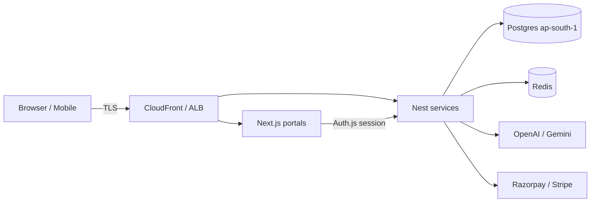

# EduAI Threat Model (Phase 9)

**Document ID:** EDUAI-SEC-TM-001  
**Date:** 2026-07-23  
**Method:** STRIDE (lightweight)  
**Scope:** identity, learning, AI, ERP, billing, web/admin/mobile clients  
**Status:** Engineering baseline — legal/pen-test sign-off is Phase 12

## 1. Assets

| Asset | Sensitivity | Notes |
|-------|-------------|-------|
| Student / minor PII | Critical | Name, DOB, phone, school, guardian links |
| Credentials & sessions | Critical | Password hashes (bcrypt), JWT, refresh tokens |
| Academic records | High | Progress, grades, attendance |
| Billing / payment metadata | High | Invoices; card PANs never stored |
| AI prompts / homework images | Medium–High | May contain personal content |
| Tenant branding / config | Medium | White-label |

## 2. Trust boundaries

- Untrusted: client devices, uploaded URLs, webhook callers  
- Semi-trusted: CDN/edge (WAF assumed in staging/prod)  
- Trusted: Nest services with JWT + RBAC + tenant filters; Postgres with optional RLS  

## 3. STRIDE summary

| Threat | Example | Mitigations (Phase 9+) |
|--------|---------|------------------------|
| **S**poofing | Stolen JWT / forged session | Short-lived access tokens; refresh rotation; Redis revocation; `resolveJwtSecret` / `resolveAuthSecret` fail-closed in production |
| **T**ampering | Mutate audit trail | Immutable `audit_logs` triggers; append-only writes |
| **R**epudiation | Deny login/consent action | Audit on login success/fail, consent grant/verify/withdraw, DSR lifecycle |
| **I**nformation disclosure | IDOR / cross-tenant read | App-level `tenantId` on every query; `assertSameTenant`; RLS on consent/DSR (+ prior ERP/billing); NotFound on cross-tenant |
| **D**enial of service | Auth flooding | Throttler (auth stricter); login anomaly counters |
| **E**levation of privilege | Parent acting without link | `consent:manage:linked` + verified `ParentStudentLink`; permission guards |

## 4. High-risk flows

### 4.1 Authentication
- Demo logins preserved in non-production via known secrets in `.env` (never committed).  
- Failed logins → `auth:login_failed` audit + `recordFailedLogin` anomaly hook (threshold 5 / 15m).

### 4.2 Parental consent (minors)
- Parent grants purpose-limited consent for linked child → `pending_parental`.  
- Verification via hashed OTP / attestation (`hashVerificationSecret`) — plaintext OTP never persisted.  
- Withdrawal supported; purpose limitation encoded per `ConsentPurpose`.

### 4.3 Data subject requests
- Export auto-packages minimized profile + consents + sessions (no password hashes / payment secrets).  
- Erasure anonymizes user + revokes sessions on admin completion.  
- SLA due date default 30 days (product/legal may adjust).

### 4.4 AI homework media (SSRF)
- `imageUrl` / `pdfUrl` must pass `assertSafeExternalUrl` (https + host allowlist + private IP block).

### 4.5 File upload
- Client: MIME + size + path-safe names in `@eduai/ui` FileUploader.  
- Server: `validateUploadFile` + optional `scanUpload` webhook / ClamAV hook.

## 5. Encryption posture

| Layer | Control |
|-------|---------|
| Transit | TLS terminated at edge; document `sslmode=require` for RDS (ops) |
| At rest | RDS/S3 AES-256 (infra); passwords bcrypt cost 12 |
| Field-level | `encryptField` / `decryptField` AES-256-GCM when `FIELD_ENCRYPTION_KEY` set |

## 6. Out of scope / assumptions

- Full legal DPDP opinion and DPIA — Phase 12.  
- Live ClamAV sidecar — hook only unless `SCAN_WEBHOOK_URL` / `CLAMAV_HOST` configured.  
- Hardware MFA — roadmap beyond Phase 9.  
- Setting `app.tenant_id` on every Prisma connection for RLS enforcement — evaluated; app filters remain primary (see `postgres-rls-evaluation.md`).

## 7. Residual risk

| Risk | Rating | Treatment |
|------|--------|-----------|
| Misconfigured AUTH_SECRET in prod | High → mitigated | Fail-closed boot |
| Allowlist gaps for media hosts | Medium | Ops maintain `UPLOAD_URL_ALLOWLIST` |
| Soft-delete erasure vs hard purge of learning history | Medium | Documented; expand purge jobs later |
| Dependency CVEs | Ongoing | CI `pnpm audit` + gitleaks |
