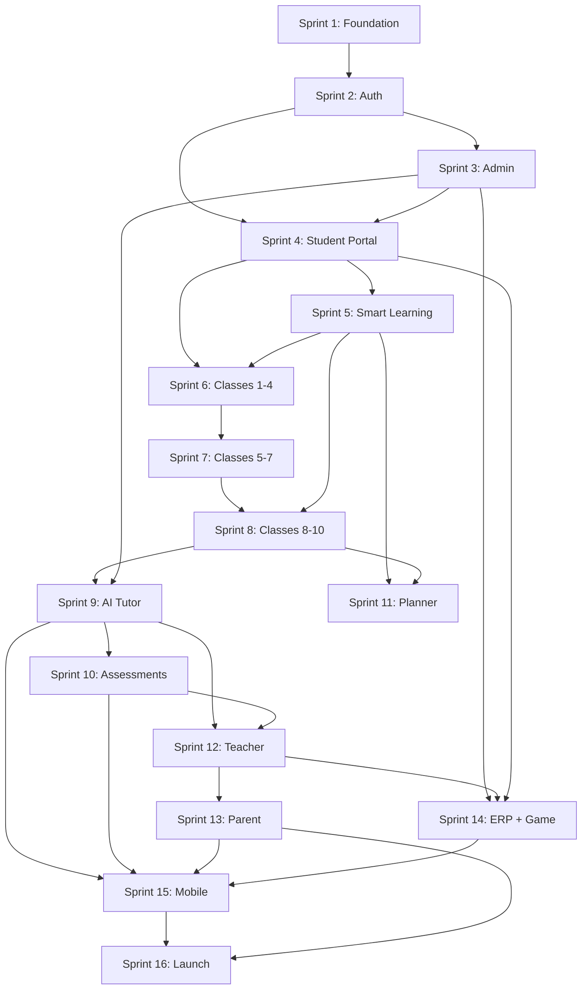

# EduAI — Sprint Planning (Sprints 1–16)

**Document ID:** EDUAI-SP-001  
**Version:** 1.0.0  
**Status:** Approved for Pre-Development  
**Date:** June 2025  
**Owner:** Engineering & Product

---

## 1. Overview

EduAI Phase 1 delivers MVP through **16 two-week sprints** (~8 months). Each sprint has a theme, goal, assigned user stories, acceptance criteria, and dependencies.

**Velocity assumption:** ~60 story points per sprint (team of 8: 2 frontend, 3 backend, 1 mobile, 1 DevOps, 1 QA).

**Related:** [User Stories](./user-stories.md) · [User Flows](./user-flows.md) · [SRS](../srs/software-requirements-specification.md)

---

## 2. Sprint Calendar

| Sprint | Theme | Dates (est.) | Points |
|--------|-------|--------------|--------|
| 1 | Foundation & DevOps | Jun 2025 – Jul 2025 | 49 |
| 2 | Auth & RBAC | Jul 2025 | 55 |
| 3 | Admin CRM & Tenant Mgmt | Jul – Aug 2025 | 58 |
| 4 | Student Portal Core | Aug 2025 | 62 |
| 5 | Smart Learning Hub | Aug – Sep 2025 | 55 |
| 6 | Classes 1–4 System | Sep 2025 | 50 |
| 7 | Classes 5–7 System | Sep – Oct 2025 | 49 |
| 8 | Classes 8–10 System | Oct 2025 | 41 |
| 9 | AI Tutor & Homework | Oct – Nov 2025 | 69 |
| 10 | AI Assessments | Nov 2025 | 59 |
| 11 | Study Planner & Brain Dev | Nov – Dec 2025 | 50 |
| 12 | Teacher Portal | Dec 2025 | 62 |
| 13 | Parent Portal | Dec 2025 – Jan 2026 | 62 |
| 14 | School ERP & Gamification | Jan 2026 | 55 |
| 15 | Mobile App | Jan – Feb 2026 | 81 |
| 16 | Polish & Launch | Feb 2026 | 55 |

---

## 3. Sprint 1: Foundation & DevOps

### Goal

Establish monorepo, CI/CD, containerization, observability, and AWS infrastructure so all subsequent sprints deploy to a working staging environment.

### Assigned Stories

| ID | Story | Points |
|----|-------|--------|
| US-001 | Turborepo monorepo with shared packages | 8 |
| US-002 | Docker images for all services | 5 |
| US-003 | GitHub Actions CI (lint, test, build) | 5 |
| US-004 | EKS cluster via Terraform | 8 |
| US-005 | OpenAPI auto-generation | 3 |
| US-006 | Structured JSON logging + correlation IDs | 5 |
| US-007 | Docker Compose local dev environment | 5 |
| US-008 | Prometheus + Grafana dashboards | 5 |
| US-009 | Shared ESLint/Prettier/TS configs | 2 |
| US-010 | AWS Secrets Manager integration | 3 |

### Sprint Acceptance Criteria

- [ ] `turbo run build test lint` passes in CI on every PR
- [ ] All services deploy to staging EKS via GitHub Actions
- [ ] Grafana dashboard shows health metrics for deployed services
- [ ] Developer onboarding doc: clone → `docker compose up` → running locally in < 30 min
- [ ] OpenAPI spec published at `/api/docs`

### Dependencies

- **External:** AWS account provisioned, GitHub org configured
- **Decisions:** Clerk vs Auth.js (resolve by sprint end — see PRD Open Question #1)
- **Blocks:** All subsequent sprints

---

## 4. Sprint 2: Auth & RBAC

### Goal

Deliver secure authentication, multi-role RBAC, parent-child linking, and DPDP parental consent flows.

### Assigned Stories

| ID | Story | Points |
|----|-------|--------|
| US-011 | Email/password registration | 5 |
| US-012 | Email verification | 3 |
| US-013 | Google OAuth | 5 |
| US-014 | JWT access + refresh tokens | 5 |
| US-015 | Multi-device session management | 5 |
| US-016 | Parent-child account linking | 5 |
| US-017 | Parental consent for minors (DPDP) | 8 |
| US-018 | Account lockout after failed attempts | 3 |
| US-019 | Password reset flow | 3 |
| US-020 | RBAC permission guards on all APIs | 8 |
| US-021 | Role assignment by school admin | 5 |
| US-022 | JWT claims with tenant_id/school_id | 5 |

### Sprint Acceptance Criteria

- [ ] All FR-AUTH P0 requirements pass QA
- [ ] RBAC permission matrix implemented per [RBAC Design](../architecture/rbac-design.md)
- [ ] Parent consent flow blocks minor account until approved
- [ ] Security review: no auth endpoints without rate limiting
- [ ] Integration tests cover all role × permission combinations

### Dependencies

- **Requires:** Sprint 1 (infra, CI, monorepo)
- **Blocks:** Sprint 3 (admin needs auth), Sprint 4 (student portal needs auth)

---

## 5. Sprint 3: Admin CRM & Tenant Management

### Goal

Enable platform and tenant admins to provision white-label tenants, manage users, and monitor SaaS operations.

### Assigned Stories

| ID | Story | Points |
|----|-------|--------|
| US-023 | Role-based UI navigation | 5 |
| US-026 | Create white-label tenants | 8 |
| US-027 | Tenant branding configuration | 5 |
| US-028 | Suspend/delete tenants | 5 |
| US-029 | Tenant dashboard with metrics | 5 |
| US-030 | Cross-tenant analytics | 8 |
| US-031 | AI token spend monitoring | 5 |
| US-032 | CMS content pipeline | 8 |
| US-033 | Audit log viewer | 5 |
| US-034 | Per-tenant feature flags | 5 |
| US-037 | Bulk user CSV import | 5 |

### Sprint Acceptance Criteria

- [ ] Platform admin can CRUD tenants with branding in staging
- [ ] Tenant data isolation verified — cross-tenant query returns zero rows
- [ ] Audit logs capture all tenant CRUD operations
- [ ] CMS pipeline: draft → review → publish workflow functional
- [ ] Bulk import of 500 users completes in < 2 minutes

### Dependencies

- **Requires:** Sprint 2 (auth, RBAC, tenant_id in JWT)
- **Blocks:** Sprint 8 (school onboarding), Sprint 14 (ERP tenant config)

---

## 6. Sprint 4: Student Portal Core

### Goal

Deliver the foundational student experience: dashboard, curriculum navigation, lessons, quizzes, and i18n.

### Assigned Stories

| ID | Story | Points |
|----|-------|--------|
| US-041 | Personalized dashboard | 5 |
| US-042 | Curriculum browser (board/class/subject/chapter) | 5 |
| US-043 | Video lessons via Mux | 8 |
| US-044 | Interactive text lessons + quizzes | 5 |
| US-046 | Immediate quiz feedback | 3 |
| US-047 | Profile and settings | 3 |
| US-048 | Notification center | 5 |
| US-049 | UI language selection (en/hi/mr) | 5 |
| US-051 | Search across lessons | 5 |
| US-054 | Responsive tablet/mobile web layout | 5 |
| US-055 | Onboarding wizard | 5 |

### Sprint Acceptance Criteria

- [ ] Student can complete a full lesson (video + quiz) with progress persisted
- [ ] Dashboard LCP < 2.5s on staging (4G throttled)
- [ ] i18n: English and Hindi UI fully translated for student portal
- [ ] Mux video playback with progress tracking verified
- [ ] All FR-STU P0 items except AI/class-band features pass QA

### Dependencies

- **Requires:** Sprint 2 (auth), Sprint 3 (tenant branding, CMS content)
- **Content dependency:** CBSE Class 5 Math sample unit published in CMS
- **Blocks:** Sprints 5–8 (class systems build on portal core)

---

## 7. Sprint 5: Smart Learning Hub

### Goal

Implement adaptive learning paths, diagnostic assessments, recommendations, and spaced repetition.

### Assigned Stories

| ID | Story | Points |
|----|-------|--------|
| US-056 | Diagnostic assessment on first use | 8 |
| US-057 | Adaptive learning path generation | 8 |
| US-058 | Content recommendation engine | 5 |
| US-059 | Spaced repetition reminders | 8 |
| US-060 | Cross-module progress sync | 5 |
| US-062 | Skill mastery heatmap | 5 |
| US-063 | Recommendation respects subscription tier | 3 |
| US-064 | Review due queue | 5 |

### Sprint Acceptance Criteria

- [ ] New student completes diagnostic → receives personalized path within 30s
- [ ] Recommendations update after each lesson completion
- [ ] Spaced repetition queue surfaces due reviews correctly
- [ ] Freemium users see limited recommendation depth
- [ ] Progress heatmap renders for all subjects with data

### Dependencies

- **Requires:** Sprint 4 (student portal, lesson completion events)
- **Blocks:** Sprint 11 (study planner uses weak topic data)

---

## 8. Sprint 6: Classes 1–4 System

### Goal

Deliver age-appropriate UX for pre-primary and early primary (Classes 1–4): playful UI, voice guidance, brain games foundation.

### Assigned Stories

| ID | Story | Points |
|----|-------|--------|
| US-066 | Large touch targets, playful UI | 8 |
| US-067 | Voice-guided activities | 8 |
| US-068 | Phonics and letter recognition games | 5 |
| US-069 | Basic numeracy exercises | 5 |
| US-070 | Parent co-play mode | 5 |
| US-071 | Animated rewards | 3 |
| US-072 | Simplified navigation (max 3 levels) | 5 |
| US-073 | Age-appropriate content filters for teachers | 3 |
| US-074 | Shape and color recognition | 3 |

### Sprint Acceptance Criteria

- [ ] Class 1–4 UI passes usability test with 5 target-age children
- [ ] Voice guidance works in English and Hindi
- [ ] Navigation depth never exceeds 3 levels
- [ ] Touch targets ≥ 48px per WCAG
- [ ] Content tagged `age_band: 1-4` only shown to appropriate students

### Dependencies

- **Requires:** Sprint 4 (portal core), Sprint 5 (adaptive paths)
- **Content dependency:** Pre-primary + Class 1–4 CBSE content units

---

## 9. Sprint 7: Classes 5–7 System

### Goal

Gamified middle-primary experience with story-driven lessons, group challenges, and skill development hub.

### Assigned Stories

| ID | Story | Points |
|----|-------|--------|
| US-076 | Gamified story-driven introductions | 5 |
| US-077 | Subject module navigation with progress rings | 5 |
| US-078 | Group challenges with classmates | 8 |
| US-079 | Skill development hub access | 5 |
| US-080 | Micro-certificates on completion | 3 |
| US-081 | Moderate information density UI | 5 |
| US-082 | Teacher assigns group challenges | 5 |
| US-083 | Hindi UI + English content toggle | 5 |

### Sprint Acceptance Criteria

- [ ] Class 5–7 UI distinct from Class 1–4 and 8–10 bands
- [ ] Group challenges functional with 2+ students in same class
- [ ] Micro-certificates generated as shareable PDF/image
- [ ] Bilingual toggle persists across sessions
- [ ] Usability test with Class 6 students passes

### Dependencies

- **Requires:** Sprint 6 (class band framework established)
- **Blocks:** Sprint 12 (teacher assigns group content)

---

## 10. Sprint 8: Classes 8–10 System

### Goal

Exam-focused, mobile-first secondary experience with board prep, peer leaderboards, and PYQ practice.

### Assigned Stories

| ID | Story | Points |
|----|-------|--------|
| US-086 | Exam-focused dashboard with countdown | 5 |
| US-087 | Mobile-first responsive layout | 5 |
| US-088 | Peer leaderboard | 5 |
| US-089 | Previous year board question practice | 8 |
| US-090 | Topic-wise weak area drill mode | 5 |
| US-091 | Dense information layout | 3 |
| US-092 | Formula sheets and reference cards | 5 |
| US-093 | Exam calendar synced to board schedule | 3 |

### Sprint Acceptance Criteria

- [ ] Class 8–10 dashboard shows board exam countdown
- [ ] PYQ practice functional for CBSE Class 10 Math sample
- [ ] Leaderboard scoped to class with privacy controls
- [ ] Mobile web layout passes testing on iPhone SE and budget Android
- [ ] **Decision:** Gemini vs OpenAI primary provider resolved (PRD Open Question #2)

### Dependencies

- **Requires:** Sprint 7 (class band UX pattern), Sprint 5 (weak topic data)
- **Blocks:** Sprint 9 (AI features need class context), Sprint 10 (mock tests)

---

## 11. Sprint 9: AI Tutor & Homework

### Goal

Ship AI Tutor with RAG, streaming responses, homework assistant, and digital submission workflow.

### Assigned Stories

| ID | Story | Points |
|----|-------|--------|
| US-096 | AI Tutor chat with chapter context | 8 |
| US-097 | AI responses in user's UI language | 5 |
| US-098 | Curriculum RAG retrieval | 8 |
| US-099 | Streaming AI responses | 5 |
| US-100 | Homework assistant (hints, not answers) | 8 |
| US-101 | Homework submission (text + photo) | 5 |
| US-102 | Submission status tracking | 3 |
| US-103 | AI content safety filter | 5 |
| US-104 | Daily AI query quota per tier | 5 |
| US-105 | 90-day conversation retention | 3 |
| US-106 | Model tier routing (mini vs full) | 8 |
| US-108 | Follow-up "why" questions | 3 |

### Sprint Acceptance Criteria

- [ ] AI Tutor first token < 2s p95 on staging
- [ ] RAG responses cite board-aligned content (not generic LLM knowledge)
- [ ] Content safety filter blocks test injection prompts
- [ ] Homework photo upload to S3 with OCR optional (P1: US-110 deferred if needed)
- [ ] AI COGS tracking shows spend per query in admin dashboard
- [ ] All FR-AI P0 items for tutor and homework pass QA

### Dependencies

- **Requires:** Sprint 4 (lessons), Sprint 8 (class context), Sprint 3 (AI cost monitoring)
- **External:** OpenAI/Gemini API keys, vector index populated with CBSE content
- **Blocks:** Sprint 10 (assessments use AI infra), Sprint 12 (teacher grading)

---

## 12. Sprint 10: AI Assessments

### Goal

Deliver mock tests with auto-grading, AI Question Paper Generator, and curated question banks.

### Assigned Stories

| ID | Story | Points |
|----|-------|--------|
| US-111 | Timed mock tests (board pattern) | 8 |
| US-112 | Instant auto-grading (MCQ/objective) | 5 |
| US-113 | Detailed mock test report | 5 |
| US-114 | AI Question Paper Generator | 8 |
| US-115 | Teacher review/edit before publish | 5 |
| US-116 | QPG filters (topic, difficulty, type) | 5 |
| US-117 | Curated question banks | 5 |
| US-118 | Pause/resume for long tests | 5 |
| US-119 | Teacher assigns mock tests to class | 5 |

### Sprint Acceptance Criteria

- [ ] Student completes timed mock test → instant graded report
- [ ] QPG generates CBSE Class 10 pattern paper in < 30s
- [ ] Teacher can edit AI-generated questions before publishing
- [ ] Mock test report shows topic-wise breakdown
- [ ] Question bank search < 500ms p95

### Dependencies

- **Requires:** Sprint 9 (AI infra), Sprint 8 (Class 8–10 exam UX)
- **Content dependency:** Question bank with 500+ verified CBSE questions
- **Blocks:** Sprint 12 (teacher assigns tests), Sprint 13 (parent views scores)

---

## 13. Sprint 11: Study Planner & Brain Development

### Goal

AI-generated study schedules and cognitive brain development games with parent progress reports.

### Assigned Stories

| ID | Story | Points |
|----|-------|--------|
| US-121 | AI-generated weekly study schedule | 8 |
| US-122 | Planner synced to exam dates + weak topics | 5 |
| US-123 | Calendar view of study sessions | 5 |
| US-124 | Mark study tasks complete | 3 |
| US-125 | Brain development cognitive games | 8 |
| US-126 | Age-appropriate difficulty scaling | 5 |
| US-127 | Brain dev progress reports for parents | 5 |
| US-128 | Study planner push reminders | 3 |
| US-129 | Planner adjusts on missed sessions | 5 |

### Sprint Acceptance Criteria

- [ ] Study planner generates weekly schedule from exam date + weak topics
- [ ] Calendar view shows daily planned sessions
- [ ] Brain games functional for age bands 3–9 and 10–12
- [ ] Missed session triggers planner recalculation
- [ ] Parent report includes brain dev metrics

### Dependencies

- **Requires:** Sprint 5 (weak topics), Sprint 8 (exam calendar), Sprint 6 (brain games foundation)
- **Blocks:** Sprint 13 (parent reports include planner data)

---

## 14. Sprint 12: Teacher Portal

### Goal

Complete teacher workflow: roster, assignments, grading, analytics, QPG integration, and parent communication.

### Assigned Stories

| ID | Story | Points |
|----|-------|--------|
| US-131 | Class roster management | 5 |
| US-132 | Create and assign homework | 5 |
| US-133 | Grade submissions with rubric | 8 |
| US-134 | Class analytics dashboard | 5 |
| US-135 | Assign content from library | 5 |
| US-136 | Announcements to parents | 5 |
| US-137 | Individual student gap analysis | 5 |
| US-138 | Message parents directly | 5 |
| US-140 | Pending grading queue dashboard | 3 |
| US-143 | Attendance + academic analytics | 5 |
| US-144 | Hindi UI for teacher portal | 5 |

### Sprint Acceptance Criteria

- [ ] Teacher completes full cycle: assign homework → grade → notify parent
- [ ] QPG accessible from teacher portal (Sprint 10 integration)
- [ ] Class analytics show avg scores and completion rates
- [ ] Gap analysis identifies bottom 20% students by topic
- [ ] All FR-TCH P0 requirements pass QA

### Dependencies

- **Requires:** Sprint 9 (homework), Sprint 10 (QPG, mock tests), Sprint 2 (teacher role)
- **Blocks:** Sprint 13 (parent views teacher messages), Sprint 14 (attendance integration)

---

## 15. Sprint 13: Parent Portal

### Goal

Multi-child dashboard, subscription management, DPDP consent, progress reports, and screen time controls.

### Assigned Stories

| ID | Story | Points |
|----|-------|--------|
| US-146 | Multi-child dashboard | 5 |
| US-147 | Weekly AI progress reports | 8 |
| US-148 | Subscription and payment management | 5 |
| US-149 | Screen time limits per child | 5 |
| US-150 | DPDP consent management | 5 |
| US-151 | Message teachers | 5 |
| US-152 | Homework completion status | 3 |
| US-153 | Mock test scores and trends | 5 |
| US-154 | Family plan single billing | 5 |
| US-155 | Notification preferences | 3 |
| US-157 | Approve/reject child features | 5 |
| US-196 | Razorpay subscription checkout | 8 |

### Sprint Acceptance Criteria

- [ ] Parent views all linked children on single dashboard
- [ ] Weekly AI report generated and delivered (email + in-app)
- [ ] Razorpay checkout completes with UPI/card in staging
- [ ] DPDP consent preferences persist and enforce data processing
- [ ] Screen time limit triggers session pause for child
- [ ] **Decision:** Leaderboard opt-out default for schools (PRD Open Question #4)

### Dependencies

- **Requires:** Sprint 2 (parent linking), Sprint 12 (teacher data), Sprint 10 (mock scores)
- **External:** Razorpay staging account, legal review of consent flows
- **Blocks:** Sprint 16 (billing for launch)

---

## 16. Sprint 14: School ERP & Gamification

### Goal

School operations (enrollment, attendance, fees, announcements) plus XP, badges, streaks, and leaderboards.

### Assigned Stories

| ID | Story | Points |
|----|-------|--------|
| US-161 | Student enrollment management | 8 |
| US-162 | Daily attendance marking | 5 |
| US-163 | Attendance reports | 5 |
| US-167 | School-wide announcements | 5 |
| US-169 | Bulk student import from SIS | 5 |
| US-171 | XP for lessons, quizzes, streaks | 5 |
| US-172 | Badge definitions and awards | 5 |
| US-173 | Daily streak with freeze token | 5 |
| US-174 | Leaderboards (class/school/tenant) | 5 |
| US-175 | School opt-out of public leaderboards | 3 |
| US-177 | XP level progression | 3 |
| US-178 | Streak reminder notifications | 3 |
| US-180 | Gamification hub | 5 |

### Sprint Acceptance Criteria

- [ ] School admin manages enrollment records for 500+ students
- [ ] Teacher marks attendance → report generated by date range
- [ ] XP awarded on lesson completion with correct values
- [ ] Streak increments daily; freeze token prevents break once/month
- [ ] Leaderboard respects school opt-out setting
- [ ] All FR-ERP P0 and FR-GAME P0 requirements pass QA

### Dependencies

- **Requires:** Sprint 3 (tenant/school entities), Sprint 12 (teacher portal), Sprint 4 (lesson events for XP)
- **Blocks:** Sprint 15 (mobile gamification), Sprint 16 (launch)

---

## 17. Sprint 15: Mobile App

### Goal

React Native app with core student flows, AI tutor, mock tests, parent dashboard, push notifications, and offline downloads.

### Assigned Stories

| ID | Story | Points |
|----|-------|--------|
| US-181 | React Native core learning flows | 13 |
| US-182 | AI tutor chat on mobile | 8 |
| US-183 | Mock tests on mobile | 8 |
| US-184 | Push notifications | 5 |
| US-185 | Offline lesson download (Pro) | 13 |
| US-186 | Biometric login | 5 |
| US-187 | Parent dashboard on mobile | 8 |
| US-188 | Deep links from notifications | 3 |
| US-189 | Camera homework upload | 5 |
| US-190 | iOS 15+ / Android 10+ support | 3 |
| US-192 | App size under 50MB initial | 5 |
| US-194 | Pull-to-refresh on dashboards | 2 |

### Sprint Acceptance Criteria

- [ ] Student completes lesson + quiz on iOS and Android
- [ ] AI tutor streaming works on mobile network (4G)
- [ ] Push notifications delivered for assignment due dates
- [ ] Offline download plays without network (Pro tier)
- [ ] App submitted to TestFlight and Google Play internal track
- [ ] All FR-MOB P0 requirements pass QA

### Dependencies

- **Requires:** Sprints 4, 9, 10, 13, 14 (API endpoints stable)
- **External:** Apple Developer account, Google Play Console, FCM/APNs configured
- **Blocks:** Sprint 16 (store submission for GA)

---

## 18. Sprint 16: Polish & Launch

### Goal

Production readiness: accessibility, security, performance, SEO, app store approval, and GA launch.

### Assigned Stories

| ID | Story | Points |
|----|-------|--------|
| US-159 | 7-day free trial flow | 3 |
| US-198 | Razorpay webhook handling | 5 |
| US-200 | Plan upgrade/downgrade | 5 |
| US-201 | WCAG 2.1 AA compliance | 8 |
| US-202 | Penetration test remediation | 8 |
| US-203 | 50K concurrent load test | 8 |
| US-204 | SEO-optimized marketing pages | 5 |
| US-205 | App Store + Google Play approval | 5 |
| US-207 | Public status page | 3 |
| US-208 | On-call runbooks | 5 |
| US-209 | Core Web Vitals targets met | 5 |
| US-210 | DPDP consent flows legal sign-off | 5 |

### Sprint Acceptance Criteria

- [ ] All P0 functional requirements pass final QA regression
- [ ] Penetration test: zero critical/high findings open
- [ ] Load test: 50K concurrent users, p95 API < 300ms, 99.9% success rate
- [ ] WCAG 2.1 AA audit passed
- [ ] Core Web Vitals: LCP < 2.5s, INP < 200ms, CLS < 0.1
- [ ] Mobile apps approved on App Store and Google Play
- [ ] DPDP consent flows signed off by legal
- [ ] 30-day staging soak test demonstrates 99.9% uptime
- [ ] GA launch checklist complete

### Dependencies

- **Requires:** All Sprints 1–15 complete
- **External:** Legal sign-off, penetration test vendor report, app store review

---

## 19. Cross-Sprint Dependency Graph

---

## 20. Risk Register

| Risk | Impact | Mitigation | Sprint |
|------|--------|------------|--------|
| AI API latency/cost overrun | High | Model tier routing (US-106), quota limits (US-104) | 9 |
| Content not ready for class bands | High | Parallel content track; CMS pipeline Sprint 3 | 6–8 |
| Razorpay integration delays | Medium | Start staging integration Sprint 13 | 13 |
| Mobile app store rejection | Medium | Submit internal track Sprint 15, buffer in Sprint 16 | 15–16 |
| DPDP compliance gaps | High | Legal review Sprint 2 (consent), Sprint 16 (sign-off) | 2, 16 |
| Load test failure at 50K | High | HPA tuning, read replicas; early load test Sprint 14 | 14, 16 |

---

*Related: [User Stories](./user-stories.md) · [User Flows](./user-flows.md) · [Performance Targets](../testing/performance-targets.md)*
