# EduAI — User Flows

**Document ID:** EDUAI-UF-001  
**Version:** 1.0.0  
**Status:** Approved for Pre-Development  
**Date:** June 2025  
**Owner:** Product Design

---

## 1. Overview

This document defines key user journeys as Mermaid flowcharts. Each flow maps to user stories in [User Stories](./user-stories.md) and sprint assignments in [Sprint Planning](./sprint-planning.md).

**Conventions:**
- `{decision}` — diamond decision node
- `[action]` — process step
- `((start/end))` — terminal nodes
- Error paths shown where critical for security or compliance

---

## 2. Registration & Onboarding

Covers B2C student/parent registration, parental consent (DPDP), and first-time onboarding wizard.

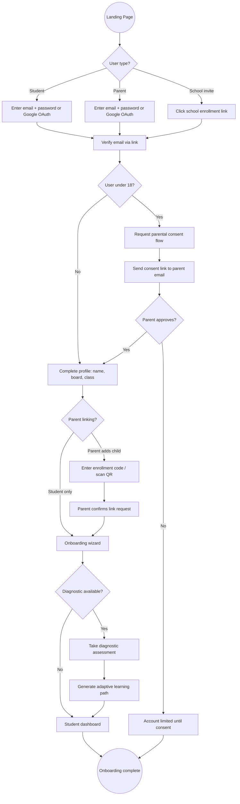

**Key touchpoints:** US-011, US-012, US-013, US-016, US-017, US-055, US-056

---

## 3. Student Learning Session

End-to-end flow from dashboard to lesson completion with XP and progress sync.

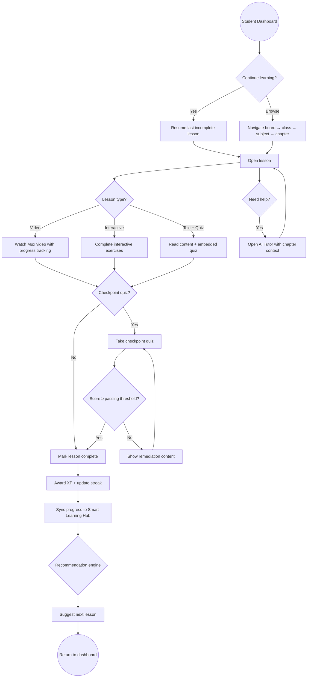

**Key touchpoints:** US-041, US-043, US-044, US-046, US-056, US-060, US-171

---

## 4. AI Tutor Chat

Streaming conversational help with RAG, quota enforcement, and content safety.

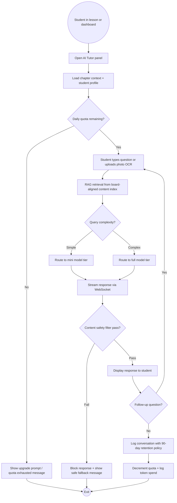

**Key touchpoints:** US-096, US-098, US-099, US-103, US-104, US-106

---

## 5. Homework Submission

Student submission through teacher grading workflow.

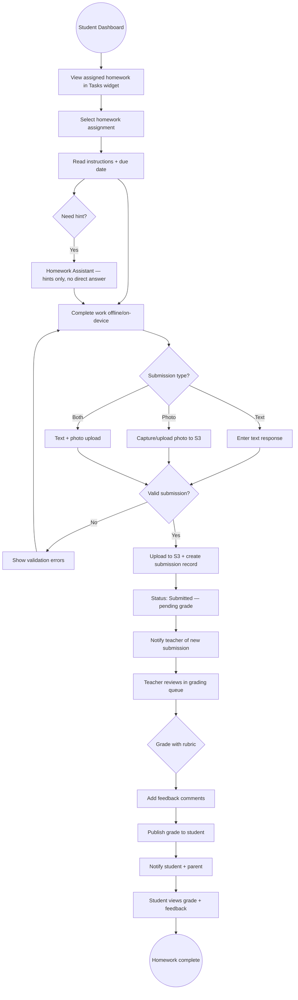

**Key touchpoints:** US-100, US-101, US-102, US-132, US-133, US-152

---

## 6. Parent Progress Review

Multi-child dashboard, weekly AI reports, and consent controls.

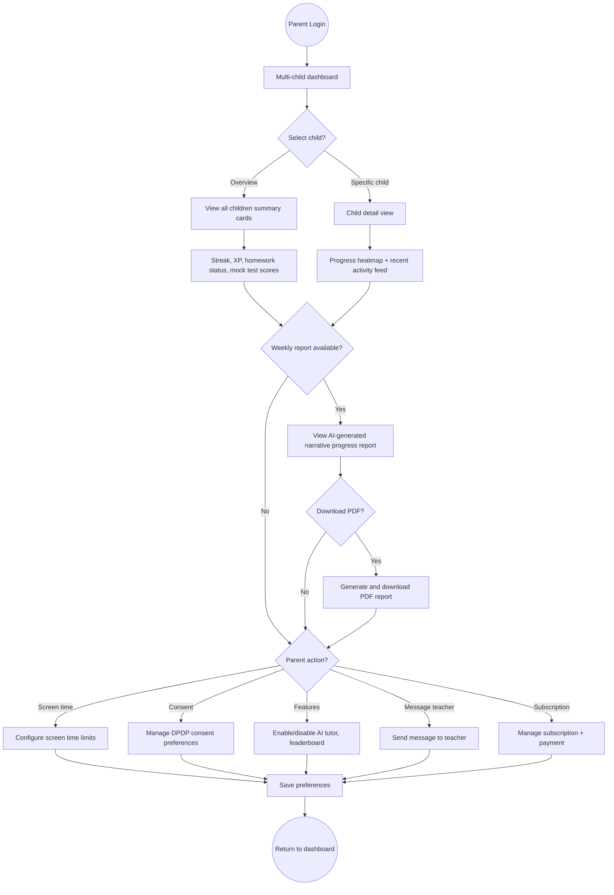

**Key touchpoints:** US-146, US-147, US-149, US-150, US-157, US-158

---

## 7. Teacher Question Paper Generator (QPG)

AI-assisted exam paper creation with teacher review and publish.

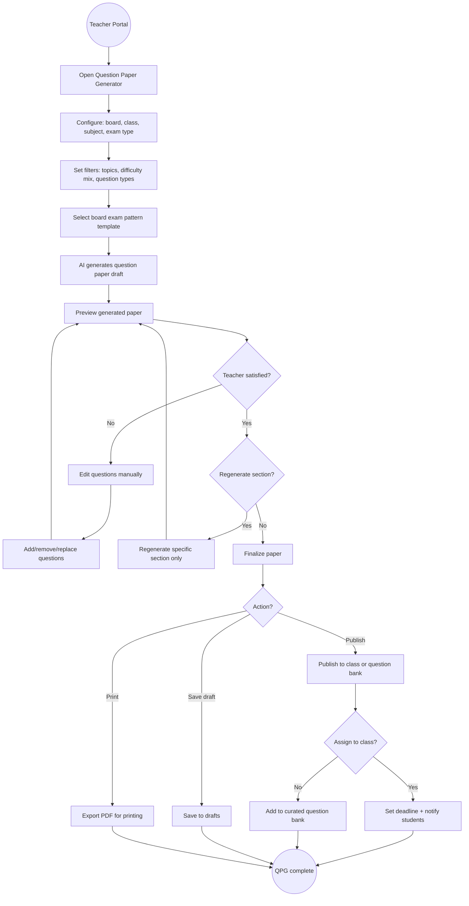

**Key touchpoints:** US-114, US-115, US-116, US-119

---

## 8. School Onboarding

B2B tenant provisioning, bulk user import, and white-label configuration.

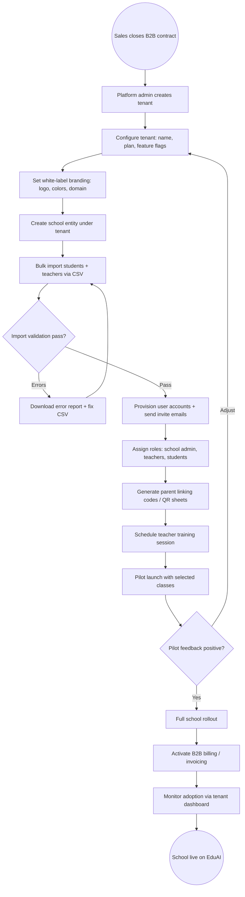

**Key touchpoints:** US-026, US-027, US-034, US-037, US-161, US-169, US-199

---

## 9. Subscription Purchase

B2C freemium trial through Razorpay payment and feature activation.

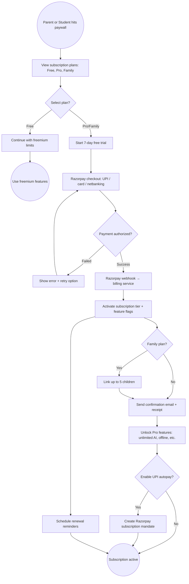

**Key touchpoints:** US-154, US-158, US-159, US-196, US-197, US-198

---

## 10. Cross-Flow Dependencies

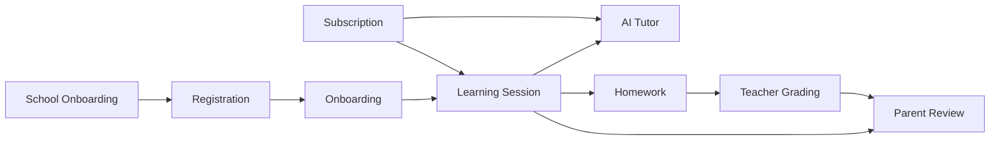

---

## 11. Error & Edge Case Flows

### 11.1 Session Expiry During Learning

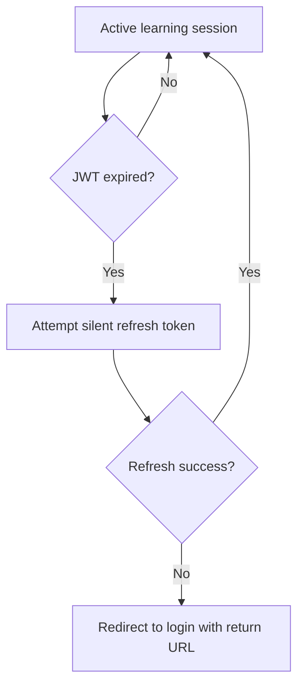

### 11.2 AI Quota Exhausted Mid-Conversation

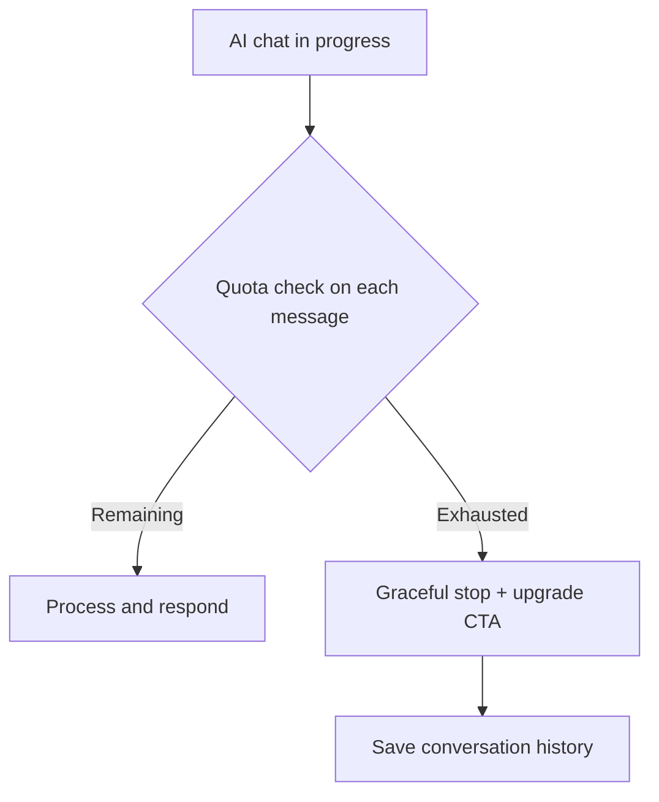

---

*Related: [User Stories](./user-stories.md) · [Sprint Planning](./sprint-planning.md) · [PRD](../prd/product-requirements-document.md)*
