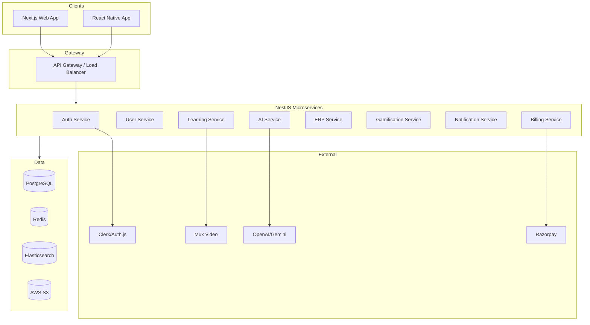

# EduAI — Software Requirements Specification (SRS)

**Document ID:** EDUAI-SRS-001  
**Version:** 1.0.0  
**Status:** Approved for Pre-Development  
**Date:** June 2025  
**Owner:** Engineering

---

## 1. Introduction

### 1.1 Purpose

This Software Requirements Specification defines the functional and non-functional requirements for EduAI — an AI-powered digital learning ecosystem. It serves as the contract between product and engineering for Sprint 1–16 delivery.

### 1.2 Scope

Refer to [BRD](../brd/business-requirements-document.md) Section 6 for business scope. This document specifies **how** the system shall behave.

### 1.3 Definitions

| Term | Definition |
|------|------------|
| FR | Functional Requirement |
| NFR | Non-Functional Requirement |
| SLA | Service Level Agreement |
| RAG | Retrieval-Augmented Generation |
| RBAC | Role-Based Access Control |

### 1.4 References

- EDUAI-BRD-001, EDUAI-PRD-001
- DPDP Act 2023
- WCAG 2.1 AA
- OWASP Top 10 (2021)

---

## 2. System Overview

---

## 3. Functional Requirements

### 3.1 Authentication & Authorization (FR-AUTH)

| ID | Requirement | Priority |
|----|-------------|----------|
| FR-AUTH-001 | System shall support email/password registration with email verification | P0 |
| FR-AUTH-002 | System shall support Google OAuth 2.0 social login | P0 |
| FR-AUTH-003 | System shall issue JWT access tokens (15 min TTL) and refresh tokens (7 day TTL) | P0 |
| FR-AUTH-004 | System shall enforce RBAC on every API endpoint | P0 |
| FR-AUTH-005 | System shall support multi-device sessions with device list and remote logout | P0 |
| FR-AUTH-006 | System shall require parental consent for users under 18 | P0 |
| FR-AUTH-007 | System shall support OTP-based login for mobile (SMS — Phase 2) | P1 |
| FR-AUTH-008 | System shall lock accounts after 5 failed login attempts (15 min lockout) | P0 |
| FR-AUTH-009 | System shall support password reset via secure email link (1 hr expiry) | P0 |
| FR-AUTH-010 | System shall map users to tenant_id and school_id in JWT claims | P0 |

### 3.2 Multi-Tenancy (FR-TENANT)

| ID | Requirement | Priority |
|----|-------------|----------|
| FR-TENANT-001 | System shall isolate data by tenant_id at database query level | P0 |
| FR-TENANT-002 | System shall support custom domain per white-label tenant | P1 |
| FR-TENANT-003 | System shall allow per-tenant branding (logo, colors, favicon) | P0 |
| FR-TENANT-004 | System shall support tenant-level feature flags | P0 |
| FR-TENANT-005 | Platform admin shall create, suspend, and delete tenants | P0 |

### 3.3 Student Portal (FR-STU)

| ID | Requirement | Priority |
|----|-------------|----------|
| FR-STU-001 | Student shall view personalized dashboard with continue-learning widget | P0 |
| FR-STU-002 | Student shall browse curriculum by board, class, subject, chapter | P0 |
| FR-STU-003 | Student shall consume lessons (video, text, interactive) with progress tracking | P0 |
| FR-STU-004 | Student shall complete quizzes with immediate feedback | P0 |
| FR-STU-005 | Student shall interact with AI Tutor with chapter context | P0 |
| FR-STU-006 | Student shall submit homework (text + image upload to S3) | P0 |
| FR-STU-007 | Student shall take mock tests in timed mode | P0 |
| FR-STU-008 | Student shall view study planner calendar | P1 |
| FR-STU-009 | Student shall earn XP, badges, and view leaderboard | P0 |
| FR-STU-010 | Student UI shall adapt layout based on class band (1-4, 5-7, 8-10) | P0 |

### 3.4 AI Ecosystem (FR-AI)

| ID | Requirement | Priority |
|----|-------------|----------|
| FR-AI-001 | AI Tutor shall use RAG retrieval from board-aligned content before LLM call | P0 |
| FR-AI-002 | AI shall enforce daily query quota per subscription tier | P0 |
| FR-AI-003 | Homework Assistant shall provide hints, not direct answers (configurable strictness) | P0 |
| FR-AI-004 | QPG shall generate papers matching board exam pattern (MCQ + short + long) | P0 |
| FR-AI-005 | Mock tests shall auto-grade objective questions | P0 |
| FR-AI-006 | Study Planner shall generate weekly schedule from exam dates and weak topics | P1 |
| FR-AI-007 | All AI outputs shall pass content safety filter before display | P0 |
| FR-AI-008 | AI conversations shall be stored for 90 days then purged | P0 |
| FR-AI-009 | System shall route queries to appropriate model tier (mini vs full) | P0 |
| FR-AI-010 | Teachers shall review and edit AI-generated question papers before publish | P0 |

### 3.5 Teacher Portal (FR-TCH)

| ID | Requirement | Priority |
|----|-------------|----------|
| FR-TCH-001 | Teacher shall manage class rosters (view, add students) | P0 |
| FR-TCH-002 | Teacher shall create and assign homework to classes | P0 |
| FR-TCH-003 | Teacher shall grade submissions with rubric support | P0 |
| FR-TCH-004 | Teacher shall use QPG with difficulty and topic filters | P0 |
| FR-TCH-005 | Teacher shall view class analytics (avg scores, completion rates) | P0 |
| FR-TCH-006 | Teacher shall send announcements to parents | P1 |
| FR-TCH-007 | Teacher shall assign content from library to class | P0 |

### 3.6 Parent Portal (FR-PAR)

| ID | Requirement | Priority |
|----|-------------|----------|
| FR-PAR-001 | Parent shall link to one or more student accounts | P0 |
| FR-PAR-002 | Parent shall view multi-child progress dashboard | P0 |
| FR-PAR-003 | Parent shall receive weekly AI-generated progress report (email + in-app) | P1 |
| FR-PAR-004 | Parent shall manage subscription and payment methods | P0 |
| FR-PAR-005 | Parent shall configure screen time limits | P1 |
| FR-PAR-006 | Parent shall manage consent preferences (DPDP) | P0 |
| FR-PAR-007 | Parent shall message teachers | P1 |

### 3.7 School ERP (FR-ERP)

| ID | Requirement | Priority |
|----|-------------|----------|
| FR-ERP-001 | School admin shall manage student enrollment records | P0 |
| FR-ERP-002 | Teacher shall mark daily attendance | P0 |
| FR-ERP-003 | System shall generate attendance reports | P0 |
| FR-ERP-004 | School admin shall manage fee structures | P1 |
| FR-ERP-005 | System shall process fee payments via Razorpay | P1 |
| FR-ERP-006 | School admin shall manage timetables | P1 |
| FR-ERP-007 | System shall publish school announcements | P0 |

### 3.8 Gamification (FR-GAME)

| ID | Requirement | Priority |
|----|-------------|----------|
| FR-GAME-001 | System shall award XP for defined actions (lesson, quiz, streak) | P0 |
| FR-GAME-002 | System shall support badge definitions with criteria | P0 |
| FR-GAME-003 | System shall maintain daily streak with freeze token (1/month free) | P0 |
| FR-GAME-004 | System shall display leaderboards scoped to class/school/tenant | P0 |
| FR-GAME-005 | Schools shall opt out of public leaderboards | P0 |

### 3.9 Admin CRM (FR-ADMIN)

| ID | Requirement | Priority |
|----|-------------|----------|
| FR-ADMIN-001 | Platform admin shall CRUD tenants with white-label config | P0 |
| FR-ADMIN-002 | Platform admin shall view cross-tenant analytics | P0 |
| FR-ADMIN-003 | Platform admin shall monitor AI token spend per tenant | P0 |
| FR-ADMIN-004 | Content admin shall manage CMS pipeline (draft → review → publish) | P0 |
| FR-ADMIN-005 | Platform admin shall view audit logs with filters | P0 |

### 3.10 Mobile App (FR-MOB)

| ID | Requirement | Priority |
|----|-------------|----------|
| FR-MOB-001 | Mobile app shall support student login and core learning flows | P0 |
| FR-MOB-002 | Mobile app shall support AI tutor chat | P0 |
| FR-MOB-003 | Mobile app shall support offline lesson download (Pro tier) | P1 |
| FR-MOB-004 | Mobile app shall receive push notifications | P0 |
| FR-MOB-005 | Mobile app shall support biometric authentication | P1 |
| FR-MOB-006 | Parent dashboard shall be accessible on mobile | P0 |

### 3.11 Billing (FR-BILL)

| ID | Requirement | Priority |
|----|-------------|----------|
| FR-BILL-001 | System shall support Razorpay subscription billing (UPI, card, netbanking) | P0 |
| FR-BILL-002 | System shall enforce feature access by subscription tier | P0 |
| FR-BILL-003 | System shall handle webhook events (payment success, failure, cancel) | P0 |
| FR-BILL-004 | System shall support 7-day free trial for B2C | P0 |
| FR-BILL-005 | B2B invoicing shall be supported for school contracts | P1 |

### 3.12 Notifications (FR-NOTIFY)

| ID | Requirement | Priority |
|----|-------------|----------|
| FR-NOTIFY-001 | System shall send email notifications (transactional) | P0 |
| FR-NOTIFY-002 | System shall send push notifications via FCM/APNs | P0 |
| FR-NOTIFY-003 | System shall support in-app notification center | P0 |
| FR-NOTIFY-004 | Users shall configure notification preferences | P0 |

---

## 4. Non-Functional Requirements

### 4.1 Performance (NFR-PERF)

| ID | Requirement | Target |
|----|-------------|--------|
| NFR-PERF-001 | Web LCP (Largest Contentful Paint) | < 2.5s (p75) |
| NFR-PERF-002 | API response time (non-AI endpoints) | < 300ms (p95) |
| NFR-PERF-003 | AI Tutor first token latency | < 2s (p95) |
| NFR-PERF-004 | Concurrent users supported | 50K simultaneous |
| NFR-PERF-005 | Database query time | < 100ms (p95) for indexed queries |
| NFR-PERF-006 | Search (Elasticsearch) | < 500ms (p95) |

### 4.2 Scalability (NFR-SCALE)

| ID | Requirement | Target |
|----|-------------|--------|
| NFR-SCALE-001 | Horizontal scaling of all stateless services | K8s HPA |
| NFR-SCALE-002 | Database read replicas | 2+ replicas at 100K MAU |
| NFR-SCALE-003 | Tenant count | 1,000+ tenants |
| NFR-SCALE-004 | Student records | 1M+ without degradation |

### 4.3 Availability (NFR-AVAIL)

| ID | Requirement | Target |
|----|-------------|--------|
| NFR-AVAIL-001 | Uptime SLA | 99.9% monthly |
| NFR-AVAIL-002 | Planned maintenance window | Sundays 2–4 AM IST, notified 48 hrs ahead |
| NFR-AVAIL-003 | RPO (Recovery Point Objective) | 1 hour |
| NFR-AVAIL-004 | RTO (Recovery Time Objective) | 4 hours |

### 4.4 Security (NFR-SEC)

| ID | Requirement | Target |
|----|-------------|--------|
| NFR-SEC-001 | Data encryption at rest | AES-256 |
| NFR-SEC-002 | Data encryption in transit | TLS 1.3 |
| NFR-SEC-003 | OWASP Top 10 mitigation | All items addressed |
| NFR-SEC-004 | Penetration testing | Before GA and annually |
| NFR-SEC-005 | Audit logging | All write operations logged |
| NFR-SEC-006 | PII access | Role-restricted, logged |

### 4.5 Accessibility (NFR-A11Y)

| ID | Requirement | Target |
|----|-------------|--------|
| NFR-A11Y-001 | WCAG compliance | 2.1 AA |
| NFR-A11Y-002 | Keyboard navigation | All interactive elements |
| NFR-A11Y-003 | Screen reader support | ARIA labels on all components |
| NFR-A11Y-004 | Color contrast | 4.5:1 minimum |
| NFR-A11Y-005 | Font scaling | Up to 200% without layout break |

### 4.6 Internationalization (NFR-I18N)

| ID | Requirement | Target |
|----|-------------|--------|
| NFR-I18N-001 | UI languages (Phase 1) | English, Hindi, Marathi |
| NFR-I18N-002 | Content language tagging | Per lesson metadata |
| NFR-I18N-003 | Date/number formatting | Locale-aware (en-IN, hi-IN, mr-IN) |
| NFR-I18N-004 | Translation framework | i18next with namespace per module |

### 4.7 Maintainability (NFR-MAINT)

| ID | Requirement | Target |
|----|-------------|--------|
| NFR-MAINT-001 | Code coverage (unit tests) | ≥ 80% backend, ≥ 70% frontend |
| NFR-MAINT-002 | API documentation | OpenAPI 3.1 auto-generated |
| NFR-MAINT-003 | Monorepo structure | Turborepo with shared packages |
| NFR-MAINT-004 | Linting/formatting | ESLint + Prettier enforced in CI |

---

## 5. External Interface Requirements

### 5.1 User Interfaces

- Web: Responsive (mobile, tablet, desktop); breakpoints 640/768/1024/1280px
- Mobile: iOS 15+, Android 10+
- Minimum supported browsers: Chrome 100+, Safari 15+, Firefox 100+, Edge 100+

### 5.2 API Interfaces

- REST JSON over HTTPS
- Version prefix: `/api/v1/`
- WebSocket for real-time notifications and AI streaming
- See [API Documentation](../api/api-documentation.md)

### 5.3 Hardware Interfaces

- Camera (mobile): homework photo upload
- Biometric sensors (mobile): Face ID / fingerprint login

---

## 6. Data Requirements

- All tables include: `id` (UUID), `tenant_id`, `created_at`, `updated_at`, `deleted_at` (soft delete)
- PII fields encrypted at application level where required
- See [Database Schema](../database/database-schema.md)

---

## 7. Constraints

| Constraint | Detail |
|------------|--------|
| Tech stack | Next.js 15, NestJS, PostgreSQL, Redis — per BRD |
| Cloud | AWS ap-south-1 primary |
| AI providers | OpenAI and/or Google Gemini (no vendor lock — abstraction layer) |
| Budget | AI COGS < 25% ARPU |
| Compliance | DPDP Act 2023, data residency India |
| Timeline | MVP GA at Sprint 16 (~8 months) |

---

## 8. Acceptance Criteria (System-Level)

The system is accepted for GA when:

1. All P0 functional requirements pass QA verification
2. NFR performance targets met in load test (50K concurrent)
3. Security penetration test passed with no critical/high findings open
4. WCAG 2.1 AA audit passed
5. DPDP consent flows verified by legal
6. 99.9% uptime demonstrated over 30-day staging soak test
7. Mobile app approved on App Store and Google Play (test track)

---

*Related: [HLD](../architecture/high-level-design.md) · [LLD](../architecture/low-level-design.md) · [Testing Strategy](../testing/testing-strategy.md)*
