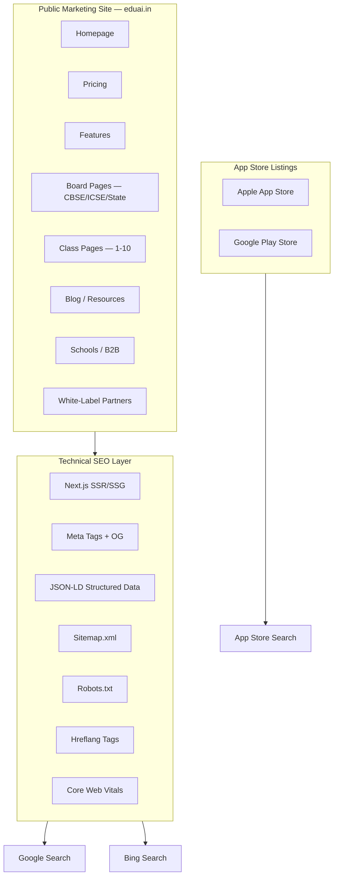

# EduAI — SEO Strategy

**Document ID:** EDUAI-SEO-001  
**Version:** 1.0.0  
**Status:** Approved for Pre-Development  
**Date:** June 2025  
**Owner:** Growth & Marketing Engineering

---

## 1. Overview

This document defines EduAI's search engine optimization strategy for marketing pages, structured data, international SEO, and app store optimization (ASO). SEO supports business goal G4 (scale as multi-label SaaS) and B2C acquisition (8% freemium → paid conversion).

**Scope:**
- **In scope:** Marketing site, landing pages, blog, pricing, school/partner pages, app store listings
- **Out of scope:** Authenticated portal pages (student, teacher, parent dashboards) — blocked by `noindex`

**Related:** [PRD](../prd/product-requirements-document.md) · [Performance Targets](./performance-targets.md) · [Testing Strategy](./testing-strategy.md)

---

## 2. SEO Architecture



---

## 3. Marketing Pages SEO

### 3.1 Page Inventory & Target Keywords

| Page | URL Pattern | Primary Keywords | Search Intent |
|------|-------------|------------------|---------------|
| Homepage | `/` | AI learning app India, EduAI, personalized tutoring | Brand + category |
| Pricing | `/pricing` | EduAI pricing, AI tutor subscription India | Commercial |
| Features | `/features` | AI tutor features, gamified learning app | Informational |
| CBSE | `/boards/cbse` | CBSE online learning, CBSE AI tutor | Board-specific |
| ICSE | `/boards/icse` | ICSE study app, ICSE online classes | Board-specific |
| Class pages | `/classes/class-{n}` | Class {n} study app, Class {n} AI tutor CBSE | Class-specific |
| AI Tutor | `/features/ai-tutor` | AI tutor for students India, homework help AI | Feature-specific |
| For Schools | `/schools` | school ERP India, digital learning platform schools | B2B |
| For Parents | `/parents` | parent portal education app, track child progress | Parent-focused |
| Blog | `/blog/{slug}` | Long-tail educational content | Informational |
| Hindi homepage | `/hi/` | AI शिक्षा ऐप, EduAI हिंदी | Hindi audience |
| Marathi homepage | `/mr/` | EduAI मराठी, AI शिक्षण | Marathi audience |

### 3.2 On-Page SEO Checklist (Per Page)

- [ ] Unique `<title>` tag (50–60 chars, primary keyword front-loaded)
- [ ] Unique `<meta description>` (150–160 chars, includes CTA)
- [ ] Single `<h1>` per page matching primary keyword
- [ ] Logical heading hierarchy (H1 → H2 → H3)
- [ ] Canonical URL set (`<link rel="canonical">`)
- [ ] Open Graph tags (og:title, og:description, og:image, og:url)
- [ ] Twitter Card tags
- [ ] Internal links to related pages (board, class, feature)
- [ ] Alt text on all images (descriptive, keyword-natural)
- [ ] Mobile-responsive (Google mobile-first indexing)
- [ ] Page load LCP < 2.5s

### 3.3 Title & Meta Templates

```
Homepage:
  Title: EduAI — AI-Powered Learning for Classes 1–10 | CBSE, ICSE & State Boards
  Description: Personalized AI tutor, gamified lessons, and parent dashboard for Indian students. Try free for 7 days. English, Hindi & Marathi.

Class page (example Class 10):
  Title: Class 10 CBSE AI Tutor & Board Prep | EduAI
  Description: AI-powered Class 10 board preparation with mock tests, previous year questions, and personalized study plans. Start your free trial.

Board page (example CBSE):
  Title: CBSE Online Learning Platform with AI Tutor | EduAI
  Description: Complete CBSE curriculum for Classes 1–10 with AI tutoring, interactive lessons, and exam preparation. Trusted by 1000+ schools.
```

---

## 4. Structured Data (JSON-LD)

### 4.1 Organization Schema (All Pages)

```json
{
  "@context": "https://schema.org",
  "@type": "Organization",
  "name": "EduAI",
  "url": "https://eduai.in",
  "logo": "https://eduai.in/logo.png",
  "description": "AI-powered digital learning ecosystem for Indian K-10 students",
  "foundingDate": "2025",
  "areaServed": {
    "@type": "Country",
    "name": "India"
  },
  "sameAs": [
    "https://twitter.com/eduai_in",
    "https://www.linkedin.com/company/eduai",
    "https://www.youtube.com/@eduai"
  ],
  "contactPoint": {
    "@type": "ContactPoint",
    "contactType": "customer support",
    "email": "support@eduai.in",
    "availableLanguage": ["English", "Hindi", "Marathi"]
  }
}
```

### 4.2 SoftwareApplication Schema (Homepage + App Pages)

```json
{
  "@context": "https://schema.org",
  "@type": "SoftwareApplication",
  "name": "EduAI",
  "applicationCategory": "EducationalApplication",
  "operatingSystem": "Web, iOS, Android",
  "offers": {
    "@type": "Offer",
    "price": "0",
    "priceCurrency": "INR",
    "description": "Free tier available; Pro from ₹499/month"
  },
  "aggregateRating": {
    "@type": "AggregateRating",
    "ratingValue": "4.5",
    "ratingCount": "1000",
    "bestRating": "5"
  },
  "featureList": [
    "AI Tutor with curriculum-aligned RAG",
    "Gamified learning for Classes 1-10",
    "Mock tests and board preparation",
    "Parent progress dashboard",
    "Multi-language support (English, Hindi, Marathi)"
  ]
}
```

### 4.3 FAQ Schema (Pricing + Feature Pages)

```json
{
  "@context": "https://schema.org",
  "@type": "FAQPage",
  "mainEntity": [
    {
      "@type": "Question",
      "name": "What boards does EduAI support?",
      "acceptedAnswer": {
        "@type": "Answer",
        "text": "EduAI supports CBSE, ICSE, and major State Boards for Classes 1 through 10, with curriculum-aligned AI tutoring and mock tests."
      }
    },
    {
      "@type": "Question",
      "name": "Is there a free trial?",
      "acceptedAnswer": {
        "@type": "Answer",
        "text": "Yes, EduAI offers a 7-day free trial with full Pro features. No credit card required to start."
      }
    },
    {
      "@type": "Question",
      "name": "Does EduAI work in Hindi?",
      "acceptedAnswer": {
        "@type": "Answer",
        "text": "Yes, EduAI offers full UI in Hindi and Marathi, and the AI tutor responds in your selected language."
      }
    }
  ]
}
```

### 4.4 Course Schema (Class/Board Pages)

```json
{
  "@context": "https://schema.org",
  "@type": "Course",
  "name": "CBSE Class 10 Mathematics — AI Tutor",
  "description": "Complete CBSE Class 10 Mathematics curriculum with AI tutoring, mock tests, and board exam preparation",
  "provider": {
    "@type": "Organization",
    "name": "EduAI",
    "url": "https://eduai.in"
  },
  "educationalLevel": "Class 10",
  "inLanguage": ["en", "hi"],
  "hasCourseInstance": {
    "@type": "CourseInstance",
    "courseMode": "online",
    "courseWorkload": "PT01H00M"
  }
}
```

### 4.5 BreadcrumbList Schema (All Sub-Pages)

```json
{
  "@context": "https://schema.org",
  "@type": "BreadcrumbList",
  "itemListElement": [
    { "@type": "ListItem", "position": 1, "name": "Home", "item": "https://eduai.in" },
    { "@type": "ListItem", "position": 2, "name": "Boards", "item": "https://eduai.in/boards" },
    { "@type": "ListItem", "position": 3, "name": "CBSE", "item": "https://eduai.in/boards/cbse" }
  ]
}
```

### 4.6 Structured Data Validation

- Validate all JSON-LD with Google Rich Results Test before deploy
- Automated check in CI: schema validation script on marketing page builds
- Monitor Google Search Console for structured data errors weekly

---

## 5. Technical SEO

### 5.1 Rendering Strategy

| Page Type | Rendering | Rationale |
|-----------|-----------|-----------|
| Homepage, pricing, features | SSG with ISR (revalidate: 3600) | Fast LCP, fresh content hourly |
| Board/class landing pages | SSG with ISR (revalidate: 86400) | Stable content, daily refresh |
| Blog posts | SSG with ISR (revalidate: 3600) | Content freshness |
| Authenticated portals | CSR with `noindex` | Not for search indexing |

### 5.2 Robots.txt

```
User-agent: *
Allow: /
Disallow: /app/
Disallow: /api/
Disallow: /admin/
Disallow: /teacher/
Disallow: /parent/
Disallow: /student/
Disallow: /auth/

Sitemap: https://eduai.in/sitemap.xml
Sitemap: https://eduai.in/hi/sitemap.xml
Sitemap: https://eduai.in/mr/sitemap.xml
```

### 5.3 Sitemap Strategy

| Sitemap | Contents | Update Frequency |
|---------|----------|------------------|
| `sitemap.xml` (index) | References to sub-sitemaps | Daily |
| `sitemap-pages.xml` | Static marketing pages | Weekly |
| `sitemap-boards.xml` | Board landing pages | Monthly |
| `sitemap-classes.xml` | Class landing pages (1–10 × boards) | Monthly |
| `sitemap-blog.xml` | Blog posts | Daily (on publish) |
| `sitemap-hi.xml` | Hindi pages | Weekly |
| `sitemap-mr.xml` | Marathi pages | Weekly |

Generated at build time via Next.js `next-sitemap` plugin.

### 5.4 URL Structure

```
https://eduai.in/                          # Homepage
https://eduai.in/pricing                   # Pricing
https://eduai.in/features/ai-tutor         # Feature pages
https://eduai.in/boards/cbse               # Board pages
https://eduai.in/boards/cbse/class-10      # Board + class
https://eduai.in/blog/how-ai-tutor-helps   # Blog
https://eduai.in/hi/                       # Hindi homepage
https://eduai.in/hi/boards/cbse            # Hindi board page
https://eduai.in/schools                   # B2B landing
https://app.eduai.in/                      # App (noindex on auth pages)
```

**Rules:**
- Lowercase, hyphen-separated slugs
- No trailing slashes (301 redirect if present)
- No query parameters in canonical URLs
- Max URL depth: 3 levels from root

### 5.5 Core Web Vitals (SEO Impact)

Google uses Core Web Vitals as a ranking signal. Targets from [Performance Targets](./performance-targets.md):

| Metric | Target | SEO Impact |
|--------|--------|------------|
| LCP | < 2.5s | High — primary ranking factor |
| INP | < 200ms | High — interactivity signal |
| CLS | < 0.1 | Medium — visual stability |

**Optimizations for marketing pages:**
- Hero image: WebP/AVIF with `priority` loading and explicit dimensions
- Font: `next/font` with `display: swap` and subset loading
- Third-party scripts: defer analytics (Google Analytics 4) until after LCP
- CSS: critical CSS inlined; Tailwind purged
- Images: CloudFront CDN with responsive `srcset`

---

## 6. International SEO (i18n)

### 6.1 Language Strategy

| Language | Code | URL Prefix | Phase | Priority Content |
|----------|------|------------|-------|------------------|
| English | `en` | `/` (default) | Phase 1 | All marketing pages |
| Hindi | `hi` | `/hi/` | Phase 1 | Homepage, pricing, top 5 board pages, features |
| Marathi | `mr` | `/mr/` | Phase 1 | Homepage, pricing, Maharashtra state board page |

### 6.2 Hreflang Implementation

```html
<!-- On English homepage -->
<link rel="alternate" hreflang="en" href="https://eduai.in/" />
<link rel="alternate" hreflang="hi" href="https://eduai.in/hi/" />
<link rel="alternate" hreflang="mr" href="https://eduai.in/mr/" />
<link rel="alternate" hreflang="x-default" href="https://eduai.in/" />
```

**Rules:**
- Every translated page has hreflang tags for all available languages
- Untranslated pages: hreflang points to English version only
- `x-default` always points to English
- Validated with Google Search Console international targeting report

### 6.3 Hindi SEO Keywords

| English Keyword | Hindi Target | Page |
|----------------|--------------|------|
| AI learning app | AI शिक्षा ऐप | `/hi/` |
| AI tutor for students | छात्रों के लिए AI ट्यूटर | `/hi/features/ai-tutor` |
| CBSE online learning | CBSE ऑनलाइन शिक्षा | `/hi/boards/cbse` |
| Class 10 board prep | कक्षा 10 बोर्ड तैयारी | `/hi/boards/cbse/class-10` |
| Parent progress tracking | बच्चे की प्रगति ट्रैक करें | `/hi/parents` |

### 6.4 Content Localization (Not Translation)

- Hindi/Marathi pages use culturally adapted copy, not literal translation
- Local exam references (e.g., Maharashtra Board for Marathi pages)
- Local payment messaging (UPI prominence)
- Local testimonials from respective regions

### 6.5 Future Languages (Phase 2)

| Language | Code | Target Region | Timeline |
|----------|------|---------------|----------|
| Gujarati | `gu` | Gujarat | Post-GA Q2 |
| Tamil | `ta` | Tamil Nadu | Post-GA Q3 |
| Telugu | `te` | Andhra Pradesh, Telangana | Post-GA Q3 |
| Kannada | `kn` | Karnataka | Post-GA Q4 |

---

## 7. Content SEO Strategy

### 7.1 Blog / Resource Hub

**Purpose:** Capture long-tail informational queries; build topical authority in Indian K-10 education.

| Content Pillar | Example Topics | Target Queries |
|----------------|----------------|----------------|
| Board exam prep | "CBSE Class 10 Math important topics 2025" | High-volume exam queries |
| AI in education | "How AI tutors help with homework" | Category awareness |
| Parent guides | "How to track your child's online learning progress" | Parent acquisition |
| Teacher resources | "How to create question papers faster with AI" | B2B teacher acquisition |
| Study tips | "Spaced repetition technique for board exams" | Student engagement |

**Publishing cadence:** 4 articles/month (Phase 1); 8 articles/month (post-GA)

### 7.2 Content Quality Guidelines

- Minimum 1,500 words for pillar content; 800 words for supporting articles
- Include original data (EduAI learning analytics insights) where possible
- Expert review by curriculum team before publish
- Update evergreen content quarterly (exam dates, syllabus changes)
- Internal links: minimum 3 per article to relevant product pages

### 7.3 E-E-A-T Signals

Google evaluates Experience, Expertise, Authoritativeness, Trustworthiness:

| Signal | Implementation |
|--------|----------------|
| Experience | Case studies from pilot schools; student success stories |
| Expertise | Author bios with credentials (teachers, curriculum experts) |
| Authoritativeness | Backlinks from `.edu.in` domains; education publication features |
| Trustworthiness | Privacy policy, DPDP compliance badge, security certifications |

---

## 8. App Store Optimization (ASO)

### 8.1 Apple App Store

| Field | Content | Char Limit |
|-------|---------|------------|
| App Name | EduAI: AI Tutor & Learning | 30 |
| Subtitle | Classes 1-10 CBSE, ICSE Prep | 30 |
| Keywords | AI tutor,CBSE,ICSE,homework,learning,Class 10,board exam,study,gamified,Hindi | 100 |
| Description | (See template below) | 4000 |
| Category | Primary: Education; Secondary: Productivity | — |
| Age Rating | 4+ (Made for Ages 6–8, 9–11, 12+) | — |

**Description template (first 3 lines — above fold):**

```
EduAI is India's AI-powered learning companion for Classes 1–10.

🎓 PERSONALIZED AI TUTOR
Get instant help with homework and concepts — aligned to your CBSE, ICSE, or State Board syllabus. The AI tutor explains step-by-step in English or Hindi.

📚 COMPLETE CURRICULUM
Interactive lessons, mock tests, previous year board questions, and gamified learning paths for every subject.
```

### 8.2 Google Play Store

| Field | Content | Char Limit |
|-------|---------|------------|
| App Name | EduAI: AI Tutor for Class 1-10 | 30 |
| Short Description | AI tutor, mock tests & gamified learning for CBSE, ICSE & State Boards | 80 |
| Full Description | (Same as Apple, adapted) | 4000 |
| Category | Education | — |
| Content Rating | Everyone (IARC) | — |
| Tags | Education, AI tutor, CBSE, homework help, exam prep | — |

### 8.3 ASO Visual Assets

| Asset | Apple | Google Play | Spec |
|-------|-------|-------------|------|
| App icon | Required | Required | 1024×1024 PNG |
| Screenshots (phone) | 6.7" + 6.1" | Phone + 7" tablet | 1290×2796, localized |
| Screenshots (tablet) | 12.9" iPad | 10" tablet | 2048×2732 |
| Feature graphic | N/A | Required | 1024×500 |
| Preview video | Optional | Optional | 15–30 sec |

**Screenshot sequence (storytelling order):**
1. AI Tutor chat solving a Math problem
2. Gamified dashboard with streak and XP
3. Mock test with instant results
4. Parent progress dashboard
5. Class 10 board prep countdown
6. Hindi UI toggle demonstration

### 8.4 ASO Localization

| Store | Languages | Priority |
|-------|-----------|----------|
| Apple App Store | English, Hindi | Phase 1 |
| Google Play | English, Hindi, Marathi | Phase 1 |
| Both | + Gujarati, Tamil, Telugu, Kannada | Phase 2 |

Localized screenshots with Hindi UI for Hindi store listings.

### 8.5 ASO KPIs

| Metric | Target (6 months post-GA) |
|--------|---------------------------|
| App Store rating | ≥ 4.3 |
| Google Play rating | ≥ 4.3 |
| Organic install rate (store search) | ≥ 30% of total installs |
| Keyword ranking: "AI tutor" (India) | Top 10 |
| Keyword ranking: "CBSE learning app" | Top 5 |
| Conversion rate (store page → install) | ≥ 25% |

---

## 9. Link Building & Off-Page SEO

| Strategy | Target | Timeline |
|----------|--------|----------|
| School partnership pages | Backlinks from `.edu.in` school websites | Sprint 14+ |
| Education blog guest posts | EdTech publications, teacher blogs | Post-GA |
| PR / media coverage | Launch press release; education journalists | Sprint 16 |
| Google Business Profile | EduAI HQ listing | Pre-GA |
| YouTube SEO | Tutorial videos with links to landing pages | Post-GA |
| Parent community forums | Genuine participation in parenting/education forums | Ongoing |

---

## 10. Analytics & Monitoring

| Tool | Purpose |
|------|---------|
| Google Search Console | Index coverage, query performance, Core Web Vitals |
| Google Analytics 4 | Traffic, conversion funnel, page engagement |
| Ahrefs / Semrush | Keyword rankings, backlink monitoring, competitor analysis |
| App Store Connect | ASO metrics, keyword rankings (iOS) |
| Google Play Console | ASO metrics, store listing experiments (Android) |

### 10.1 SEO KPIs

| Metric | Target (6 months post-GA) | Measurement |
|--------|---------------------------|-------------|
| Organic traffic (marketing site) | 50K monthly sessions | GA4 |
| Organic keyword rankings (top 10) | 100 keywords | Ahrefs |
| Indexed pages | 100+ | Search Console |
| Core Web Vitals pass rate | 100% of marketing URLs | Search Console |
| Blog organic traffic | 10K monthly sessions | GA4 |
| Organic install rate | 30% of app installs | App Store analytics |
| Domain authority | ≥ 30 | Ahrefs |

### 10.2 Monthly SEO Review

1. Search Console: index coverage errors, query performance changes
2. Core Web Vitals: any regressions on marketing pages
3. Keyword rankings: top 20 target keywords movement
4. Competitor analysis: Byju's, Unacademy, LEAD ranking changes
5. Content calendar: upcoming blog topics based on query gaps
6. ASO: rating trends, keyword ranking changes, screenshot A/B results

---

## 11. SEO Implementation Timeline

| Sprint | SEO Deliverable |
|--------|-----------------|
| 4 | Marketing site foundation (SSR, meta tags, robots.txt) |
| 8 | Board and class landing pages live with structured data |
| 13 | Hindi marketing pages with hreflang |
| 14 | Blog launch with 4 pillar articles |
| 15 | App store listings optimized (ASO) |
| 16 | Full SEO audit; Core Web Vitals verification; sitemap submission |

---

*Related: [Performance Targets](./performance-targets.md) · [Testing Strategy](./testing-strategy.md) · [PRD](../prd/product-requirements-document.md)*
