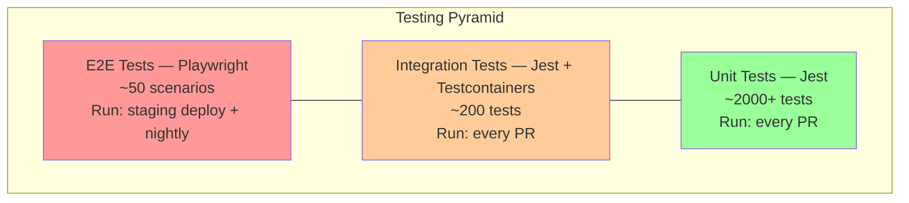
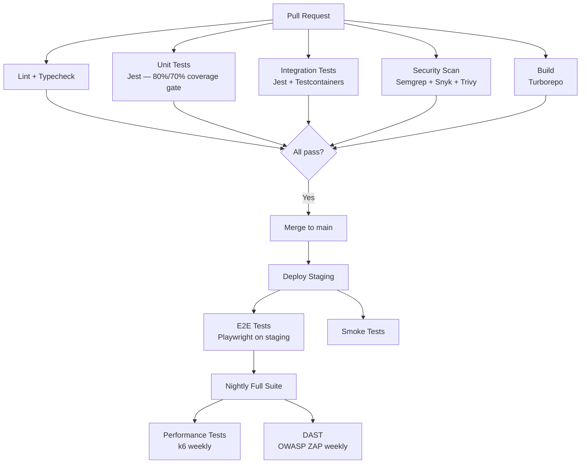

# EduAI — Testing Strategy

**Document ID:** EDUAI-TEST-001  
**Version:** 1.0.0  
**Status:** Approved for Pre-Development  
**Date:** June 2025  
**Owner:** Quality Engineering

---

## 1. Overview

This document defines EduAI's testing strategy across unit, integration, end-to-end, performance, security, and accessibility testing. It implements NFR-MAINT-001 coverage targets and supports GA acceptance criteria from the [SRS](../srs/software-requirements-specification.md).

**Testing principles:**
1. **Shift left** — test early in development, not just before release
2. **Automate relentlessly** — manual testing reserved for exploratory and UX validation
3. **Test behavior, not implementation** — focus on user-facing outcomes
4. **Production-like environments** — staging mirrors production topology
5. **Fast feedback** — CI pipeline completes in < 15 minutes

**Related:** [Performance Targets](./performance-targets.md) · [Security Architecture](../security/security-architecture.md) · [Sprint Planning](../sprints/sprint-planning.md)

---

## 2. Testing Pyramid



| Layer | Tool | Coverage Target | Run Frequency | Duration |
|-------|------|-----------------|---------------|----------|
| Unit | Jest | 80% backend, 70% frontend | Every PR | < 5 min |
| Integration | Jest + Testcontainers | Critical paths | Every PR | < 8 min |
| E2E | Playwright | Top 50 user journeys | Staging deploy + nightly | < 30 min |
| Performance | k6 | SLA targets | Sprint 14, 16 + weekly | < 60 min |
| Security | OWASP ZAP, Semgrep | OWASP Top 10 | Weekly DAST + every PR SAST | < 10 min |
| Accessibility | axe-core + manual audit | WCAG 2.1 AA | Sprint 16 | 2 days |
| Mobile | Detox (RN) + manual device lab | Core flows | Sprint 15 + nightly | < 20 min |

---

## 3. Unit Testing

### 3.1 Backend (NestJS Services)

**Framework:** Jest + `@nestjs/testing`

**Scope:**
- Service business logic (pure functions)
- RBAC guard permission checks
- DTO validation (class-validator)
- Utility functions and helpers
- AI prompt construction and response parsing
- Billing tier enforcement logic
- Gamification XP/badge calculation rules

**Coverage target:** ≥ 80% line coverage (enforced in CI)

**Conventions:**
```
apps/auth-service/
├── src/
│   ├── auth.service.ts
│   ├── auth.service.spec.ts      # Co-located unit tests
│   ├── guards/
│   │   ├── rbac.guard.ts
│   │   └── rbac.guard.spec.ts
│   └── ...
```

**Example test categories:**

| Service | Key Unit Tests |
|---------|----------------|
| auth-service | JWT generation, refresh rotation, lockout logic, consent validation |
| learning-service | Progress calculation, adaptive path algorithm, spaced repetition scheduling |
| ai-service | RAG retrieval scoring, quota enforcement, content safety filter, model routing |
| gamification-service | XP awards, streak logic, freeze token, badge criteria evaluation |
| billing-service | Tier feature mapping, webhook event parsing, trial expiration |

### 3.2 Frontend (Next.js / React)

**Framework:** Jest + React Testing Library

**Scope:**
- Component rendering and interaction
- Hook logic (custom hooks)
- Form validation
- i18n key presence
- Redux/Zustand state transitions
- API client error handling

**Coverage target:** ≥ 70% line coverage (enforced in CI)

**Conventions:**
- Test user behavior, not implementation details
- Mock API calls with MSW (Mock Service Worker)
- Snapshot tests only for stable UI components (icons, badges)

### 3.3 Mobile (React Native)

**Framework:** Jest + React Native Testing Library

**Scope:**
- Component unit tests (shared with web where applicable)
- Navigation logic
- Offline cache management
- Push notification handler logic

**Coverage target:** ≥ 70% line coverage

---

## 4. Integration Testing

### 4.1 Backend Integration Tests

**Framework:** Jest + Testcontainers (PostgreSQL, Redis)

**Scope:**
- API endpoint tests with real database (Testcontainers)
- Multi-service workflows (auth → learning → gamification)
- Tenant isolation verification (cross-tenant query returns empty)
- Razorpay webhook processing (mocked Razorpay, real billing service)
- File upload to S3 (LocalStack or mocked S3)
- Queue job processing (BullMQ with Testcontainers Redis)

**Run environment:** CI pipeline on every PR; Testcontainers spin up ephemeral PostgreSQL + Redis.

**Critical integration test suites:**

| Suite | Tests | Sprint |
|-------|-------|--------|
| Auth flow | Register → verify → login → refresh → logout | 2 |
| RBAC matrix | Each role × each protected endpoint | 2 |
| Tenant isolation | Create data in tenant A; verify tenant B cannot access | 3 |
| Lesson completion | Start lesson → complete quiz → XP awarded → progress saved | 4 |
| AI tutor | Submit query → RAG retrieval → streamed response → quota decremented | 9 |
| Homework cycle | Assign → submit → grade → notify | 12 |
| Subscription | Checkout → webhook → feature unlock | 13 |
| Gamification | Lesson → XP → streak → badge → leaderboard update | 14 |

### 4.2 Contract Testing

**Tool:** Pact (consumer-driven contract tests)

- Web app (consumer) ↔ API services (provider)
- Mobile app (consumer) ↔ API services (provider)
- Verify API response schemas match OpenAPI spec
- Run in CI on every PR affecting API contracts

### 4.3 Database Migration Tests

- Run all migrations against fresh Testcontainers PostgreSQL
- Verify schema matches expected state
- Run rollback migrations and verify clean state
- Run in CI on every migration file change

---

## 5. End-to-End Testing

### 5.1 Web E2E (Playwright)

**Framework:** Playwright (Chromium, Firefox, WebKit)

**Environment:** Staging (`staging.eduai.in`)

**Scope:** Top 50 user journeys covering all portals and critical paths.

| # | Journey | Portal | Sprint |
|---|---------|--------|--------|
| 1 | Registration + email verification | Auth | 2 |
| 2 | Google OAuth login | Auth | 2 |
| 3 | Parent-child linking | Auth | 2 |
| 4 | Parental consent flow (minor) | Auth | 2 |
| 5 | Student onboarding wizard | Student | 4 |
| 6 | Browse curriculum → complete lesson | Student | 4 |
| 7 | Take quiz with immediate feedback | Student | 4 |
| 8 | Switch UI language (en → hi) | Student | 4 |
| 9 | Diagnostic assessment → adaptive path | Smart Learning | 5 |
| 10 | Class 1–4 voice-guided activity | Classes 1–4 | 6 |
| 11 | Class 5–7 group challenge | Classes 5–7 | 7 |
| 12 | Class 8–10 mock test (timed) | Classes 8–10 | 8 |
| 13 | AI tutor chat with chapter context | AI | 9 |
| 14 | Homework submission (text + photo) | AI | 9 |
| 15 | Homework assistant hints (no direct answer) | AI | 9 |
| 16 | Timed mock test → instant report | Assessments | 10 |
| 17 | Teacher QPG → edit → publish | Assessments | 10 |
| 18 | Study planner calendar view | Planner | 11 |
| 19 | Brain development game | Brain Dev | 11 |
| 20 | Teacher: assign homework → grade | Teacher | 12 |
| 21 | Teacher: class analytics dashboard | Teacher | 12 |
| 22 | Parent: multi-child dashboard | Parent | 13 |
| 23 | Parent: subscription checkout (Razorpay test mode) | Parent | 13 |
| 24 | Parent: DPDP consent management | Parent | 13 |
| 25 | School admin: mark attendance | ERP | 14 |
| 26 | XP earned → badge unlocked → leaderboard | Gamification | 14 |
| 27 | Platform admin: create tenant | Admin | 3 |
| 28 | Platform admin: audit log search | Admin | 3 |
| 29 | Tenant admin: bulk user import | Admin | 3 |
| 30 | School onboarding flow | Admin | 3 |

**Playwright configuration:**

```typescript
// playwright.config.ts (summary)
export default {
  testDir: './e2e',
  timeout: 60000,
  retries: 2,
  workers: 4,
  use: {
    baseURL: process.env.STAGING_URL || 'https://staging.eduai.in',
    trace: 'on-first-retry',
    screenshot: 'only-on-failure',
    video: 'retain-on-failure',
  },
  projects: [
    { name: 'chromium', use: { ...devices['Desktop Chrome'] } },
    { name: 'mobile-chrome', use: { ...devices['Pixel 5'] } },
    { name: 'mobile-safari', use: { ...devices['iPhone 13'] } },
  ],
};
```

### 5.2 Mobile E2E (Detox)

**Framework:** Detox for React Native

**Scope:**
- Student login → lesson → quiz completion
- AI tutor chat on mobile
- Mock test on mobile
- Push notification tap → deep link
- Parent dashboard view
- Camera homework upload
- Offline lesson playback (Pro tier)

**Device matrix:**

| Device | OS | Priority |
|--------|-----|----------|
| iPhone 13 | iOS 17 | P0 |
| iPhone SE (3rd gen) | iOS 16 | P0 |
| Samsung Galaxy A14 | Android 13 | P0 |
| Pixel 7 | Android 14 | P1 |
| iPad (10th gen) | iPadOS 17 | P1 |

---

## 6. Performance Testing

See [Performance Targets](./performance-targets.md) for detailed SLAs.

**Tool:** k6 (Grafana k6)

| Test Type | Tool | When | Target |
|-----------|------|------|--------|
| Load test | k6 | Sprint 14, 16 | 50K concurrent users |
| Stress test | k6 | Sprint 16 | Find breaking point |
| Soak test | k6 | Sprint 16 | 30-day staging at 10K concurrent |
| AI latency test | k6 + custom | Sprint 9, 16 | p95 < 4s first token |
| Database benchmark | pgbench | Sprint 4 | p95 query < 100ms |

**k6 test structure:**

```
tests/performance/
├── scenarios/
│   ├── student-learning.js      # Browse + lesson + quiz
│   ├── ai-tutor-chat.js         # AI query load
│   ├── auth-login.js            # Login burst
│   ├── mixed-workload.js        # Realistic traffic mix
│   └── spike-test.js            # 10x traffic spike
├── lib/
│   ├── auth.js                  # JWT token helper
│   └── data.js                  # Test data generators
└── thresholds.js                # Shared SLA thresholds
```

---

## 7. Security Testing

| Type | Tool | Frequency | Gate |
|------|------|-----------|------|
| SAST | Semgrep (OWASP rules) | Every PR | Block on critical |
| Dependency scan | Snyk | Every PR | Block on critical/high |
| Container scan | Trivy | Every PR (on Docker build) | Block on critical |
| Secret scan | GitLeaks | Every PR | Block on any secret |
| DAST | OWASP ZAP (baseline) | Weekly on staging | Alert on high |
| Penetration test | Third-party vendor | Sprint 8, 15 | Zero critical/high at GA |
| RBAC fuzz testing | Custom Jest suite | Sprint 2 | 100% role matrix coverage |

---

## 8. Accessibility Testing

**Standard:** WCAG 2.1 Level AA

| Method | Tool | When |
|--------|------|------|
| Automated | axe-core in Playwright E2E | Every E2E run |
| Automated | eslint-plugin-jsx-a11y | Every PR |
| Manual audit | Screen reader (NVDA, VoiceOver) | Sprint 16 |
| Manual audit | Keyboard-only navigation | Sprint 16 |
| Color contrast | axe + manual verification | Sprint 16 |
| Cognitive | Dyslexia-friendly font testing | Sprint 16 |

**Acceptance criteria:**
- Zero critical axe violations on all portal pages
- All interactive elements keyboard-accessible
- All images have alt text
- Color contrast ≥ 4.5:1 for normal text
- Focus indicators visible on all interactive elements

---

## 9. Test Data Management

| Environment | Data Strategy |
|-------------|---------------|
| Local | Seed script with 3 tenants, 50 users, sample content |
| CI | Testcontainers with migration + seed on each run |
| Staging | Persistent seed data; refreshed weekly; anonymized production-like volume |
| Production | No test data; synthetic monitoring only |

**Test accounts (staging):**

| Role | Email | Notes |
|------|-------|-------|
| Platform admin | admin@test.eduai.in | Full access |
| Tenant admin | tenant@test.eduai.in | Single tenant |
| School admin | school@test.eduai.in | Single school |
| Teacher | teacher@test.eduai.in | Classes 6–8 |
| Student (Class 5) | student5@test.eduai.in | CBSE Class 5 |
| Student (Class 10) | student10@test.eduai.in | CBSE Class 10 |
| Parent | parent@test.eduai.in | Linked to student5 + student10 |

---

## 10. CI/CD Test Integration



**CI time budget:** Total pipeline < 15 minutes for PR checks.

| Stage | Target Duration |
|-------|-----------------|
| Lint + typecheck | 2 min |
| Unit tests | 5 min |
| Integration tests | 8 min |
| Security scans | 3 min |
| Build | 3 min |
| **Total (parallel)** | **< 15 min** |

---

## 11. Test Reporting & Metrics

| Metric | Target | Dashboard |
|--------|--------|-----------|
| Unit test coverage (backend) | ≥ 80% | Codecov |
| Unit test coverage (frontend) | ≥ 70% | Codecov |
| E2E pass rate | ≥ 98% | Playwright report |
| Flaky test rate | < 2% | CI analytics |
| Mean time to detect (MTTD) | < 15 min | Grafana |
| Defect escape rate (prod bugs/sprint) | < 3 | Jira |
| Test automation ratio | ≥ 85% | QA dashboard |

---

## 12. QA Process per Sprint

| Phase | Activity | Owner |
|-------|----------|-------|
| Sprint planning | QA reviews assigned stories; identifies test scenarios | QA Lead |
| Development | Developers write unit tests alongside code | Developers |
| Code review | PR must include tests; coverage gate enforced | Reviewer |
| Sprint mid-point | Integration tests for completed stories | QA |
| Sprint end | E2E tests for sprint stories; exploratory testing | QA |
| Regression | Full E2E suite before staging promotion | QA |
| Release | Performance test + security scan + accessibility audit | QA + Security |

### 12.1 Definition of Done (Testing)

A story is done when:
- [ ] Unit tests written and passing (coverage maintained)
- [ ] Integration tests for API endpoints (if applicable)
- [ ] E2E test for user-facing flows (if P0)
- [ ] Manual exploratory testing completed by QA
- [ ] No P0/P1 bugs open for the story
- [ ] Accessibility check (axe) passes for UI changes

---

## 13. Tool Summary

| Category | Tool | Version | Purpose |
|----------|------|---------|---------|
| Unit/Integration | Jest | 29.x | Backend + frontend unit/integration |
| E2E (Web) | Playwright | 1.40+ | Cross-browser E2E |
| E2E (Mobile) | Detox | 20.x | React Native E2E |
| Performance | k6 | 0.48+ | Load, stress, soak tests |
| API mocking | MSW | 2.x | Frontend unit test API mocks |
| Containers | Testcontainers | 10.x | Ephemeral DB/Redis in CI |
| Coverage | Codecov | — | Coverage reporting and gates |
| SAST | Semgrep | — | Static analysis |
| Dependency | Snyk | — | Vulnerability scanning |
| Container | Trivy | — | Image vulnerability scanning |
| DAST | OWASP ZAP | 2.14+ | Dynamic security testing |
| Accessibility | axe-core | 4.x | Automated a11y checks |
| Contract | Pact | 12.x | API contract testing |
| Reporting | Allure | 2.x | Test report aggregation |

---

*Related: [Performance Targets](./performance-targets.md) · [SEO Strategy](./seo-strategy.md) · [Sprint Planning](../sprints/sprint-planning.md)*
